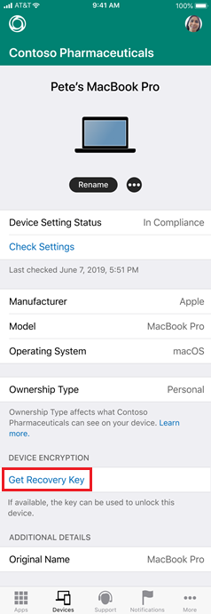

---
# required metadata

title: Get a recovery key for a macOS device from the Intune Company Portal website  
description: View the recovery key for an enrolled, managed macOS device.   
keywords:
author: lenewsad
ms.author: lanewsad
manager: dougeby
ms.date: 12/04/2019
ms.topic: end-user-help
ms.prod:
ms.service: microsoft-intune
ms.subservice: end-user
ms.technology:
ms.assetid:

searchScope:
 - User help

# optional metadata

ROBOTS:  
#audience:

ms.reviewer: 
ms.suite: ems
#ms.tgt_pltfrm:
ms.custom: intune-enduser
ms.collection:
- tier2
---

# Get a recovery key for a macOS device  

*Applies to macOS*  

Use the Company Portal website to get a recovery key for your locked macOS device. If you forget your device password, you can sign in to the Company Portal from another device to retrieve your key.  

## Get recovery key from Company Portal website

This option is available for devices that were encrypted by your organization using FileVault. It's not available for devices that you've personally encrypted.

1. On any device, sign in to the [Company Portal website](https://portal.manage.microsoft.com) and select the **Menu** button > **Devices**.  
2. Select the encrypted macOS device.  
3. Select **Get recovery key**.  

      

4. Your recovery key will appear.

      

    For security reasons, the key will disappear after five minutes. To see the key again, select **Get recovery key**.

If a key isn't found but your device is properly encrypted, contact your organization's support person. For contact information, check the [Company Portal website](https://go.microsoft.com/fwlink/?linkid=2010980).  

## Get recovery key from Company Portal app for iOS

You can retrieve your personal recovery key (FileVault key) using the Company Portal app for iOS. Your device that has the personal recovery key must be enrolled with Intune and encrypted with FileVault through Intune. This option is not available for devices that you've personally encrypted. 

Using the Company Portal app, you can open the Safari web view and retrieve your personal recovery key. 

1. Open Company Portal.
2. Click on **Get recovery key**.

      

The Company Portal website opens in Safari web view and displays the key. 

## IT pro support

If you're an IT support person and want to configure and manage FileVault encryption for macOS devices, see [Use device encryption with Intune](/intune/protect/encrypt-devices).

## Next steps

Find out what else you can do from the Company Portal website. See [Using the Intune Company Portal website](using-the-intune-company-portal-website.md) for the list of actions.  

Still need help? Contact your IT support person. For contact information, check the [Company Portal website](https://go.microsoft.com/fwlink/?linkid=2010980).  
