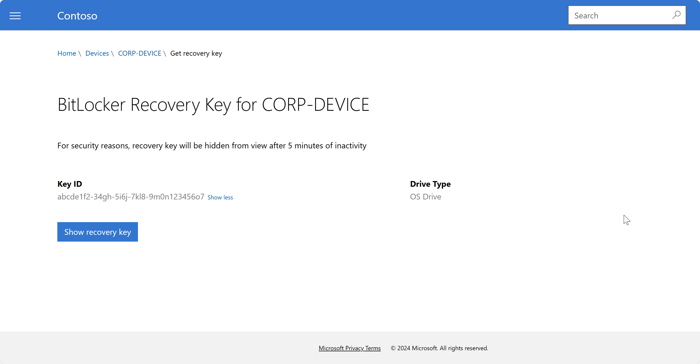

---
# required metadata

title: Get BitLocker recovery key for enrolled device   
description: Get a BitLocker recovery key for your work or school device from the Company portal website or apps.   
keywords:
author: lenewsad
ms.author: lanewsad
manager: dougeby
ms.date: 11/08/2024
ms.topic: end-user-help
ms.service: microsoft-intune
ms.subservice: end-user
ms.assetid:

searchScope:
 - User help

# optional metadata

ROBOTS:  
#audience:

ms.reviewer: 
ms.suite: ems
#ms.tgt_pltfrm:
ms.custom: intune-enduser
ms.collection:
- tier2
---

# Get recovery key for Windows    

**Applies to**:  

 - Windows 10  
 - Windows 11
 - iOS/iPadOS 
 - macOS   

 Access the BitLocker recovery key for a work or school device on the Intune Company Portal website or in the Intune Company Portal app. If you forget the sign-in password and get locked out of an Intune-enrolled PC, you can unlock it with a stored recovery key. This article describes how to retrieve the key from Company Portal.  

 >[!NOTE]
 > A BitLocker key is a 48-character long password divided into eight groups of 6 characters separated by dashes. Example: *123456-789012-345678-901234-567890-123456-789012-345678*  

 ## Requirements  

- Enrolled, BitLocker-encrypted work or school device provided by your organization  
- Registered work or school account   
- Permission to view BitLocker recovery key  
- Supported devices  
- Supported version of Company Portal app 

You can obtain the recovery key for a work or school device that's encrypted by your organization. Recovery keys aren't available for devices you personally encrypt. 

## Get recovery key from Company Portal website  
Retrieve a personal BitLocker recovery key on the Company Portal website. 

> [!div class="mx-imgBorder"]
>   

1. On any device, sign in to the [Company Portal website](https://portal.manage.microsoft.com).   
1. Go to **Devices**.  
1. Select the PC you're locked out of.
1. Select **Get recovery key**.  
1. Select **Show recovery key**.  
1. Your recovery key appears. Write down or copy the code, and then enter it in the BitLocker recovery screen on your computer. For security reasons, the key disappears after five minutes. To see the key again, select **Show recovery key**.  

If a key isn't found, but your device is properly encrypted, contact your IT support person for help. Check the Company Portal website for your organization's helpdesk details. 

## Get recovery key from Company Portal app 

Retrieve a personal BitLocker recovery key in the Company Portal app. The recovery key must belong to a device that's enrolled in Microsoft Intune.  

1. Open the Intune Company Portal app. The following apps support recovery key retrieval:  

    - Company Portal for iOS  
    - Company Portal for macOS  

2. Go to **Devices**, and then select your Windows device.  
3. On the device details page, select **Get recovery key**. The Company Portal website opens in Safari and shows the key.  

  After 5 minutes of inactivity, Company Portal returns you to the device page in Safari. You can view the key again from there.  

## IT pro support  

If you're an IT support person and want to configure and manage  encryption, see [Manage  policy for Windows devices with Microsoft Intune](../protect/encrypt-devices.md).  
