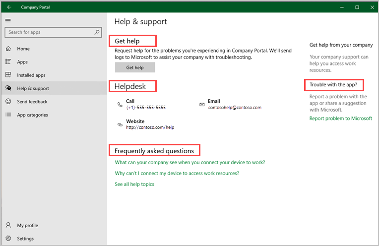

---
# required metadata

title: Get help and support in Company Portal for Windows devices | Microsoft Docs
description: Learn how to get help and support in Company Portal for Windows.   
keywords:
author: lenewsad
ms.author: lanewsad
manager: dougeby
ms.date: 03/03/2022
ms.topic: end-user-help
ms.service: microsoft-intune
ms.subservice: end-user
ms.technology:
ms.assetid: bd428c14-7d75-42de-9322-b57323a01f06
searchScope:
 - User help

# optional metadata

ROBOTS:  
#audience:

ms.reviewer:
ms.suite: ems
#ms.tgt_pltfrm:
ms.custom: intune-enduser
ms.collection: 
---

# Get help and support in Company Portal for Windows devices  

**Applies to**
- Windows 10  
- Windows 11 

Visit the Company Portal **Help & support** page to start troubleshooting your app and access problems. If the problem you're experiencing prevents you from accessing Help & support in the Company Portal app, try to access the page on the [Company Portal website](https://go.microsoft.com/fwlink/?linkid=2010980). Use your work or school email to sign in to your account.      

From **Help & support** you can:  

* Get help with app problems
* View helpdesk contact details
* Find answers to your frequently asked questions (FAQs) 
* Report app problems to Microsoft  

  

## Get help with app problems

Email your organization about any problems you experience in Company Portal. Select **Get Help** to start describing the problem. Your organization will use the information you provide to troubleshoot the problem. If more help is needed to determine the problem, your organization will use the diagnostic ID in the email to reach out to Microsoft's support team.  

For the step-by-step procedure, see [Send logs to your company support from the Company Portal app for Windows 10/11](send-logs-to-your-it-admin-cp-windows.md).  

## View helpdesk contact details  
Use your organization's helpdesk details, such as phone number, emails, and website to quickly troubleshoot work or school access.  

## Find answers to frequently asked questions  
The **Frequently asked questions** section lists some of the most common questions people ask when enrolling their devices. Select a question to go to the most relevant help article on Docs.microsoft.com. Select **See all help topics** to browse through all Windows enrollment articles.   

## Report app problems to Microsoft  
Select **Report problem to Microsoft** to open the **Send feedback** page. From there, you can:  

* Report a problem or bug that you see in the app  
* Send a suggestion or idea you have for the app  
* Leave a review for the app in Microsoft Store   

## IT pro and administrator documentation  
Other help and support documentation is available for IT pros and Intune administrators on docs.microsoft.com. 

* [Docs.microsoft.com](/): Home to the Microsoft technical documentation where you can explore all guides and articles by product. 
* [Microsoft Endpoint Manager documentation](/mem): Official product documentation for Microsoft Endpoint Manager, which includes Microsoft Intune, Microsoft Endpoint Configuration Manager, and Windows Autopilot.  
* [Troubleshooting device enrollment in Intune](/troubleshoot/mem/intune/troubleshoot-device-enrollment-in-intune): Microsoft Intune article suggestions for troubleshooting device enrollment issues in Microsoft Intune.  
