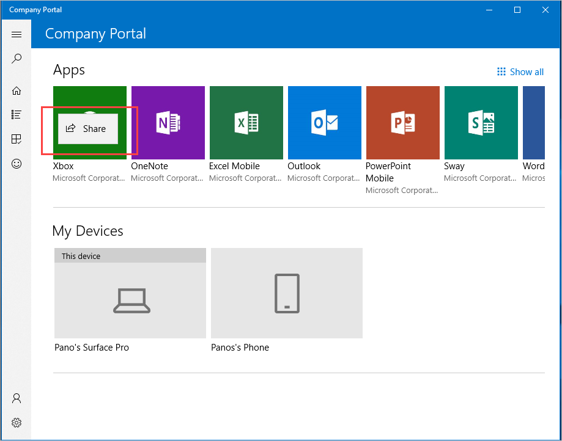

---
# required metadata

title: Installing apps from Intune Company Portal app for Windows
description: Install and share apps from the Company Portal app for Windows
keywords:
author: lenewsad
ms.author: lanewsad
manager: dougeby
ms.date: 11/11/2019
ms.topic: end-user-help
ms.prod:
ms.service: microsoft-intune
ms.subservice: end-user
ms.technology:
ms.assetid:

searchScope:
 - User help

# optional metadata

ROBOTS:  
#audience:

ms.reviewer: 
ms.suite: ems
#ms.tgt_pltfrm:
ms.custom: intune-enduser
ms.collection: 
---

# Install and share apps on your device

Install apps on your device from the Company Portal app for Windows.

## Install apps

1. Open the Company Portal app and sign in with your work or school account.  

    
2. Find and install apps from any of the following sections of the Company Portal app:  

    * **Home**: Select from a list of your organization's featured apps.  
    * **Show all**: From the **Home page** > **Apps** section, click **Show all** to view all available apps.  
    * **All apps**: Select this page in the navigation pane to see all available apps, including installed and featured. View, sort, and filter the apps. Search results are sorted automatically by relevancy.  
    * **App categories**: Select this page in the navigation pane to choose apps based on type or function. Apps are sorted under categories such as **Featured**, **Education**, and **Productivity**.  
    * **Search for apps**: A static search bar sits in the app's navigation pane. To find your available apps, search by app name or publisher.  

3. Select an app.   
4. On the apps details page, click **Install**. After installation is done, you'll see an **Installed** status.  

      
    
        

> [!IMPORTANT]
> If a required app fails to install and your organization makes it available for you to manually install, select **Retry**. It could take up to ten minutes to see the updated status. If you select **Retry** again during this time and get an error, that's okay. Continue to wait the ten minutes for an updated status.   

Depending on the size of your company, you might see multiple versions of Office available to download from Company Portal. For specific information about the Office suite for Windows devices, see [Installing Office 365 on your Windows device](./install-office-windows.md).

## Share apps  
Share and recommend apps to your work or school contacts. The following steps describe how to share a link directly from Company Portal.

1. In Company Portal, right-click or press and hold on any app to open its [context menu](https://docs.microsoft.com//windows/uwp/design/controls-and-patterns/menus).  

      

2. Select **Share**.
3. Choose from individual contacts or select another program, such as OneNote, to send to a group. If you don't see an app you want to use, select **Get apps in Store** to see other available apps.  

     

After you share, the recipient will receive a link and a message to view the app's details. The link opens the Company Portal **App details** page. 

## Optional and required apps
Apps are assigned to you by your organization. Your organization will require you to have some apps and will make other apps optional. To find out which apps are required versus optional, go to **Installed apps** and look under the column **Required by your organization**.  

* Optional apps: These apps are selected by your organization and are appropriate and useful for work or school. They're made available to you but it's up to you whether you want to install them. These are the only kind of apps you'll find in the Company Portal to install. 

* Required apps: These apps are necessary for work and school and are deployed directly to your device. These apps are automatically installed for you without intervention. 

Apps are also made available to you based on your device type. For example, if you're using the Company Portal app for Windows, you'll have access to Windows apps, but not iOS apps.

## Request an app for work or school  
If there's an app you need, but don't see in Company Portal, request it. Find contact details for your **Helpdesk** in the Company Portal app, on the help & support page. You'll find the same contact information on the [Company Portal website](https://go.microsoft.com/fwlink/?linkid=2010980).    

    

## View installed apps  
View a list of all apps installed on your device. The **Installed apps** page lists the following details about each app:

* Name: The name of the app. Optional apps include a link to the **App details** page.
* Assignment type: How the app is assigned and made available to you. 
* Publisher: The name of the developer or company that distributed the app. A publisher is typically a software vendor or your organization.  
* Date Published: The date that the app was made available to download. Publish date could show an app's initial release or an app's most recent update.
* Status: The current installation status of the app on your device. Apps can show as installing, installed, and install failed. Required apps could take up to 10 minutes to show an up-to-date status. See the note under [Install apps](#install-apps) for important details about installing a required app. 

To get to this page, go to the navigation menu and select **Installed apps**.  

Use **Sort by** to rearrange the apps assignment type, publisher, alphabetically by name, or chronologically by publish date. Use **Filter by** to limit the apps you see by installation status.  If no apps are available, you'll see a message that no company apps were installed.  

Need additional help? Contact your company support. For contact information, check the [Company Portal website](https://go.microsoft.com/fwlink/?linkid=2010980).  
