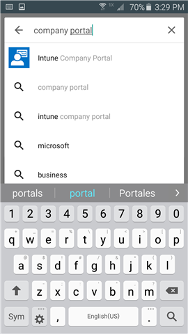

---
# required metadata

title: Install the Company Portal app | Microsoft Docs
description:
keywords:
author: lenewsad
ms.author: lanewsad
manager: dougeby
ms.date: 04/19/2019
ms.topic: article
ms.prod:
ms.service: microsoft-intune
ms.subservice: end-user
ms.technology:
ms.assetid: 68e5a234-4353-4cb9-b869-4f2af5e59f31
searchScope:
 - User help

# optional metadata

ROBOTS:  
#audience:

ms.reviewer: arnab
ms.suite: ems
#ms.tgt_pltfrm:
ms.custom: intune-enduser
ms.collection: 
---
# Install the Company Portal app for Android

The Company Portal is an app that gives you access to your company or school apps, email, and Internet connections. This app helps you keep both your organization's information safe by keeping your device secure - for example, by keeping company apps up-to-date, or making sure your device locks itself after a certain amount of time. To learn more about the features of Company Portal and its part in device management, see [Why enroll your Android device](why-enroll-android-device.md).  

1. Tap **Home** > **Play Store**.

2. In the **Search** box, type **Intune company portal**.  

3. Tap **Intune Company Portal**.

    

4. Tap **INSTALL**.

    

5. Tap **ACCEPT**.

    

After you download the Company Portal app, you'll likely want to [enroll your device in Intune](enroll-device-android-company-portal.md) to get full access to your work information. You can also [sign in using another device](https://docs.microsoft.com/user-help/sign-in-to-the-company-portal#sign-in-from-another-device).  

Still need help? Contact your company support. For contact information, check the [Company Portal website](https://go.microsoft.com/fwlink/?linkid=2010980).
