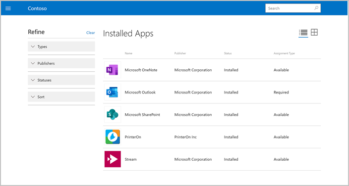

---
# required metadata

title: Manage apps from Intune Company Portal website  
description: Manage and view available and installed apps  
keywords:
author: lenewsad
ms.author: lanewsad
manager: dougeby
ms.date: 12/10/2021
ms.topic: end-user-help
ms.prod:
ms.service: microsoft-intune
ms.subservice: end-user
ms.technology:
ms.assetid:

searchScope:
 - User help

# optional metadata

ROBOTS:  
#audience:

ms.reviewer: 
ms.suite: ems
#ms.tgt_pltfrm:
ms.custom: intune-enduser
ms.collection:
- tier2
---  

# Manage apps from the Company Portal website  

**Applies to:** 
* Android   
* iOS/iPadOS   
* macOS   
* Windows 10/11     

Sign in to the [Company Portal website](https://portal.manage.microsoft.com) to view and manage apps from your organization. 

## View all apps  
From the menu, select **Apps** to see all apps made available by your organization. 

     

This page lists the following details about each app:  

* Name: The name of the app, with a link to the app's details page.
* Publisher: The name of the developer or company that distributed the app. A publisher is typically a software vendor or your organization.  
* Date Published: The date that the app was made available to download. Publish date could show an app's initial release or an app's most recent update.
* Status: The current state of the app on your device, which includes available, installed, and installing. 
* Category: The app's function or purpose, such as featured, engineering, education, and productivity.  

### Viewing apps for Windows devices  
Company Portal doesn't immediately recognize newly added Windows devices. So before you can see your available apps, you have to tell Company Portal which device you're using. To do that: 

1. Sign in to https://portal.manage.microsoft.com/devices.
2. Select **Devices**.
3. Under the list of devices, you'll see a message that prompts you to identify your device. Tap the message. 
4. Select your device on the **What device are you using** screen.   

### Search and refine   

Use the search bar to find apps. Search results are sorted automatically by relevancy.  

     

Select **Refine** to see filter and sort options. Filter the list to show apps with specific criteria, including **Type**, **Availability**, and **Publishers**. Select **Sort** to rearrange the apps by:

* App name, ascending or descending alphabetically 
* Publisher name, ascending or descending alphabetically 
* Publish date, oldest or newest  

## View installed apps  
From the menu, select **Installed Apps** to view a list of all apps installed on your device.  

     

This page lists the following details about each app:  

* Name: The name of the app, with a link to the app's details page.
* Assignment type: How the app is assigned and made available to you. See Available and required apps for more details. Your organization can either make an app available for you to install yourself, or they can require and install an app on your device automatically.  
* Publisher: The name of the developer or company that distributed the app. A publisher is typically a software vendor or your organization.  
* Date Published: The date that the app was made available to download. Publish date could show an app's initial release or an app's most recent update.
* Status: The current installation status of the app on your device. Apps can show as installing, installed, and install failed. Required apps could take up to 10 minutes to show an up-to-date status.  

### Search and refine  

Use the search bar to find apps. Search results are sorted automatically by relevancy.  

     

Select **Refine** to see filter and sort options. Filter the list to show apps with specific criteria, including **Types**, **Publishers**, and **Statuses**. Select **Sort** to rearrange the apps by:

* App name, ascending or descending alphabetically  
* Publisher name, ascending or descending alphabetically  
* Publish date, oldest or most recent  

Need additional help? Contact your company support. For contact information, check the [Company Portal website](https://go.microsoft.com/fwlink/?linkid=2010980).  

### Available and required apps
Apps are assigned to you by your organization, and labeled as either available or required. The **Installed apps** page shows which apps you have under the **Assignment Type** column. 

* Available apps: These apps are selected by your organization, and are appropriate and useful for work or school. They are optional to install, and are the only apps you'll find in the Company Portal to install. 

* Required apps: Your organization might deploy necessary work and school apps directly to your device. These apps are automatically installed for you without intervention. 

Apps are made available to you based on your device type. For example, if you're using the Company Portal website on a Windows device, you'll have access to Windows apps, but not iOS apps.  

## View app details  
Select an app on the **Apps** or **Installed apps** page to view its details. You'll be taken to **App details**, where you'll find the app's description and requirements. If an app isn't already installed on your device, you can install it from this page. 

     

## Device compliance status
View the compliance status of your devices from the Company Portal website. You can navigate to the [Company Portal](https://portal.manage.microsoft.com/devices) website and select the **Devices** page to see device status. Devices will be listed with a status of **Can access company resources**, **Checking access**, or **Can't access company resources**.

## Next steps
Need more help? Contact your company support. For contact information, check the [Company Portal website](https://go.microsoft.com/fwlink/?linkid=2010980).  
