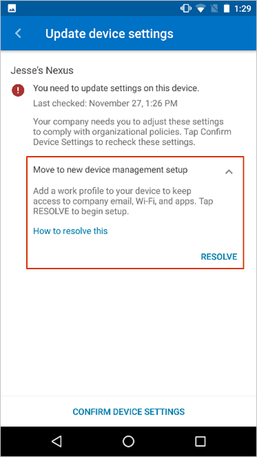
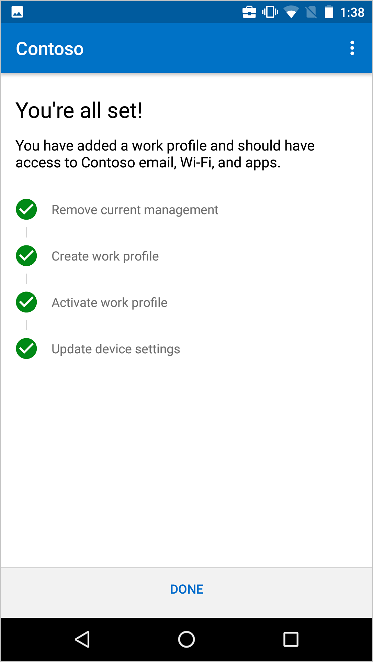

---
# required metadata

title: Move to new device management setup | Microsoft Docs
titlesuffix: Microsoft Intune
description: Move your work device to the new device management setup.
keywords:
author: lenewsad
ms.author: lanewsad
manager: dougeby
ms.date: 07/01/2024
ms.topic: end-user-help
ms.service: microsoft-intune
ms.subservice: end-user
ms.assetid: e0c5993b-3fa5-411e-bae0-93fb66c49bea
searchScope:
 - User help

# optional metadata

ROBOTS:
#audience:

ms.reviewer: esmich
ms.suite: ems
#ms.tgt_pltfrm:
ms.custom: intune-enduser
ms.collection:
- tier2
---
# Move to new device management setup  

If your organization requires you to move to a new device management setup, you'll need to follow the onscreen steps to add an Android work profile. A work profile separates the work data on your device from the personal data. Your school or workplace can manage the work profile, which consists of only school or work-related files and data. They can't see or manage the personal data on your device. 

Complete the steps in this article to set up your work profile. For a more detailed look at the Android work profile enrollment process, see [Enroll device with Android work profile](./enroll-device-android-work-profile.md).  

 1. On the **Update device settings** screen, you'll see a message titled **Move to new device management setup**. Read over the information for a brief explanation of the required change and then tap **RESOLVE**. If you don't see the resolve button, go to Google Play and install the latest version of the Company Portal app.  

      

2. Read over the checklist of steps you'll take to add the work profile. Then tap **BEGIN**. 

      

3. Continue through the guided setup until all steps in the checklist are marked as complete.  

      

Still need help? Contact your company support. For contact information, check the [Company Portal website](https://go.microsoft.com/fwlink/?linkid=2010980).  
