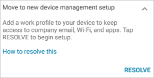
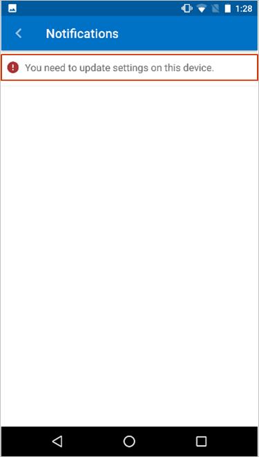
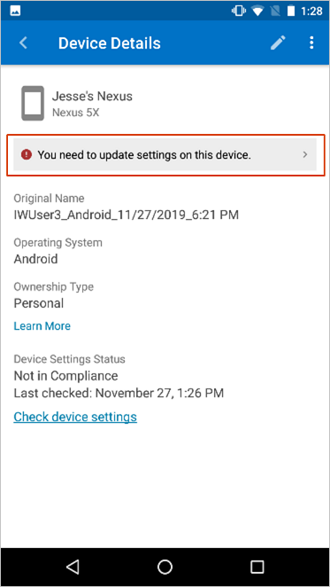
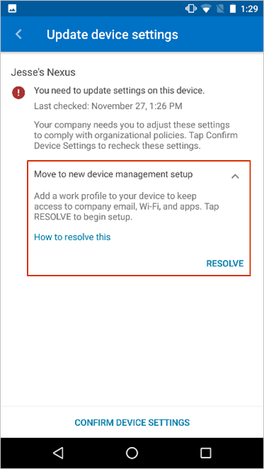
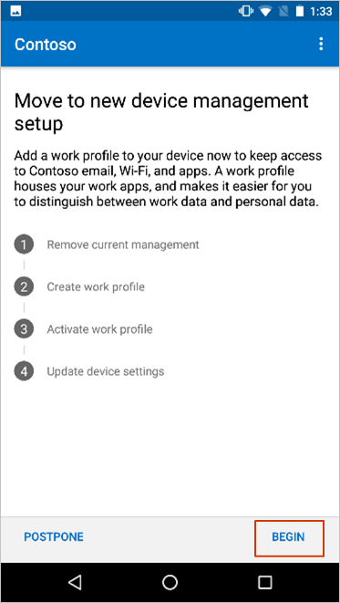

---
# required metadata

title: Move to new device management setup | Microsoft Docs
titlesuffix: Microsoft Intune
description: How to proceed when you're told to move to a new device mangement setup. 
keywords:
author: lenewsad
ms.author: lanewsad
manager: dougeby
ms.date: 03/18/2020
ms.topic: article
ms.prod:
ms.service: microsoft-intune
ms.subservice: end-user
ms.technology:
ms.assetid: e0c5993b-3fa5-411e-bae0-93fb66c49bea
searchScope:
 - User help

# optional metadata

ROBOTS:  
#audience:

ms.reviewer: esmich
ms.suite: ems
#ms.tgt_pltfrm:
ms.custom: intune-enduser; seodec18
ms.collection: 
---
# Move to new device management setup  

If you receive the following message in Company Portal, your organization requires you to move to a new device management setup, which involves adding a work profile to your device. 

The work profile will separate the work data on your device from the personal data. Your organization will manage the work profile, which only consists of school or work-related files and data. Your organization can't see or manage the personal data on your device. 

There are two ways to view the list of settings that need to be updated on your device:
* Company Portal notification: When you receive a notification, tap the flag icon. Then tap the message that says **You need to update settings on this device**.  

      
* Device status: Go to DEVICES and select the first device on the list. Then tap the message that says **You need to update settings on this device**.  

    

Continue through the following steps to set up your work profile. 

 1. On the **Update device settings** screen, you'll see a message titled **Move to new device management setup**. Read over the information for a brief explanation of the required change and then tap **RESOLVE**. If you don't see the resolve button, go to Google Play and install the latest version of the Company Portal app.  

      

2. Read over the checklist of steps you'll take to add the work profile. Then tap **BEGIN**. 

      

3. Continue through the guided setup until all steps in the checklist are marked as complete.  

      

Still need help? Contact your company support. For contact information, check the [Company Portal website](https://go.microsoft.com/fwlink/?linkid=2010980).  
