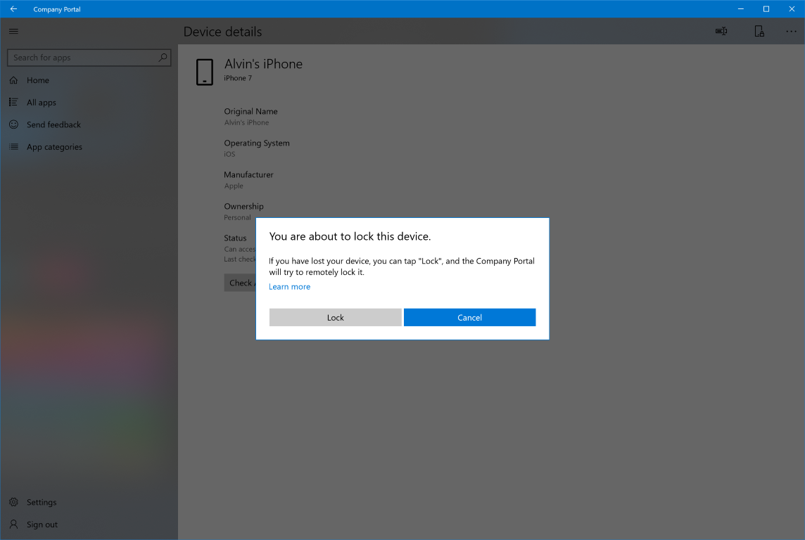

---
# required metadata

title: Remotely lock device in Intune Company Portal app for Windows 
description: Remotely lock a lost or stolen Android, iOS, or macOS device from the Company Portal app for Windows.  
keywords:
author: lenewsad
ms.author: lanewsad
manager: dougeby
ms.date: 11/29/2023
ms.topic: end-user-help
ms.service: microsoft-intune
ms.subservice: end-user
searchScope:
 - User help

# optional metadata
ROBOTS:  
#audience:

ms.reviewer: jieyan
ms.suite: ems
#ms.tgt_pltfrm:
ms.custom: intune-enduser
ms.collection:
- tier2
---

# Lock your device from the Company Portal app for Windows  

Remotely lock a lost or stolen device from the Company Portal app for Windows. This action locks the screen so that no one else can access the work or school data on your device. When you find the device, enter the correct passcode to unlock and use it again. 

## Supported devices

Remote lock is supported on devices running:  

* Android
* iOS
* macOS  
  
## Remote lock device
Complete the following steps to lock a missing device from the Company Portal app.  

1. Sign into the Intune Company Portal app for Windows. 
2. Go to **Devices**.
3. Select the device that you want to lock.
4. Choose **Actions**, and then select **Remote lock**.    
5. Select **Lock** to confirm that you want to lock the device. The app will try to lock your device and redirect you to **Home**.  

     

4. Should you find your device, enter your passcode to unlock it.  

## Next steps

Still need help? Contact your company support. For contact information, check the [Company Portal website](https://go.microsoft.com/fwlink/?linkid=2010980).
