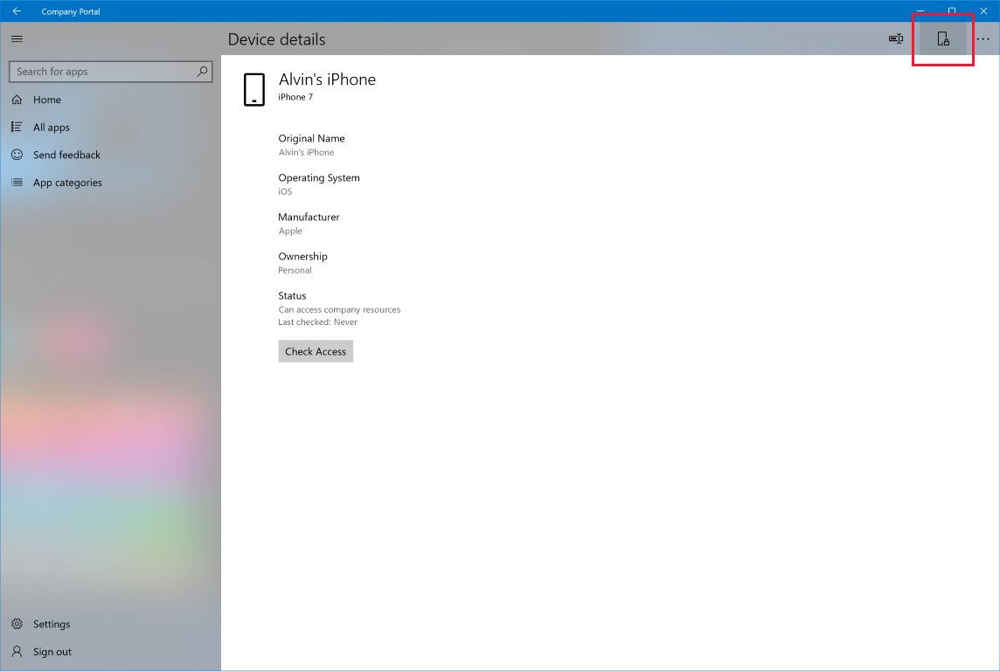

---
# required metadata

title: Remotely lock your device from the Intune Company Portal app
description: Remotely lock a lost or stolen device from the Company Portal app for Windows.
keywords:
author: lenewsad
ms.author: lanewsad
manager: dougeby
ms.date: 10/04/2021
ms.topic: end-user-help
ms.prod:
ms.service: microsoft-intune
ms.subservice: end-user
ms.technology:
searchScope:
 - User help

# optional metadata
ROBOTS:  
#audience:

ms.reviewer: jieyan
ms.suite: ems
#ms.tgt_pltfrm:
ms.custom: intune-enduser
ms.collection:
- tier2
---

# Lock your device from the Company Portal app for Windows  

**Applies to**  
- Windows 10  
- Windows 11  

Remotely lock a lost or stolen device from the Company Portal app for Windows. If supported on your device, this setting locks your device's screen, no matter where the device is. A person must enter the correct passcode before the device can be unlocked and used again.

## Supported devices

Remote lock is supported on devices running:  

* Android
* iOS
* macOS  
  
## Remote lock device
Complete the following steps to lock your device from the Company app.  

1. From the **Home** page of the Company Portal app, go to **My Devices** and select the device that you want to lock.

2. On the **Device details** page, select the **Remote lock** icon.  

     

3. Select **Lock** to confirm that you want to lock the device. The app will try to lock your device and redirect you to the **Home** page.  

     

4. Should you find your device, enter your passcode to unlock it.  

## Next steps

Still need help? Contact your company support. For contact information, check the [Company Portal website](https://go.microsoft.com/fwlink/?linkid=2010980).
