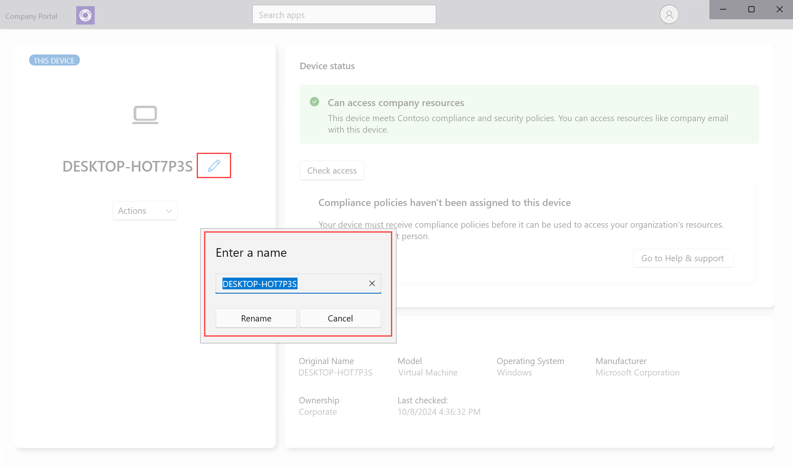

---
# required metadata

title: Rename device in Intune Company Portal app for Windows 
description: Rename your work or school device in the Intune Company portal app for Windows. 
keywords:
author: lenewsad
ms.author: lanewsad
manager: dougeby
ms.date: 10/16/2024
ms.topic: end-user-help
ms.service: microsoft-intune
ms.subservice: end-user
ms.assetid: 
searchScope:
 - User help

# optional metadata

ROBOTS:  
#audience:

ms.reviewer: 
ms.suite: ems
#ms.tgt_pltfrm:
ms.custom: intune-enduser
ms.collection:
- tier2
---

# Rename device from the Company Portal app for Windows  

Rename a device to make it easier to recognize and manage in the Intune Company Portal app. The Company Portal app for Windows lets you rename the following types of connected devices:  

* Windows 10
* Windows 11  
* iOS
* Android  

## Change name in device details   

Select the name of a device in the Company Portal app to edit it directly. After you rename the device, its name immediately changes in the app.    

1. Open the Company Portal app and go to **Devices**.  
2. Select the device you want to rename.
3. Next to the current device name, select the **Edit** pencil icon. Then type in the new name and select **Rename**. 

   > [!div class="mx-imgBorder"]
   >   

## Rename device from Actions menu   

Rename a device via the **Actions** menu in the Company Portal app. 

1. Open the Company Portal app and go to **Devices**.
2. Select the device you want to rename.  
2. Select **Actions** > **Rename**.   
3. Type in a new name and select **Rename**. The device name updates immediately in the app.  

Still need help? Contact your IT support person. For contact information, sign into the Company Portal app or [Company Portal website](https://go.microsoft.com/fwlink/?linkid=2010980) with your work or school account. 

>[!NOTE]
>The rename action in the Company Portal app gives employees and students the chance to rename enrolled devices to something that's easy to recognize. This change only applies to the name in Company Portal, and not to the device name or management name that appears in the Microsoft Intune admin center. If you're an IT administrator and need more information about managing device details in the admin center, see:  
>
>- [Rename a device with Microsoft Intune](../remote-actions/device-rename.md).
>- [View device details with Microsoft Intune](../remote-actions/device-inventory.md#hardware-device-details).
