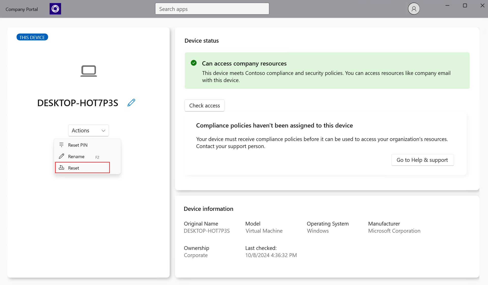
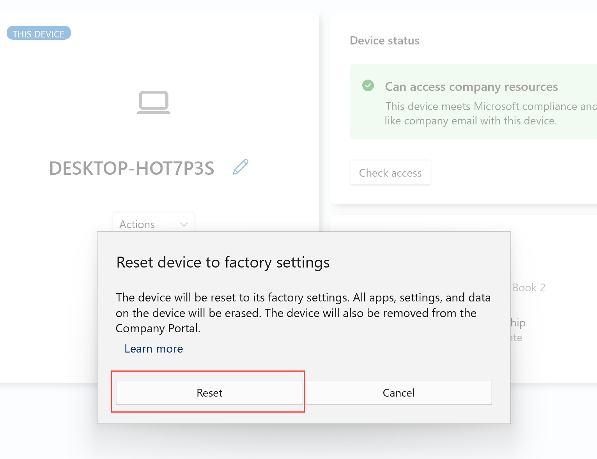

---
# required metadata

title: Reset device from Intune Company Portal for Windows | Microsoft Docs
description: Reset a used, lost, or stolen device in Company Portal for Windows.
keywords:
author: lenewsad
ms.author: lanewsad
manager: dougeby
ms.date: 10/16/2024
ms.topic: end-user-help
ms.service: microsoft-intune
ms.subservice: end-user
ms.assetid: 
searchScope:
 - User help

# optional metadata

ROBOTS:  
#audience:

ms.reviewer: madakeva
ms.suite: ems
#ms.tgt_pltfrm:
ms.custom: intune-enduser; intune-azure
ms.collection:
- tier1
---

# Reset device in Company Portal app for Windows  

Use the Company Portal app for Windows to reset a used, lost, or stolen device back to factory settings. After a reset, all apps, settings, and personal data on the device are deleted, and the device no longer appears in Company Portal.  

The reset option may not be available for every device that appears in Company Portal. Your organization can choose to hide the option.  

## Reset device   
To reset a device to its original, out-of-box settings:  

1. Open the Company Portal app on any managed device and sign in with your work or school account.
2. Select **Devices**, and then select the device you want to reset.  
3. Select **Actions** > **Reset**.    

   > [!div class="mx-imgBorder"]
   >   

4. Select **Reset** to start wiping the device.   

   > [!div class="mx-imgBorder"]
   >  

## Reset limitations  
Company Portal device resets aren't supported on all devices. The feasibility of a reset depends on the Windows version and how your organization configured their policies. This table lists the expected outcomes for various Windows devices and configurations.  

|Device configuration and management|Device type|
|---------------------------------------|---------------|
|Your organization manages your mobile device|**Windows 10/11 and Windows Phone 8.1** Your device no longer appears in Company Portal. Company Portal tries to reset the device back to the manufacturer's default settings. Your personal data, apps, and settings are removed.   **Windows 10 Mobile** The only way to unenroll your device is to reset it.|
|Your device can access company email only|**Windows Phone 8.1** Your device no longer appears in Company Portal. The email that belongs to your work account, and all unsaved emails, are deleted.  **Windows 7 or Windows Vista**  Devices running Windows 7 or earlier, and used exclusively for email, can't be reset.   **Windows 8.1 and Windows 8** Your device no longer appears in Company Portal. The email that belongs to your work account, and all unsaved emails, are deleted.|
|PCs and laptops|**Windows 8.1 and Windows 8**  Devices running Windows 8 or Windows 8.1 can't be reset, unless they're used exclusively for email.  **Windows 7 or Windows Vista** Devices running Windows 7 or earlier can't be reset.|  

Need more help? Contact your IT support person. For contact information, check the [Company Portal website](https://go.microsoft.com/fwlink/?linkid=2010980).  
