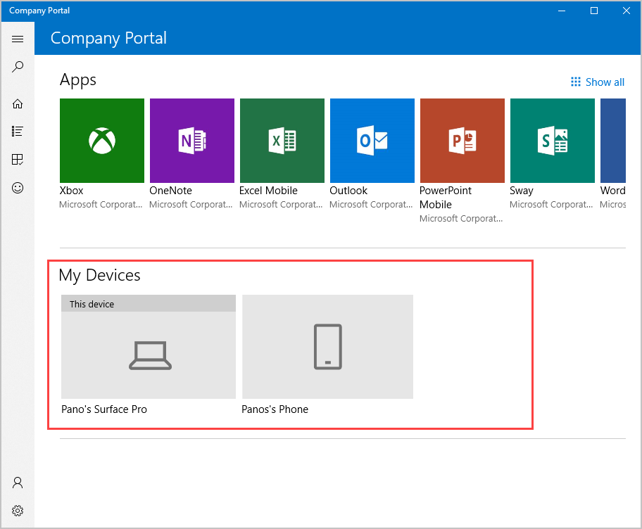
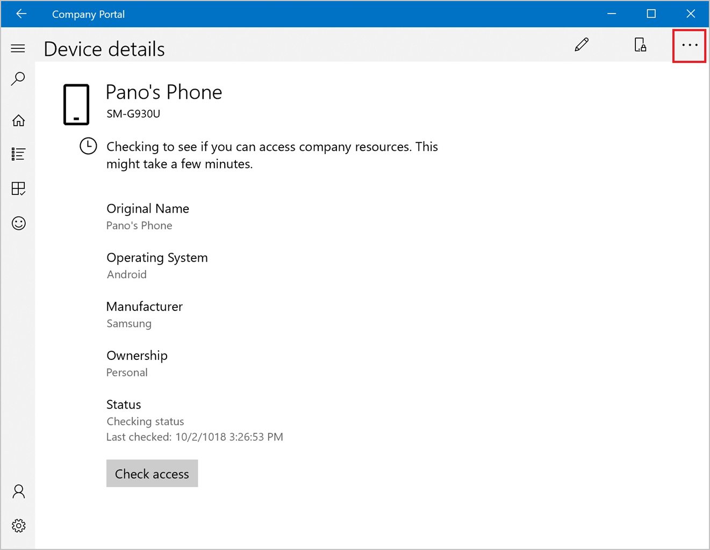
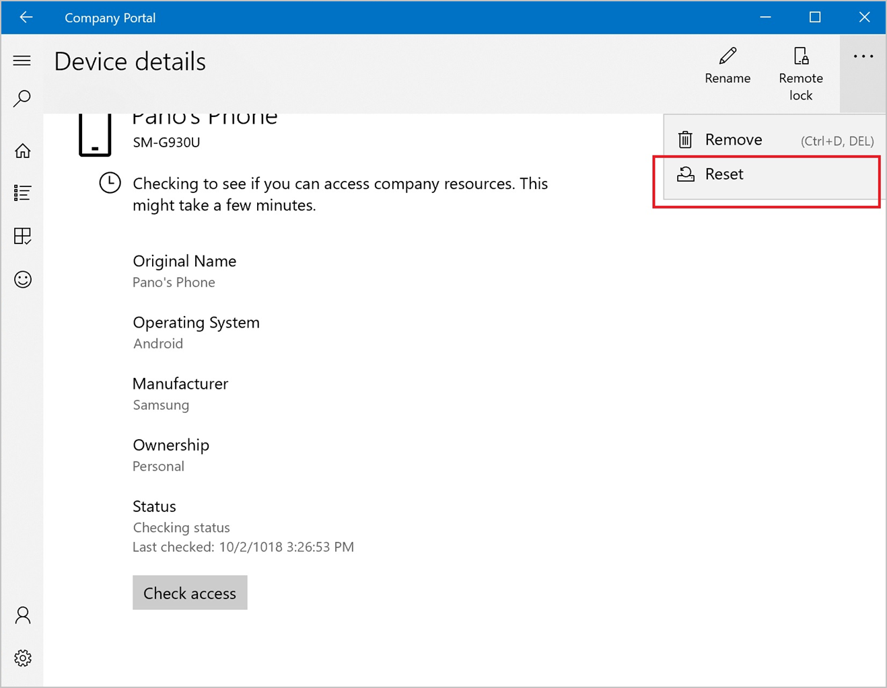
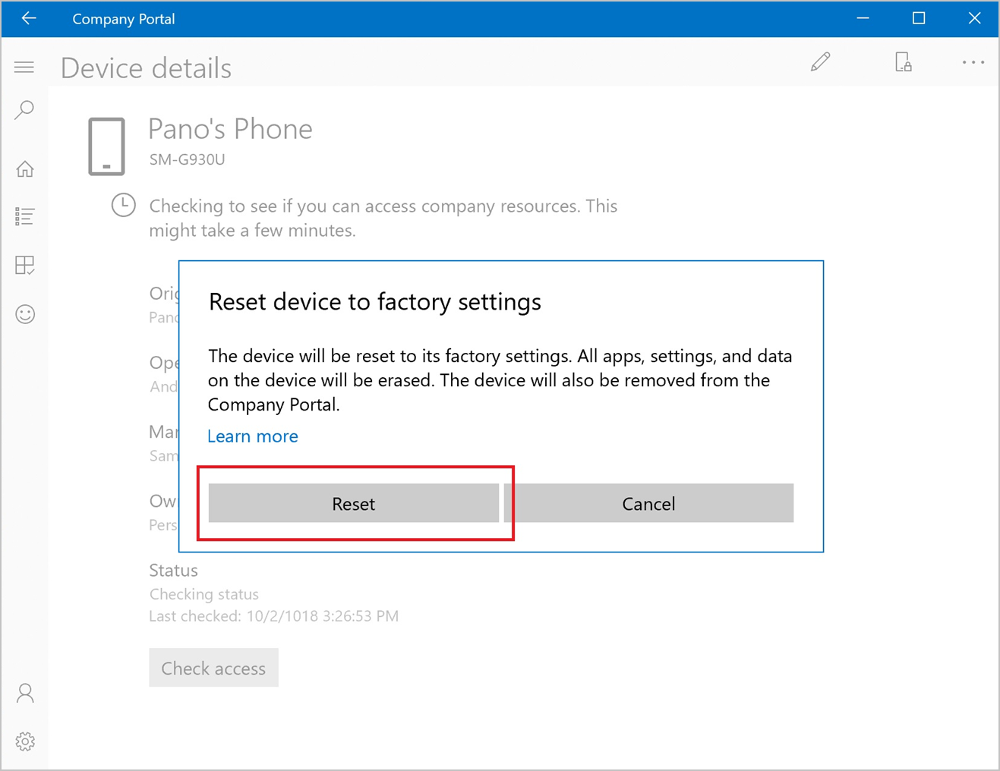

---
# required metadata

title: Reset device from Intune Company Portal app | Microsoft Docs
description: Reset your device to factory settings from Company Portal for Windows 10.
keywords:
author: lenewsad
ms.author: lanewsad
manager: dougeby
ms.date: 03/06/2019
ms.topic: article
ms.prod:
ms.service: microsoft-intune
ms.subservice: end-user
ms.technology:
ms.assetid: 
searchScope:
 - User help

# optional metadata

ROBOTS:  
#audience:

ms.reviewer: jieyang
ms.suite: ems
#ms.tgt_pltfrm:
ms.custom: intune-enduser; intune-azure
ms.collection: 
---

# Reset device from the Company Portal app  

Reset a used, lost, or stolen device to its factory settings from the Company Portal app.  

After you reset a device, it will no longer appear in Company Portal. Its existing apps and files will be erased, and it will be restored to its out-of-box settings.  

1. Open Company Portal.  
2. Under **My Devices**, select the device you want to reset.   

      

3. On the **Device details** screen, select the **See more** menu.  

      

4. Select **Reset**.  

       

5. When prompted to confirm, select **Reset**. The device will reset itself.  

       

Still need help? Contact your company support. For contact information, check the [Company Portal website](https://go.microsoft.com/fwlink/?linkid=2010980).  
