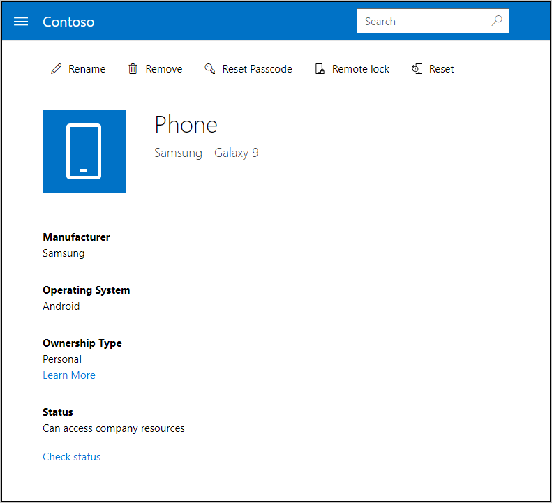

---
# required metadata

title: Reset your device from the Company Portal website | Microsoft Docs
description: Learn how to reset your device to its factory settings from the Company Portal website.
keywords:
author: lenewsad
ms.author: lanewsad
manager: dougeby
ms.date: 09/18/2019
ms.topic: article
ms.prod:
ms.service: microsoft-intune
ms.subservice: end-user
ms.technology:
ms.assetid: d3182a85-328b-45b4-bf7a-9f6249984641
searchScope:
 - User help

# optional metadata

ROBOTS:  
#audience:

ms.reviewer: coferro
ms.suite: ems
#ms.tgt_pltfrm:
ms.custom: intune-enduser
ms.collection: 
---

# Reset device from Company Portal website

Reset a used, lost, or stolen device to factory default settings from the Company Portal website.  

After you reset a device, it no longer appears in the Company Portal. Previously existing apps and files are erased and the device is restored to its factory default settings. 

Device reset in the Company Portal isn't available for all iOS devices. If you're an IT support person and want to find out more about device reset and its limitations, see [Remove devices by using wipe, retire, or manually unenrolling the device](https://docs.microsoft.com/intune/devices-wipe).  

> [!Note]
> You can also perform these steps from another device that you've enrolled. Open the Company Portal app and complete the steps for a similar reset experience. 

1. Open the Company Portal website and select the __Menu__ button > __Devices__.  

2. Select the device you want to reset.

      

3. Select **Reset**. If the reset option isn't visible at the top of your page, select **More (…)** > **Reset**.  

       

      

4. A message warns you that you're about to erase all content on your device. Tap **Reset** to confirm.  

Still need help? Contact your company support. For contact information, check the [Company Portal website](https://go.microsoft.com/fwlink/?linkid=2010980).
