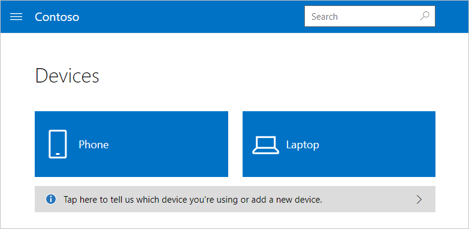
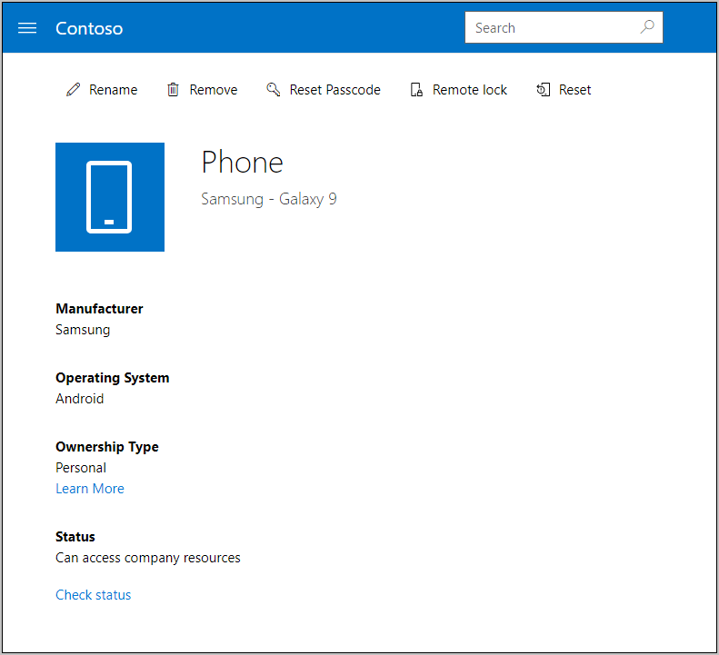
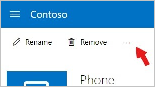
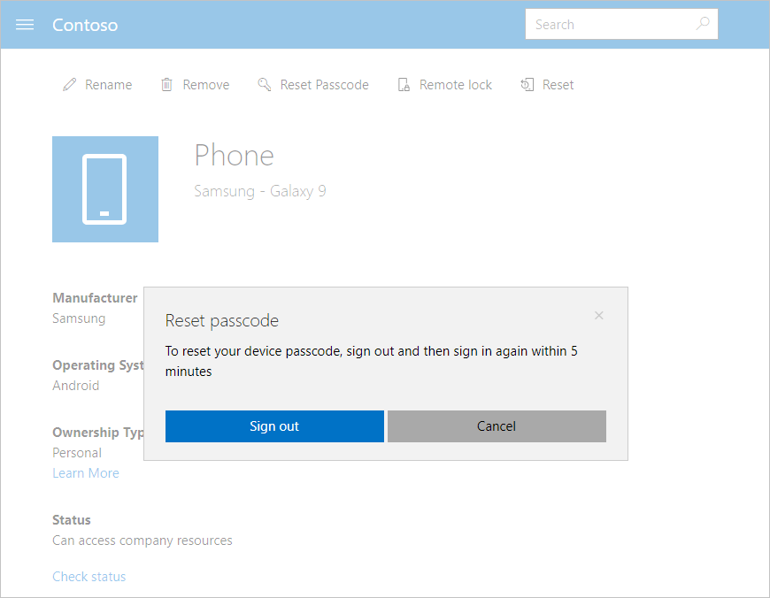
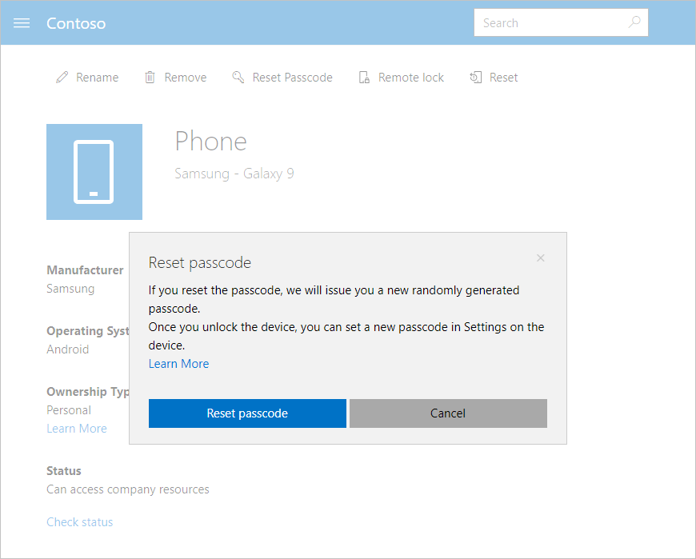

---
# required metadata

title: Reset device passcode from Intune Company Portal website | Microsoft Docs
description: Use the Company Portal website to reset a lost or forgotten device PIN or password. 
keywords:
author: lenewsad
ms.author: lanewsad
manager: dougeby
ms.date: 03/03/2023
ms.topic: end-user-help
ms.prod:
ms.service: microsoft-intune
ms.subservice: end-user
ms.technology:
ms.assetid: 4fa3255b-9d1e-42d5-bd8b-70963dcf2d86
searchScope:
 - User help

# optional metadata

ROBOTS:  
#audience:

ms.reviewer: jieyang
ms.suite: ems
#ms.tgt_pltfrm:
ms.custom: intune-enduser
ms.collection:
- tier2
---

# Reset device passcode from Company Portal website

**Applies to**:  
* Android   
* iOS/iPadOS  

Remotely reset an enrolled device's PIN or passcode. Sign in to the [Company Portal website](https://portal.manage.microsoft.com) on any device to access the *reset passcode* option. The reset passcode option can't be used on all corporate-owned devices. Contact your support person for help if the option is missing and you need to reset a device.  

>[!NOTE]
> Passcode reset doesn't work on these types of devices:  
> * Personal devices that have an Android work profile, running Android 8.0 and later  
> * Dedicated Android Enterprise work devices, such as kiosks, running Android 8.0 and later  
> * Devices utilizing Android device administrator, running Android 8.0 and later   
> 
> If you forget your passcode on one of these devices, the only way to regain access is to reset the whole device to factory settings. 

## Reset your passcode

1. Open the [Company Portal website](https://portal.manage.microsoft.com) and select the __Menu__ button > __Devices__.  

2. Select the device that needs a passcode reset.  

     

3. Select **Reset Passcode**. If the passcode option isn't visible at the top of your page, select **More (…)** > **Reset Passcode**.   

      

      

4. When prompted, click **Sign out**. When prompted again, sign back in. Sign back in to the Company Portal website within five minutes, or Company Portal won't reset the device passcode.  

   > [!NOTE]
   > You must sign back in to confirm your identity. This is to prevent malicious attempts to reset your device passcode.

   

5. A message appears to warn you that the existing device passcode is about to be removed. Click **Reset passcode** to confirm.  
    > [!WARNING]
    > After you reset your passcode, anyone who has physical access to the device will be able to access most personal and corporate information on it. If you don't currently have the device in your possession, don't reset the passcode.  

    

6. If you're resetting the passcode for an iOS device, its existing passcode will be removed. For Android devices, you'll be issued a temporary passcode to unlock the device and set a new passcode. 

   > [!NOTE]
   > You can find the temporary password for Android devices in the Company Portal, under the device's details page. See the section [Set up a new passcode](reset-your-passcode-cpwebsite.md#set-up-a-new-passcode) for more OS-specific passcode descriptions.  
   
7. On your device, go to **Settings** and change the temporary passcode. 

8. A flag appears in the top right of the Company Portal website. Click to read the notification and confirm that the password was successfully reset.  

## Set up a new passcode  

This section describes the passcode reset and the temporary password behavior for each device platform.  

**Android**: Removes the existing passcode and creates a temporary passcode made up of letters and numbers.

**iOS**: Removes the existing passcode and doesn't create a temporary passcode. If you use Touch ID to open your device or make purchases, you must set it up again.  

Still need help? Contact your company support. For contact information, check the [Company Portal website](https://go.microsoft.com/fwlink/?linkid=2010980).  
