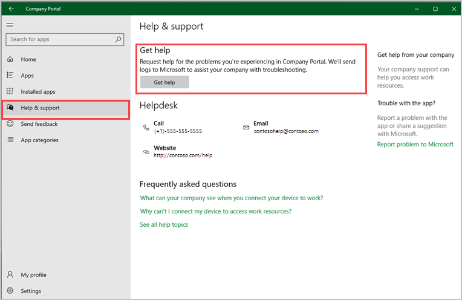
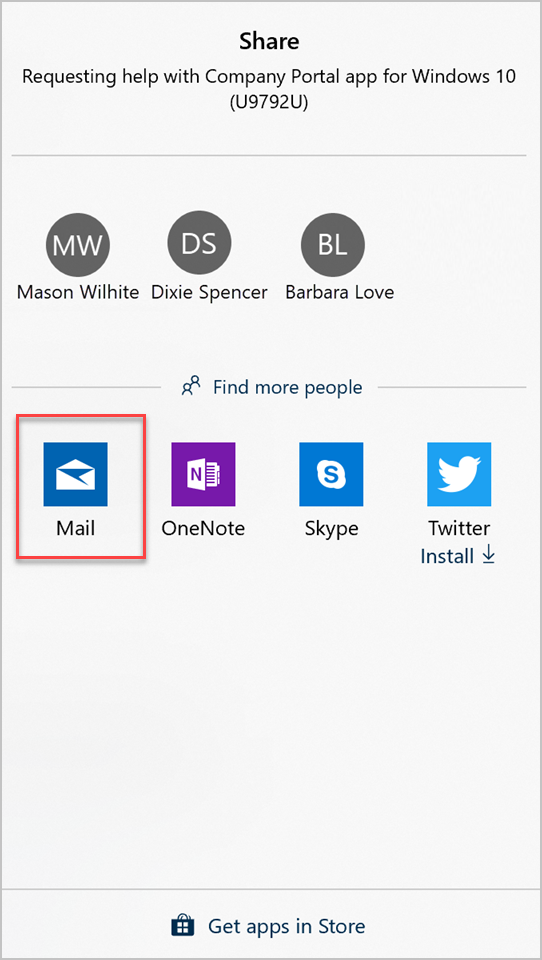
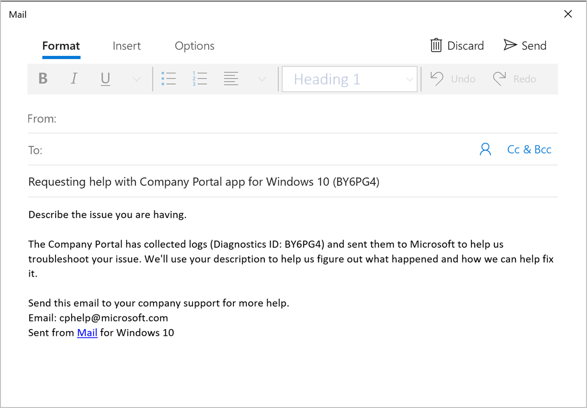

---
# required metadata

title: Report problems in Company Portal app for Windows - Microsoft Intune
description: Learn how to use the Help & Support options to report Company Portal or enrollment problems.
keywords:
author: lenewsad
ms.author: lanewsad
manager: dougeby
ms.date: 11/04/2020
ms.topic: end-user-help
ms.prod:
ms.service: microsoft-intune
ms.subservice: end-user
ms.technology:
ms.assetid: bd428c14-7d75-42de-9322-b57323a01f06
searchScope:
 - User help

# optional metadata

ROBOTS:  
#audience:

ms.reviewer: scottduf
ms.suite: ems
#ms.tgt_pltfrm:
ms.custom: intune-enduser
ms.collection: 
---

# Report a problem in Company Portal    

If you run into a problem while using Company Portal on your device, you can use the in-app **Help & support** options to get help from your IT support person. 

During this process, your Company Portal diagnostic logs are also shared with the Microsoft support team in case the problem requires additional help.   

## How to report problem 
Complete the following steps to report a problem you're experiencing in-app or during device enrollment. 

1. Open the **Company Portal** app.
2. Select **Help & support** > **Get help**. 

       
   
   > [!Note]	  
   > After you click **Get help**, the Company Portal automatically sends your logs to Microsoft's support team. This step is a proactive one that makes it easier to troubleshoot and resolve problems that are escalated to Microsoft support. 

3. When prompted to choose a program, select **Mail** or your preferred email app.   

     
   
4. The email app will open an email template for you to fill in. Type in a description of the problem you experienced so that the support team has an idea of what to look for and then tap **Send**.  

     

## What is a diagnostic log?

Events and errors that occur in the Company Portal app are saved on your device in a special document called a _diagnostic log_. Logs can reveal:  
* When a problem happened.  
* The steps leading up to the problem.  
* The state of the app when the problem appeared.   

## Next steps  

* If your company needs additional information about app or device activity, you might need to resend [logs from the Settings app](send-logs-to-your-it-admin-settings-windows.md). 

* Still need help? Contact your IT support person. For contact information, check the [Company Portal website](https://go.microsoft.com/fwlink/?linkid=2010980).   
