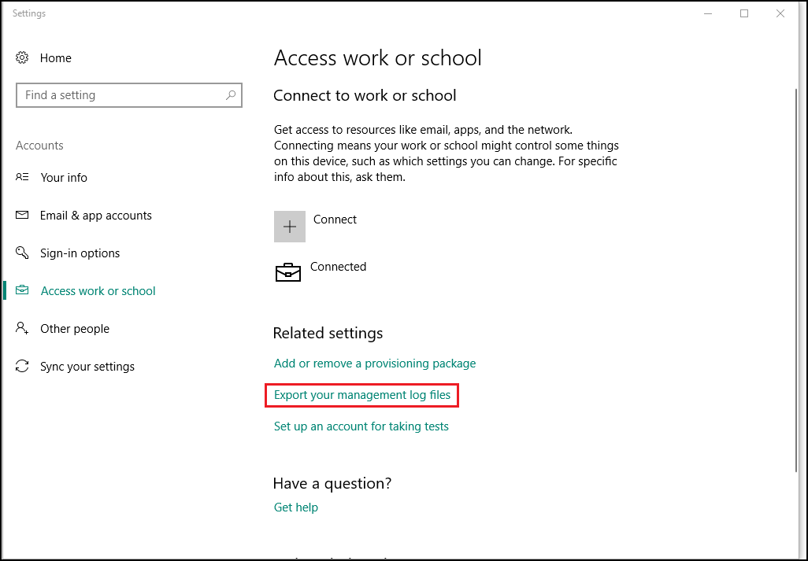

---
# required metadata

title: Export your management log files  
description: Learn how to export diagnostic log files to share with your support person.    
keywords:
author: lenewsad
ms.author: lanewsad
manager: dougeby
ms.date: 10/04/2021
ms.topic: end-user-help
ms.prod:
ms.service: microsoft-intune
ms.subservice: end-user
ms.technology:
ms.assetid: 038747fb-5b52-47c4-a2b6-f9218da4cfe1
searchScope:
 - User help

# optional metadata

ROBOTS:  
#audience:

ms.reviewer: priyar
ms.suite: ems
#ms.tgt_pltfrm:
ms.custom: intune-enduser
ms.collection: 
---

# Export your management log files     

**Applies to**  
- Windows 10  
- Windows 11  

Whenever an an error or event occurs on your device, the details of such events are recorded and saved to a document called a _diagnostic log_. Diagnostic logs can provide your support team with enough information to diagnose and fix problems on your device.  

1. Open the **Settings** app on your device.  
2. Go to **Accounts** > **Access work or school**.  
3. Select **Export your management log files**.  

   

4. Email the logs to your support person. Logs are saved in **C:\Users\Public\Public Documents\MDMDiagnostics**. Two files are created for each log: one is the log itself, and the other is a document that allows your admin to review the logs in different programs, such as Microsoft Excel. Include both files in your email to your support person. 

You can also [send Company Portal app logs](send-logs-to-your-it-admin-cp-windows.md) to your support person. 

Still need help? Contact your support person. For contact information, sign in to the [Company Portal website](https://go.microsoft.com/fwlink/?linkid=2010980).  
