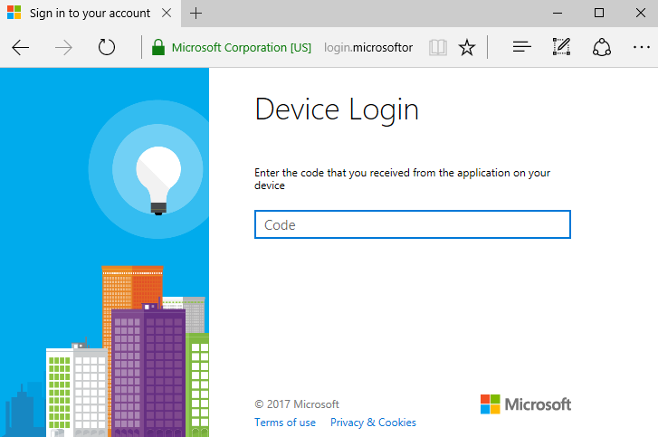

---
# required metadata

title: Get the Intune Company Portal app | Microsoft Docs
description: Learn where to get the Company Portal app and how to sign in.  
keywords:
author: lenewsad
ms.author: lanewsad
manager: dougeby
ms.date: 12/08/2021
ms.topic: end-user-help
ms.prod:
ms.service: microsoft-intune
ms.subservice: end-user
ms.technology:
ms.assetid: cfd214bc-f072-4808-af2e-a3cbf7af9bca
searchScope:
 - User help

# optional metadata

ROBOTS:  
#audience:

ms.reviewer: esmich
ms.suite: ems
#ms.tgt_pltfrm:
ms.custom: intune-enduser
ms.collection: 
---

# Get the Intune Company Portal app   

Microsoft Intune helps organizations manage access to their internal apps, data, and resources. Intune Company Portal is the app that lets you, as an employee or student in your organization, securely access those resources. 

The app is available for desktop (Windows and macOS) and mobile (Android and iOS) devices. You must have a work or school account through your organization to sign in to the app.    

## Install app  
Intune Company Portal is available for Android, iOS, macOS, and Windows. 

### Android  
Install Company Portal for Android from these stores:  

* [Portal AppStore](https://portal.facebook.com/help/467356237073256/)(Opens Portal help documentation)  
* [Google Play](https://play.google.com/store/apps/details?id=com.microsoft.windowsintune.companyportal)  
* [Amazon Appstore for Android](https://www.amazon.com/Microsoft-Corporation-Intune-Company-Portal/dp/B092BCFLBJ/)  

If the app stores listed above are unavailable, or you're using a device that doesn't support Google Mobile Services, you can [download Microsoft Intune Company Portal for Android](https://www.microsoft.com/download/details.aspx?id=49140) on your device and side-load the app. When installed this way, the app doesn't receive updates or fixes automatically. Be sure to regularly update and patch the app yourself.  

Google Play Store is not available in People's Republic of China. You can install the Company Portal app from select Chinese app marketplaces instead. For more information, see [Install Company Portal app in People's Republic of China](install-company-portal-android-china.md).   

### iOS  
Install Company Portal for iOS from the [Apple App Store](https://apps.apple.com/app/intune-company-portal/id719171358).  

### macOS
Install Company Portal for macOS from [Enroll my Mac](https://go.microsoft.com/fwlink/?linkid=853070). Selecting this link will immediately download the Company Portal installer package on your device.  

### Windows  
Install Company Portal for Windows from the [Microsoft Store](https://www.microsoft.com/p/company-portal/9wzdncrfj3pz?rtc=2&activetab=pivot:overviewtab).  

## Sign in to app   

There are three ways to sign in to Company Portal:  

* Sign in with your school or work email address and password.  
* Sign in with certificate-based authentication.  
* Sign in from another device.  

 For the best experience, use the method that your organization recommends or requires. 

### Sign in with school or work account    

1. Open the app and tap **Sign In**.  

2. Enter the email address associated with your school or work account and then tap **Next**.  

3. Enter your password and tap **Sign In**.  

4. Wait while the app verifies your credentials. When done, you can access the features in the app and your organization's resources.  

### Sign in with certificate  
You'll only see this sign-in option if your organization allows certificate-based authentication and you have a certificate available to use.  

1. Open the Company Portal app on your device.  

2. Enter the email address associated with your work or school account and then tap **Next**.   

3. Tap **Sign in with a certificate**.  

4. Tap **Continue** to use the certificate.  
5. Wait while the app verifies your certificate. When done, you can access the features in the app and your organization's resources.  

### Sign in via another device    

If you normally use a smart card to access work resources, follow the steps in this section to sign in to Company Portal.  

1. Open Company Portal on the device you'll be using to access your work resources.  

2. Select **Sign in from another device**.  

3. Write down the one-time, sign-in code that appears on screen (or just keep this screen handy for the next couple steps). 

   

3. Switch to your other device (the one you're using to authenticate) and go to [https://microsoft.com/devicelogin](https://microsoft.com/devicelogin).  

4. When prompted to, enter the code.  

   

4. Select  __Continue__ to allow the Company Portal to sign in on your work device.   

5. Once the screen says that you're signed in to Company Portal, you can close the browser and switch to your work device.  

## App permissions for Android   
The permissions described in this section apply to the Company Portal app for Android and devices running Android, versions 8.0 and later.    

### Storage    
To share diagnostic in the app, you must allow Company Portal access to photos, media, and files on the device. The Intune Company Portal app never accesses photos, media, and files. The permission text is controlled by Google and can't be changed.  

If you approve access, your device can write its data logs to the device SD card. Approval enables logs to be moved via USB cable.  

If you deny access, logs aren't written to the device's SD card. To ignore future messages about this permission, select the checkbox next to **Never ask again** when prompted again.   

To adjust permissions, go to **Settings** > **Apps** > **Company Portal** > **Permissions** > **Storage**.  

### Contacts  
To enroll your Android device with the app, you must allow Company Portal access to your contacts. The Intune Company Portal app never accesses your contacts. The permission text is controlled by Google and can't be changed.  

If you approve access, Intune can create a work account for you and manage the Azure Active Directory identity that's registered to you on your device.   

If you deny access, you can't enroll your device for work. To ignore future messages about this permission, select the checkbox next to **Never ask again** when prompted again.   

To adjust permissions, go to **Settings** > **Apps** > **Company Portal** > **Permissions** > **Phone**.  

### Phone calls  
During enrollment, Company Portal requests permission to make and manage phone calls. The Intune Company Portal app never actually makes or manages calls. The permission text is controlled by Google and can't be changed.  

If you approve access, you allow your device's phone number and IMEI to be shared with Intune. These numbers are reported as hardware details in Intune and visible to your IT admin.    

If you deny access, you can continue to use Company Portal and enroll your device. Your phone number and IMEI number will not be shared or visible to anyone. To ignore future messages about this permission, select the checkbox next to **Never ask again** when prompted again.  

To adjust permissions, go to **Settings** > **Apps** > **Company Portal** > **Permissions** > **Phone**.  

## Windows Information Protection policies 

The following message is a result of a misconfiguration in Microsoft Intune and needs to be resolved by your IT administrator.    

> *Your company support needs to give you access to company resources*  
> Your company is using Windows Information Protection policies to protect your device. Your company support will need to make sure they allow the Company Portal to access those resources.  

If you are an IT admin, you can resolve this by adding Company Portal to the allowed or exempt apps list in your Windows Information Protection (WIP) app protection policy. For more information about WIP in Intune, see [Create and deploy Windows Information Protection (WIP) policy with Intune](/apps/windows-information-protection-policy-create).   

## Next steps  
After you install the app on your device, follow your organization's instructions to set up your device for school or work. For enrollment help, see [Enroll Android device with Intune Company Portal](enroll-device-android-company-portal.md). 

Stuck or need help? Contact your IT support person. For contact information, check the [Company Portal website](https://go.microsoft.com/fwlink/?linkid=2010980).  
