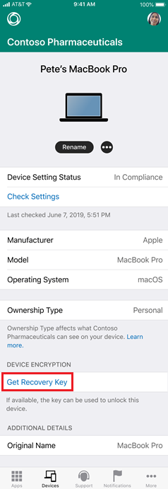

---
# required metadata

title: Store a recovery key   
description: Store and retrieve a recovery key for your managed device.   
keywords:
author: lenewsad
ms.author: lanewsad
manager: dougeby
ms.date: 07/16/2020
ms.topic: end-user-help
ms.prod:
ms.service: microsoft-intune
ms.subservice: end-user
ms.technology:
ms.assetid:

searchScope:
 - User help

# optional metadata

ROBOTS:  
#audience:

ms.reviewer: annochiva
ms.suite: ems
#ms.tgt_pltfrm:
ms.custom: intune-enduser
ms.collection: 
---

# Store a recovery key 

<what the user should do and why they would want to do it> 

<What does this article include information and steps about >

<What will they be able to do after they complete the steps in this article>

## Upload recovery key 

<Complete these steps to benefit reason for uploading recovery key. Mention any caveats and set expectations about what will happen before, during, and after uploading a key.>

1.  
2. 
3. 
4. 
5. 

    

## Retrieve recovery key

### Company Portal website 
###  Company Portal app for iOS

You can retrieve your personal recovery key (FileVault key) using the Company Portal app for iOS. Your device that has the personal recovery key must be enrolled with Intune and encrypted with FileVault through Intune. This option is not available for devices that you've personally encrypted. 

Using the Company Portal app, you can open the Safari web view and retrieve your personal recovery key. 

1. Open Company Portal.
2. Click on **Get recovery key**.

      

The Company Portal website opens in Safari web view and displays the key. 

## IT pro support

If you're an IT support person and want to configure and manage FileVault encryption for macOS devices, see [Use device encryption with Intune](/intune/protect/encrypt-devices).

## Next steps

Find out what else you can do from the Company Portal website. See [Using the Intune Company Portal website](using-the-intune-company-portal-website.md) for the list of actions.  

Still need help? Contact your IT support person. For contact information, check the [Company Portal website](https://go.microsoft.com/fwlink/?linkid=2010980).  
