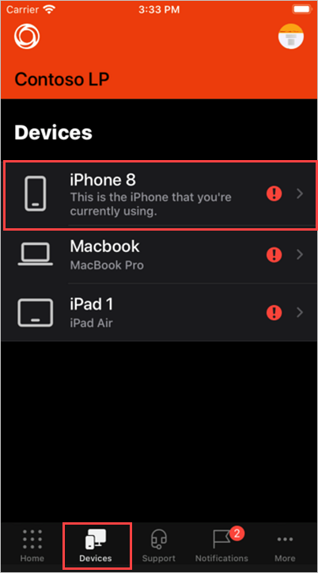
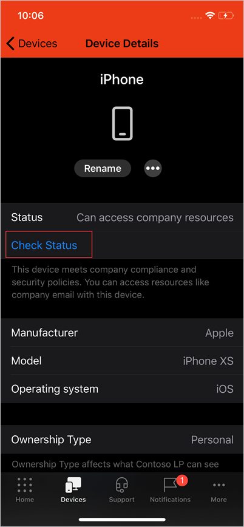
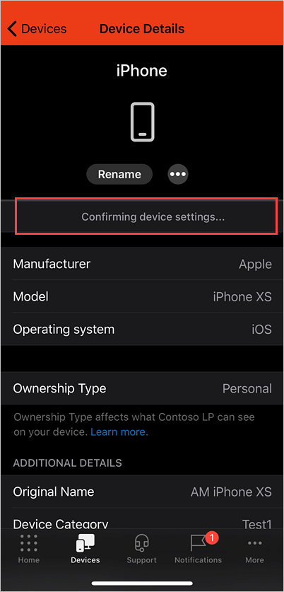

---
# required metadata

title: Manually sync your iOS device | Microsoft Docs
description:
keywords:
author: lenewsad
ms.author: lanewsad
manager: dougeby
ms.date: 06/18/2020
ms.topic: end-user-help
ms.prod:
ms.service: microsoft-intune
ms.subservice: end-user
ms.technology:
ms.assetid: 2780101b-f703-4b78-9d33-f68490b9382d
searchScope:
 - User help

# optional metadata

ROBOTS:  
#audience:

ms.reviewer: esmich
ms.suite: ems
#ms.tgt_pltfrm:
ms.custom: intune-enduser
ms.collection: 
---

# Sync your iOS device manually

Sometimes an app may take too long to download from Company Portal. To fix lags and delays like this, you can try initiating a manual sync. A manual sync forces Company Portal to check in with your device to make sure it's meeting your organization's requirements, and it can also help resolve downloads or other processes in progress.

1. Open the Company Portal app.

2. Tap **Devices**. If you have multiple devices, you'll see a list of devices. Choose the device that you're currently using. If you only have one device, you will go directly to the device details screen.

    

3. Tap **Check Status** to sync your device. 

      

 4. Wait while Company Portal confirms your device status. The status will update onscreen to tell you whether or not you meet your organization's security requirements. 

       

Once you've completed these steps, check to see if your initial problem is resolved. It may help to restart a stalled installation or task now that your device is up-to-date with your organization's requirements. 

Still need help? Contact your company support. For contact information, check the [Company Portal website](https://go.microsoft.com/fwlink/?linkid=2010980).

