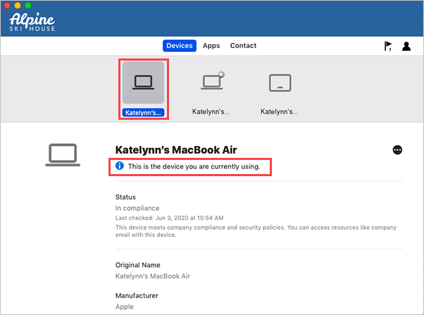
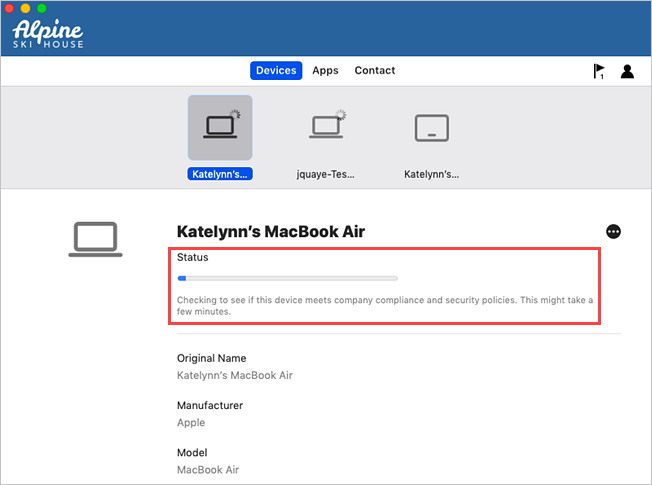

---
# required metadata

title: Manually sync your macOS device with Intune Company Portal
description:  Sync your personal Mac from the Intune Company Portal to get the latest updates and requirements from your organization.  
keywords:
author: lenewsad
ms.author: lanewsad
manager: dougeby
ms.date: 05/31/2022
ms.topic: end-user-help
ms.prod:
ms.service: microsoft-intune
ms.subservice: end-user
ms.technology:
ms.assetid: 
searchScope:
 - User help

# optional metadata

ROBOTS:  
#audience:

ms.reviewer: kakyker
ms.suite: ems
#ms.tgt_pltfrm:
ms.custom: intune-enduser
ms.collection: 
---

# Manually sync macOS device with Intune  

You can force your personal Mac to sync with Intune for the latest updates, requirements, and communications from your organization. The Intune Company Portal app regularly syncs devices when they're connected to Wi-Fi. However, if you ever need to disconnect for an extended period of time, you can use the Company Portal sync feature to reconnect and bring your device up-to-date.  
 
Syncing can also help resolve work-related downloads or other processes that are in progress or stalled. If you're experiencing slow or unusual behavior while installing or using a work app, try syncing your device to see if an update or requirement is missing.  

The sync feature is not available on corporate-owned devices. Contact your support person for help with syncing a corporate-owned Mac.     

## Sync personal Mac  

 To force a sync on your personal Mac:  

1. Open the Company Portal app.

2. Select **Devices**.  
3. If you only have one device, you'll go directly to the device details screen and can skip to step 4. If you have multiple devices, you'll see all devices inline at the top of the page. Select the device that you're currently using. 

    

4. Select **More [...]** and then choose **Check Status** to sync your device. 

      

5. Wait while Company Portal confirms your device status. The status will update onscreen to tell you whether or not you meet your organization's security requirements. 

     

## Next steps
Once you've completed these steps, check to see if your initial problem is resolved. If it's not, it may help to restart the stalled installation or task. 

Still need help? Contact your support person. Sign in to the [Company Portal website](https://go.microsoft.com/fwlink/?linkid=2010980) for your organization's contact information.  

