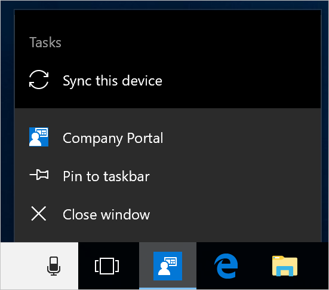
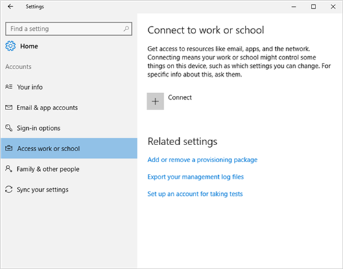
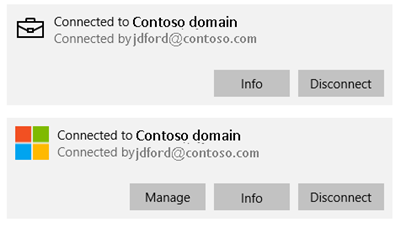

---
# required metadata

title: Sync enrolled device for Windows | Microsoft Docs
description: Sync your enrolled device using the Company Portal app, the Start menu, the task bar, or the Settings app.
keywords:
author: lenewsad
ms.author: lanewsad
manager: dougeby
ms.date: 06/28/2024
ms.topic: end-user-help
ms.service: microsoft-intune
ms.subservice: end-user
ms.assetid: 
searchScope:
 - User help

# optional metadata

ROBOTS:  
#audience:

ms.reviewer: priyar
ms.suite: ems
#ms.tgt_pltfrm:
ms.custom: intune-enduser
ms.collection:
- tier2
---

# Sync enrolled device for Windows 10 or later    

**Applies to**  
- Windows 10  
- Windows 11  

Sync the enrolled device you're using for work to get the latest updates, requirements, and communications from your organization. Company Portal regularly syncs devices as long as you have a Wi-Fi connection. However, if you ever need to disconnect for an extended period of time, you can manually sync the device when you return to get any updates you missed. Syncing can also help resolve work-related downloads or other processes that are in progress or stalled. If you're experiencing slow or unusual behavior while installing or using a work app, try syncing your device to see if an update or requirement is missing.  

This article describes how to start a sync from the:

* Company Portal app
* Windows desktop taskbar or Start menu
* System settings app  

## Sync from Company Portal app for Windows  
Complete these steps to sync a device in the Company Portal app. You can sync devices running Windows 10 with the Creator's Update (1703) or later, and Windows 11.  

1. Open the Company Portal app on your device.

2. Select **Settings** > **Sync**.

      
    
      

## Sync from device taskbar or Start menu   

You can access the Company Portal syncing action from your device's desktop. This way is useful if you have the app pinned directly to your taskbar or Start menu, and want to quickly sync.  

1. Find the Company Portal app icon in your taskbar or Start menu.  
2. Right-click the app's icon so its menu (also referred to as a jump list) appears.  

      

3. Select **Sync this device**. The Company Portal app opens and the sync begins.  

## Sync from Settings app (Windows 10 or later)   
Sync devices running Windows 10 or later from the system Settings app.  
 
1. On your device, select **Start** > **Settings**.

2. Select **Accounts**.  

3. Select the option that matches your onscreen experience.  

    * If your screen shows the **Access work or school** option, jump to [Access work or school steps](#access-work-or-school-steps) in this article.  

        

    * If your screen shows the **Work access** option, jump to [Work access steps](#work-access-steps) in this article.  

### Access work or school steps  

1. Select **Access work or school**.

      

2. Select your work account, which is marked with a briefcase icon or Microsoft logo. 

     

3. Select **Info**. 

4. Select **Sync**. 

### Work access steps

1. Select **Work access**.  
2. Under **Enroll in to device management**, select the account that's associated with your workplace.  
3. Choose **Sync**. The button remains inactive until the sync is complete.  

## Sync from Settings app (Microsoft HoloLens)    
Sync HoloLens running the Windows 10 Anniversary Update (also known as RS1) or later from the system Settings app.  

1. Open the Settings app on your device.  
2. Select **Accounts**.  
3. Select **Work Access**.  
4. Find your connected account, and then select **Sync**.  

## Next steps  

Still need help? Contact your support person. For support information, sign in to the Company Portal app or [Company Portal website](https://go.microsoft.com/fwlink/?linkid=2010980) and go to **Help & support**.  
