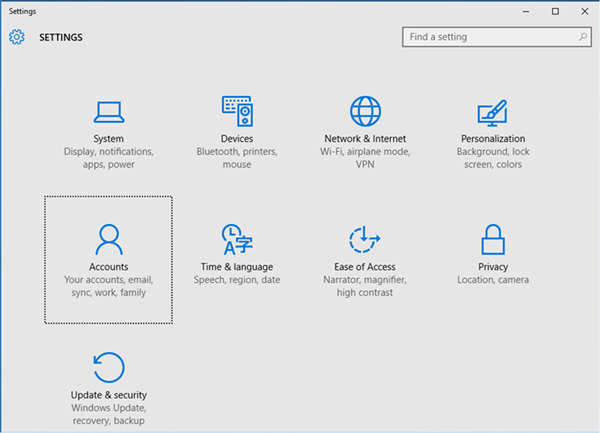

---
# required metadata

title: Manually sync your Windows device | Microsoft Docs
description: Sync your Windows devices using the Company Portal app, the Start menu, the task bar, or the Settings app.
keywords:
author: lenewsad
ms.author: lanewsad
manager: dougeby
ms.date: 10/04/2021
ms.topic: end-user-help
ms.prod:
ms.service: microsoft-intune
ms.subservice: end-user
ms.technology:
ms.assetid: 
searchScope:
 - User help

# optional metadata

ROBOTS:  
#audience:

ms.reviewer: priyar
ms.suite: ems
#ms.tgt_pltfrm:
ms.custom: intune-enduser
ms.collection:
- tier2
---

# Sync your Windows device manually  

**Applies to**  
- Windows 10  
- Windows 11  

Syncing forces your device to connect with Intune to get the latest updates, requirements, and communications from your organization. Company Portal regularly syncs devices as long as you have a Wi-Fi connection. However, if you ever need to disconnect for an extended period of time, you can manually sync to get any updates you missed when you return.   
 
Syncing can also help resolve work-related downloads or other processes that are in progress or stalled. If you're experiencing slow or unusual behavior while installing or using a work app, try syncing your device to see if an update or requirement is missing.  

You can start a sync from the Company Portal app, desktop taskbar or Start menu, and from the device Settings app. Company Portal app functionality is supported on Windows 10 devices running the Creator's Update (1703) or later, and Windows 11.  

All Windows devices can be synced from the device Settings app.  

## Sync from Company Portal app for Windows
Complete these steps to sync your Windows 10/11 device.  

1. Open the Company Portal app on your device.

2. Select **Settings** > **Sync**.

      
    
      

## Sync from device taskbar or Start menu   

You can also access the sync control outside of the app, from your device's desktop. This way is useful if you have the app pinned directly to your taskbar or Start menu, and want to quickly sync.  

1. Find the Company Portal app icon in your taskbar or Start menu.  
2. Right-click the app's icon so its menu (also referred to as a jump list) appears.  

      

3. Select **Sync this device**. The Company Portal app opens to the **Settings** page and initiates your sync.  

## Sync from Settings app 
Complete these steps to manually sync your Microsoft HoloLens and Windows 10 desktop devices from the Settings app.  

### Windows 10 desktop  
1. On your device, select **Start** > **Settings**.

2. Select **Accounts**.

      

3. Multiple versions of Windows 10 exist for desktops. Compare your screen to the screenshots below to determine which set of steps to follow. 

    * If your screen reads **Access work or school**, skip to the steps in [Access work or school](#access-work-or-school-steps).

      

    * If your screen reads **Work access**, skip to the steps under [Work access](#work-access-steps).  

    

### Microsoft HoloLens  
These instructions apply to HoloLens devices running the Windows 10 Anniversary Update (also known as RS1).  

1. Open the Settings app on your device.  

2. Select **Accounts** > **Work Access**.  

      

3. Select your connected account > **Sync**.  

       

#### Access work or school steps  

1. Select **Access work or school**.

      

2. Select the account that has a briefcase icon next to it. If you don't see this account at all, your company may have configured your settings a different way. Instead, select the account that has a Microsoft logo next to it.

     

3. Select **Info**. 

4. Select **Sync**. 

#### Work access steps

1. Select **Work access**.

    

2. Under **Enroll in to device management**, select the name of your company.

    

3. Select **Sync**. The button remains disabled until the sync is complete.

      
    
## Next steps  

Still need help? Contact your company support. For contact information, check the [Company Portal website](https://go.microsoft.com/fwlink/?linkid=2010980).
