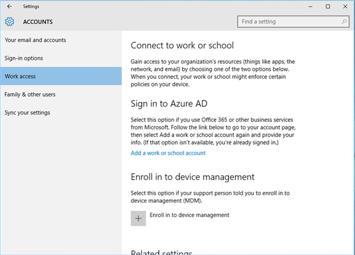

---
# required metadata

title: Sync enrolled device for Windows | Microsoft Docs
description: Sync your enrolled device using the Company Portal app, the Start menu, the task bar, or the Settings app.
keywords:
author: lenewsad
ms.author: lanewsad
manager: dougeby
ms.date: 10/04/2021
ms.topic: end-user-help
ms.prod:
ms.service: microsoft-intune
ms.subservice: end-user
ms.technology:
ms.assetid: 
searchScope:
 - User help

# optional metadata

ROBOTS:  
#audience:

ms.reviewer: priyar
ms.suite: ems
#ms.tgt_pltfrm:
ms.custom: intune-enduser
ms.collection:
- tier2
---

# Sync your Windows device manually  

**Applies to**  
- Windows 10  
- Windows 11  

Sync the enrolled device you're using for work to get the latest updates, requirements, and communications from your organization. Company Portal regularly syncs devices as long as you have a Wi-Fi connection. However, if you ever need to disconnect for an extended period of time, you can manually sync the device when you return to get any updates you missed. 
 
Syncing can also help resolve work-related downloads or other processes that are in progress or stalled. If you're experiencing slow or unusual behavior while installing or using a work app, try syncing your device to see if an update or requirement is missing.  

You can start a sync from the Company Portal app, desktop taskbar or Start menu, and from the device Settings app. Company Portal app functionality is supported on Windows 10 devices running the Creator's Update (1703) or later, and Windows 11.  

All devices running Windows can be synced from the Settings app.  

## Sync from Company Portal app for Windows
Complete these steps to sync your Windows 10/11 device.  

1. Open the Company Portal app on your device.

2. Select **Settings** > **Sync**.

      
    
      

## Sync from device taskbar or Start menu   

You can also access the sync control outside of the app, from your device's desktop. This way is useful if you have the app pinned directly to your taskbar or Start menu, and want to quickly sync.  

1. Find the Company Portal app icon in your taskbar or Start menu.  
2. Right-click the app's icon so its menu (also referred to as a jump list) appears.  

      

3. Select **Sync this device**. The **Settings** page opens in the Company Portal app and the sync begins.  

## Sync from Settings app  
Complete these steps to manually sync devices from the system Settings app.  

### Windows 10   
Sync devices running Windows 10 or later.   
1. On your device, select **Start** > **Settings**.

2. Select **Accounts**.  

3. Select the option that matches your onscreen experience.  

    * If your screen shows the **Access work or school** option, go to [Access work or school](#access-work-or-school-steps) in this article.  

       

    * If your screen shows the **Work access** option, go to [Work access steps](#work-access-steps) in this article.  

       

#### Access work or school steps  

1. Select **Access work or school**.

      

2. Select the account that has a briefcase icon next to it. If you don't see this account at all, your company may have configured your settings a different way. Instead, select the account that has a Microsoft logo next to it.

     

3. Select **Info**. 

4. Select **Sync**. 

#### Work access steps

1. Select **Work access**.

    

2. Under **Enroll in to device management**, select the name of your company.

    

3. Select **Sync**. The button remains disabled until the sync is complete.

      

### Microsoft HoloLens  
Sync HoloLens devices running the Windows 10 Anniversary Update (also known as RS1) or later.  

1. Open the Settings app on your device.  

2. Select **Accounts**. 

      
3. Select **Work Access**.  

3. Find your connected account, and then select **Sync**.  

       
    
## Next steps  

Still need help? Contact your company support. For contact information, check the [Company Portal website](https://go.microsoft.com/fwlink/?linkid=2010980).
