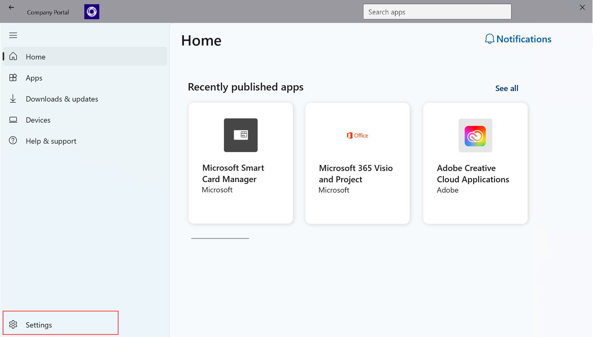

---
# required metadata

title: Turn off Microsoft data collection on Windows device - Microsoft Intune | Microsoft Docs
description: Learn how to turn off Microsoft data collection in the Microsoft Intune and Company Portal apps for Windows. 
keywords: privacy
author: lenewsad
ms.author: lanewsad
manager: dougeby
ms.date: 10/16/2024
ms.topic: end-user-help
ms.service: microsoft-intune
ms.subservice: end-user
ms.assetid: 51f1594d-0283-41d2-b4c3-a7a4ad70b369
searchScope:
 - User help

# optional metadata

ROBOTS:  
#audience:

ms.reviewer: priyar
ms.suite: ems
#ms.tgt_pltfrm:
ms.custom: intune-enduser
ms.collection:
- tier2
---

# Turn off Microsoft data collection on Windows device  

**Applies to**  
- Windows 10  
- Windows 11  

This article describes how to prevent Microsoft from collecting data about your Intune Company Portal usage. To turn off data collection in Company Portal:  

1. Open the Company Portal app and go to **Settings**.  

   > [!div class="mx-imgBorder"]
   >   

1. Under **Usage data**, switch the toggle to **No**.  

   > [!div class="mx-imgBorder"]
   >   

## Allowing Microsoft data collection   

When set to **Yes**, your in-app performance and usage data is automatically collected and shared with Microsoft. This type of data helps us improve the reliability and performance of Microsoft products. If you disable the usage data collection, your organization cannot change your preferences.    

For more information about the data we collect, see [Optional diagnostic data from Intune Client apps](../protect/client-apps-optional-data.md).  

## Next steps  

Still need help? Contact your IT support person. For contact information, check the [Company Portal website](https://go.microsoft.com/fwlink/?linkid=2010980).

