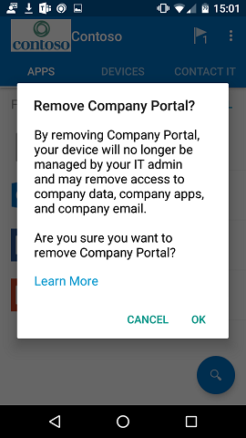

---
# required metadata

title: How to remove your Android device from Intune | Microsoft Docs
description: Remove your Android device from Intune Company Portal
keywords:
author: lenewsad
ms.author: lanewsad
manager: dougeby
ms.date: 04/19/2019
ms.topic: article
ms.prod:
ms.service: microsoft-intune
ms.subservice: end-user
ms.technology:
ms.assetid: f40aab26-7613-48cc-a74e-de83df9465a4
searchScope:
 - User help

# optional metadata

ROBOTS:   
#audience:

ms.reviewer: arnab
ms.suite: ems
#ms.tgt_pltfrm:
ms.custom: intune-enduser
ms.collection: 
---

# Unenroll your Android device from management  

Remove an enrolled Android device so that it's no longer managed by your organization. This article describes how to remove the device from the Company Portal app. After you remove the device:  

* The device loses access to your organization's protected data and resources.
* The device no longer appears in Company Portal.
* You can’t install apps from Company Portal.
* Any settings that were changed on your device when you added it (for example, disabling the camera or requiring a certain password length) no longer apply.  

> [!NOTE]
> You can't unenroll or remove your corporate-owned device from the 
> Microsoft Intune app. The device was enrolled during initial device setup and must be enrolled to access your organization's resources.  

1. In Company Portal, go to the top-right corner and tap the three vertical dots. The action menu opens.

   

2. Tap **Remove Company Portal**.  

3. A message appears with information about what happens after you unenroll your device. Tap **OK** to confirm that you want to remove the device from Company Portal.

   

## Remove data collected by the Company Portal app  

To remove all data that the Company Portal app for Android stores on your device:

- Clear app data by tapping **Applications** > **[*name of app*]** > **Clear data**.
- Delete the following folder: \storage\internal storage\Android\data\com.microsoft.windowsintune.companyportal.

## Uninstall the Company Portal app

Company Portal is a device management app. It can't be uninstalled until you unenroll your device from its management. After that's complete, tap and hold the Company Portal app icon until you see **Uninstall**. Tap **Uninstall** to remove the app from your device.  

Alternatively, tap **Settings** > **Apps** > **Company Portal** > **Uninstall**.  

### Remove the Company Portal app as a device administrator

As a last resort, you can uninstall the app from your device as a device administrator.  

If you have a company-owned device, your organization might require that Company Portal be on your device at all times. If you uninstall it, you might lose access to protected company resources such as email, apps, Wi-Fi, or VPN, until the app is reinstalled. For more information about installing, updating, or removing required apps, see [Add apps to Microsoft Intune](/intune/apps/apps-add#apps-that-are-added-automatically-by-intune).

Here's how to disable Company Portal as a device administrator. The actual names of each setting might vary on your Android device.  

**Option 1**:  

1. Select **Settings** > **Security** > **Additional Security Settings** > **Device Administrators**.  
2. Clear the **Company Portal** selection.  

**Option 2**:

1. Select **Settings** > **Lock screen and security** > **Other security settings** > **Device admin apps**.
2. Clear the **Company Portal** selection.

Still need help? Contact your company support. For contact information, check the [Company Portal website](https://go.microsoft.com/fwlink/?linkid=2010980).
