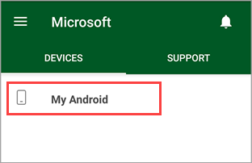
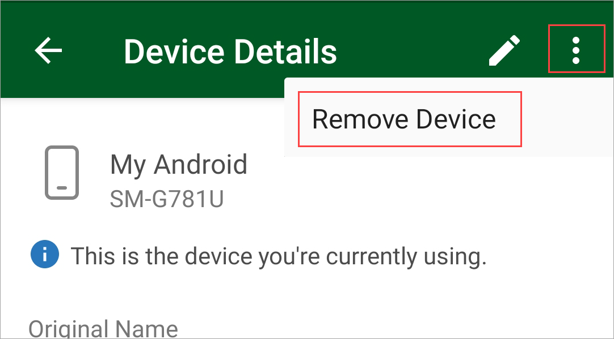
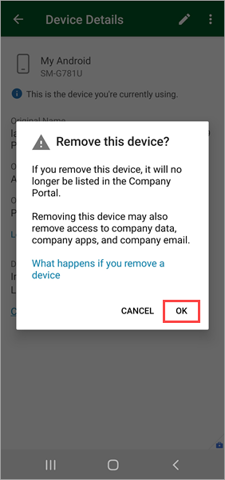
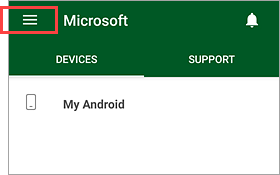
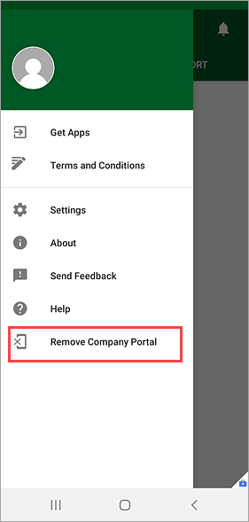
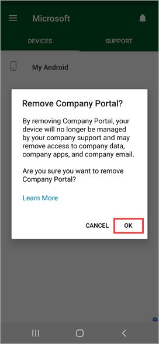

---
# required metadata

title: Remove device from Intune Company Portal for Android | Microsoft Docs
description: Learn how to remove a device from Company Portal for Android and uninstall the Company Portal app.
keywords:
author: lenewsad
ms.author: lanewsad
manager: dougeby
ms.date: 01/25/2021
ms.topic: end-user-help
ms.prod:
ms.service: microsoft-intune
ms.subservice: end-user
ms.technology:
ms.assetid: f40aab26-7613-48cc-a74e-de83df9465a4
searchScope:
 - User help

# optional metadata

ROBOTS:   
#audience:

ms.reviewer: esalter
ms.suite: ems
#ms.tgt_pltfrm:
ms.custom: intune-enduser
ms.collection:
- tier1
---

# Remove device from Company Portal for Android

Remove an enrolled device so that it's no longer managed by your organization. After you remove the device:  

* The device loses access to your organization's internal apps and websites.  
* The device no longer appears in Company Portal.
* You can't install apps from Company Portal.
* Any settings that were changed on your device when you added it (for example, disabling the camera or requiring a certain password length) no longer apply.  
* If your device was set up just so you can receive work emails, your device won't appear in the Company Portal anymore.

> [!NOTE]
> You can't unenroll or remove your corporate-owned device from the 
> Microsoft Intune app. The device was enrolled during initial device setup and must be enrolled to access your organization's resources.  

## Remove device in Company Portal app  
1. Sign in to Company Portal.
2. Select **Devices** and then select the device you want to remove. 

     

3. Select the menu > **Remove Device**.  

      

4. Select **OK** to finish removing your device.  

      

## Disable Company Portal device management 
Another way to remove your device from Intune is to disable the Company Portal app. After you disable the app, you can uninstall it. If you're planning to disable the app temporarily, be aware that you'll need to re-enroll your device when you're ready to use the app again.     

1. Sign in to Company Portal.   
2. Tap the main menu.    

     

3. Tap **Remove Company Portal**.   

     

4. Tap **OK** to remove Company Portal and unenroll the device you're on.  

     

## Uninstall the Company Portal app

Company Portal is a device management app and can't be uninstalled until you remove your device from it. Once that's done, tap and hold the Company Portal app icon until you see **Uninstall**. Tap **Uninstall** to remove the app.    

Alternatively, you can go to **Settings** > **Apps** > **Company Portal** > **Uninstall**.  

## Remove the Company Portal app as a device administrator  

As a last resort, you can remove your device and uninstall the app by removing Company Portal as device administrator. 

For example, if you declined the Microsoft terms of use while initially trying to sign in to the Company Portal app, all subsequent sign-in attempts will be blocked. These steps will help you bypass the Company Portal to remove your device from management.    

The actual names of each setting might vary on your Android device.  

**Option 1**:  

1. Select **Settings** > **Security** > **Additional Security Settings** > **Device Administrators**.  
2. Clear the **Company Portal** selection.  

**Option 2**:

1. Select **Settings** > **Lock screen and security** > **Other security settings** > **Device admin apps**.
2. Clear the **Company Portal** selection.

## Remove data collected by the Company Portal app  

To remove all data that the Company Portal app for Android stores on your device:  

- Clear app data by tapping **Applications** > **[*name of app*]** > **Clear data**.
- Delete the following folder: \storage\internal storage\Android\data\com.microsoft.windowsintune.companyportal.  

### Effects of removing required apps  
If you have a company-owned device, your organization might require that Company Portal be on your device at all times. If you uninstall it, you could lose access to protected company resources such as email, apps, Wi-Fi, or VPN, until the app is reinstalled. For more information about installing, updating, or removing required apps, see [Add apps to Microsoft Intune](/intune/apps/apps-add#apps-that-are-added-automatically-by-intune).

## Next steps  

Still need help? Contact your company support. For contact information, check the [Company Portal website](https://go.microsoft.com/fwlink/?linkid=2010980).
