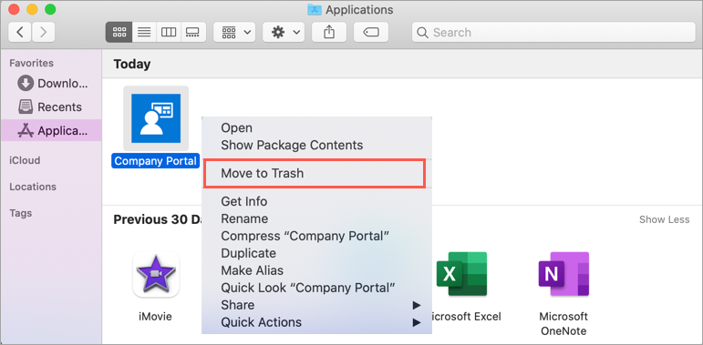

---
# required metadata

title: Unenroll device in Company Portal for macOS app - Microsoft Intune | Microsoft Docs
description: Describes how to unenroll a device in the Company Portal for macOS app.
keywords:
author: lenewsad
ms.author: lanewsad
manager: dougeby
ms.date: 08/25/2021
ms.topic: end-user-help
ms.prod:
ms.service: microsoft-intune
ms.subservice: end-user
ms.technology:
ms.assetid: dd79fc4d-6265-4dd0-87fb-8ab66b1cf692
searchScope:
 - User help

# optional metadata

ROBOTS:   
#audience:

ms.reviewer: elocholi
ms.suite: ems
#ms.tgt_pltfrm:
ms.custom: intune-enduser
ms.collection:
- tier2
---

# Remove device from Company Portal for macOS app

You can use the Company Portal app for macOS to unenroll a device that you no longer need for work or school.

After you remove a device:

- The device is removed from Intune.
- The device loses access to Company Portal features. For example, you can't install apps for the device from the Company Portal.   
- You lose access to internal file shares and websites from your device.  
- You lose access to internal apps on your device.    
- You might be blocked from connecting to your org's network over Wi-Fi or virtual private network (VPN).  
- Work and school email profiles are removed from the device.   
- Device restrictions previously enforced by Intune (for example, disabling the camera or requiring a certain password length) are no longer required. 

This article describes how to remove a device from within the Company Portal app, and then how to uninstall the app.  

## Remove a device   
Follow these steps to remove a device from Company Portal that you no longer need for work or school. For these steps to work, you must still have access to your work or school account.  If you no longer have access to your account, see [Remove management profile](unenroll-your-device-from-intune-macos.md#remove-management-profile) (in this article) to unenroll your device.    

1. Sign in to Company Portal for macOS.
2. Go to **Devices** and select the device you want to unenroll.
3. From the app toolbar, select the **Devices** menu > **Remove**. 
4. When asked to confirm the removal, select **Remove**. The device is immediately removed from Intune.  

After you complete these steps, you can uninstall Company Portal from your device.  

## Remove management profile  
To remove a device after you've left your workplace or school, you have to remove the *management profile* that was installed during enrollment. For steps specific to your version of macOS, see [Remove a configuration profile from your Mac](https://support.apple.com/guide/mac-help/configuration-profiles-standardize-settings-mh35561/mac) on the Apple Support website. After you remove the management profile, you can uninstall Company Portal from your device.  

## Uninstall Company Portal app  
To uninstall the Company Portal app from a macOS device:

1. Open **Finder** > **Applications**. 
2. Select and drag the Company Portal app to **Trash** (located in your dock). Or select the app and then choose **File** > **Move to Trash**.  

      
3. If prompted to, enter your device username and password to confirm the move.  

## Next steps  

If you change your mind and want your access back later, install the Company Portal app and go through device setup again. For detailed instructions, see [Enroll your Mac with Intune Company Portal](enroll-your-device-in-intune-macos-cp.md).  

Still need help? Contact your support person. For contact information, check the [Company Portal website](https://go.microsoft.com/fwlink/?linkid=2010980).
