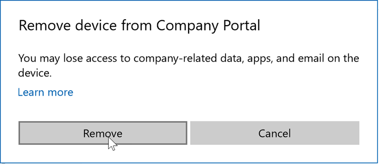

# Remove your Windows device from management

Remove a registered, Windows device from management when you no longer want or need to:  
* Use your device for work or school. 
* Access work or school email, apps, or other resources.

After you unregister the device, you'll lose device access to school or work resources. You can remove the following Windows devices from management.  
* Windows 10 devices 
* Windows 8.1 computer
* Windows 8.1 phone
 
For more information about what happens after you remove your device from management, see [What happens if you remove your device from Intune](what-happens-if-you-unenroll-your-device-from-intune-windows.md).  

## Remove your Windows 10 device
Complete the following steps to remove a Windows 10 device from management.

### Remove in Company Portal app, **Home** page  

1. Open the Company Portal app.
2. On the **Home page**, go down to the **My Devices** section.
3. Select the device you want to remove.
3. In the top, right-corner of the app, select the **See more** icon.
4. Select **Remove**. 
5. To confirm device removal, select **Remove**.  

### Remove in Company Portal app, device context menu  

1. Open the Company Portal app and go to **My Devices**.

    

2. Right-click or press and hold a device to open its [context menu](https://docs.microsoft.com//windows/uwp/design/controls-and-patterns/menus).  

3. Select **Remove**.  

      

5. In the confirmation, click **Learn More** to read how your access to work and school resources might change. To confirm device removal, select **Remove**.   

       

### Remove in device Settings app
1. Open the Settings app. 
2. Go to **Accounts** > **Access work or school**.
3. Select the connected account that you want to remove > **Disconnect**.
4. To confirm device removal, select **Yes**.

## Remove your Windows 8.1 computer
Complete the following steps to remove a Windows 8.1 computer from Intune.

1. Go to **PC Settings** > **Network** > **Workplace**.
2. Under **Workplace Join**, select **Leave**.
3. Under **Turn on device management,** select **Turn off**.
4. On the popup window that opens, select **Turn off**.

## Remove your Windows 8.1 phone
Complete the following steps to remove a Windows 8.1 phone from Intune.

1. Go to **Settings** > **Workplace**.
2. Tap the workplace account that you want to unenroll.
3. Tap **Delete** at the bottom of the screen.
4. On the **Delete account** dialog box, tap **Delete**.  
## Removing your personal information after removing the Company Portal  

There are two kinds of data that the Company Portal stores on your Windows device:

- **Diagnostic logs**: Standard app activity data that Microsoft collects. This is automatically erased when you uninstall the Company Portal app. App activity data is, for example, data about how long the app was open or if the app crashed.
- **Application cache**: Support files that are required for the app to work, such as icons and settings.

To delete the stored logs and cache, complete one of the following steps:

* [Uninstall the Company Portal app](https://support.microsoft.com/help/4028003/windows-10-uninstall-apps-and-programs) 

* Reset the Company Portal app. Open the **Settings** app and select > **Apps** > **Company Portal** > **Advanced options** > **Reset**. 

Still need help? Contact your company support. For contact information, check the [Company Portal website](https://go.microsoft.com/fwlink/?linkid=2010980).
