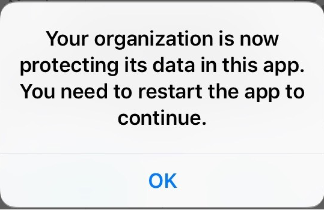
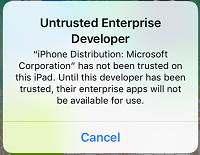
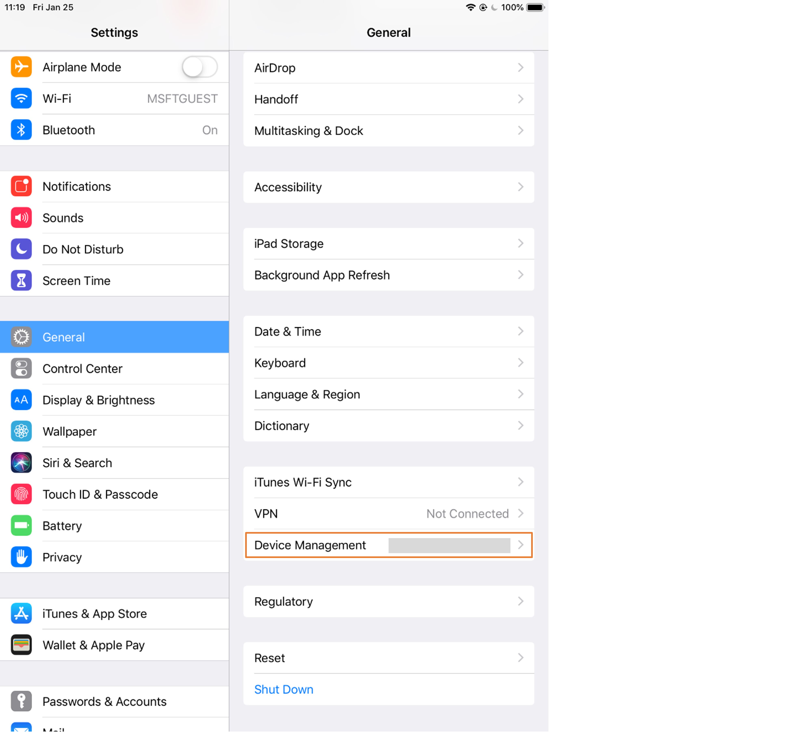

---
# required metadata

title: Get work or school apps for iOS- Microsoft Intune | Microsoft Docs
description: Learn how to get Intune-managed apps for iOS, which protect your data while also helping you stay productive at school or work.  
keywords:
author: lenewsad
ms.author: lanewsad
manager: dougeby
ms.date: 09/25/2020
ms.topic: end-user-help
ms.prod:
ms.service: microsoft-intune
ms.subservice: end-user
ms.technology:
ms.assetid: 3232c5c1-cb9f-45ca-806f-7e74eeb3533e
searchScope:
 - User help

# optional metadata

ROBOTS:  
#audience:

ms.reviewer: maxles
ms.suite: ems
#ms.tgt_pltfrm:
ms.custom: intune-enduser
ms.collection: 
---

# Work or school apps for iOS
Intune-managed apps (*managed* apps for short) are apps that've been configured for you to securely use at work or school. They're specially configured to meet your organization's security requirements and protect internal data. For example, if you're signed in to one of these apps with your work or school account, your org can restrict certain features, such as copy and paste. Or they could restrict you from saving work files to your device's local storage. These types of restrictions prevent proprietary information from being shared outside of the app or org. 

To maximize data protection, your organization might configure several of these apps to work together. For example:  
1. You connect to your organization's network in a managed browser app, such as Microsoft Edge.  
2. You click a link to open a peer's presentation file.  
3. An appropriate managed app, such as Microsoft PowerPoint, opens the file.  

Your org can require you to use a specific app to do something like opening a work file, or accessing a web link. If you don't have the app, you might not be able to do these things. 

## How do I know I'm using a managed app?  
When you sign in or try to access work or school data in a managed app, you'll receive an on-screen message that the app is protected by your organization.   

  

## How do I get work or school apps?  

There are four ways to get these apps:   
* Your organization automatically installs apps to your device at time of enrollment.  
* You install an app from the iOS App Store, and then sign in to the app with your work or school account.    
* Your organization makes managed apps available to you in Company Portal. Go to the Company Portal app or website to search, view, and install available apps. For more information about these apps, see the next section, [Available apps](#available-apps).  

### Apple Volume Purchase Program agreement  
Organizations often purchase iOS app licenses in bulk to accommodate the number of students or employees they have. If you see a message asking you to accept the Apple Volume Purchase Program agreement, this is normal, and you should accept it. If you don't accept it, you won't be able to install the app.  

## Available apps   
 Your organization selects apps that are appropriate and useful for you at work or school. These apps are the only ones you'll find in the Company Portal.   

 Apps are also made available to you based on your device type. For example, if you're using the Company Portal app for iOS, you'll have access to iOS apps, but not Android apps.   

## Request an app for work or school   
 If there's an app you need, but don't see in Company Portal, you can request it. You'll find contact details for your IT support person in the Company Portal **Support** tab. The same contact information is available on the [Company Portal website](https://go.microsoft.com/fwlink/?linkid=2010980).   
 

## What can my org manage in an app?  
The following list describes the settings your IT support person can control within an app. These settings affect how you view, access, and otherwise use work or school data on your device:  

- Access to specific websites

- Transfers of data between apps

- Saving files

- Copy and paste operations

- PIN access requirements

- Sign-in experience, using company credentials  

- Ability to back up to the cloud

- Ability to take screenshots

- Data encryption requirements  

## Approve untrusted enterprise developer  
 By default, your device doesn't trust line-of-business (LOB) apps acquired outside of the App Store, which may prevent your organization's own company apps from being installed. You'll know this is happening if you open an installed LOB app and receive an *untrusted enterprise developer* message. 

  

This section describes how to provide approval for enterprise developer apps in the device management settings on your device. 

1. Upon launching an installed line-of-business app, an "Untrusted Enterprise Developer" message is sent to your device. Select  **Cancel**.
2. Go to **Settings** > **General** > **Device Management**.  

   

3. Select **Management Profile** > **Enterprise app**.
4. Select the developer name.
5. Select **Trust developer name**.  
6. Select **Trust** to confirm approval of the enterprise developer.  

     

## Next steps  

* Contact your IT support person for more information about any apps on your device. For contact information, check the [Company Portal website](https://go.microsoft.com/fwlink/?linkid=2010980).  

* For information about using work or school apps on an Android device, see [Get work or school apps for Android](use-managed-apps-on-your-device-android.md).  
