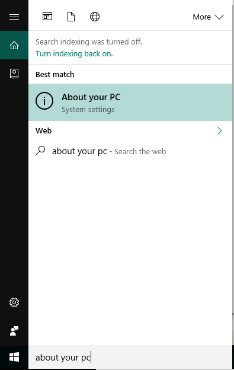

---
# required metadata

title: Identify Windows version - Microsoft Intune | Microsoft Docs  
description: Find out which version of Windows you're running so you can follow the correct Intune enrollment steps.  
keywords:
author: lenewsad

ms.author: lanewsad
manager: dougeby
ms.date: 10/05/2020
ms.topic: end-user-help
ms.prod:
ms.service: microsoft-intune
ms.subservice: end-user
ms.technology:
ms.assetid: 0de5f03a-c288-423b-b9ea-493a39eb715a
searchScope:
 - User help

# optional metadata

ROBOTS:  
#audience:

ms.reviewer: priyar
ms.suite: ems
#ms.tgt_pltfrm:
ms.custom: intune-enduser
ms.collection: 
---

# Identify Windows version for enrollment  

Find out which enrollment steps you need to take to set up your device for work or school. This article will help you identify which version of Windows you're running and point you to the appropriate enrollment steps. It also provides information about how to access Company Portal.   
  

## Get Company Portal
You can enroll Windows 10 devices through the Company Portal website *or* app. If you're enrolling a device with an earlier version of Windows, you must enroll the device through the Company Portal website.  

* Install the app from the [Microsoft Store](https://go.microsoft.com/fwlink/?linkid=2141417).    
* [Sign on to the Company Portal website](https://go.microsoft.com/fwlink/?linkid=2010980) with your work or school credentials.  

If you have any trouble signing in to the app or website, see [Sign in to the Company Portal](./sign-in-to-the-company-portal.md).  

## Supported versions  

Company Portal currently supports devices running the following versions of Windows:

* Windows 10 (Home, Pro, Education, S mode, and Enterprise versions)
* Windows 8.1 RT
* Windows 8.1

Other versions of Windows, such as [Windows 10 Holographic](https://www.microsoft.com/hololens), are supported in the Company Portal. However, these versions are not covered in this article because they are for very specific uses.

## Find Windows 10 version number  
Enrollment steps differ for different versions of Windows 10 devices. The following steps describe how to find the version number on Windows 10 desktop and mobile devices. After you know your version, continue to the recommended enrollment steps.  

### Windows 10 desktop devices  

1. Go to **Start**.

2. In the search bar, type the phrase "about your PC." Select __About your PC__ from the results.  

     

3. Scroll down to **Windows specifications** to find the **Version** of Windows 10 that's installed on your PC.  

     

4. If your version is  

    * __1607 or later__: Enroll your device by way of the [**Settings** > **Account** > **Access work or school** route](enroll-windows-10-device.md#enroll-windows-10-version-1607-and-later-device).   
    * __1511 or earlier__: Enroll your device by way of the [**Settings** > **Account** > **Your accounts** route](enroll-windows-10-device.md#enroll-windows-10-version-1511-and-earlier-device).  

### Windows 10 mobile devices

1. Go to __All apps__ and select the __Settings__ app.
2. Select __System__ > __About__.
3. Under __Device information__, find the __Version__.  
4. If your version is  

    * __1607 or later__: Enroll your device using the [**Settings** > **Access work or school** route](enroll-windows-10-device.md#enroll-windows-10-version-1607-and-later-device).   
    * __1511 or earlier__: Enroll your device using the [**Settings** > **Accounts** route](enroll-windows-10-device.md#enroll-windows-10-version-1511-and-earlier-device).  

## Enroll other Windows devices  
You can enroll [Windows 8.1. or Windows RT 8.1 devices](enroll-your-W81-or-rt81-windows.md) via the Company Portal website. 

## IT administrator support  
If you're an IT administrator and run in to problems while enrolling devices, see [Troubleshooting Windows device enrollment problems in Microsoft Intune](https://support.microsoft.com/help/4469913). This article lists common errors, their causes, and steps to resolve them.  

## Next steps  
Now that you know the supported devices, and your Windows 10 version number, proceed to the recommended enrollment article.  
 
For more information about device management, Company Portal, and how both are used in schools and at work, see the following articles:  
* [Use managed devices to access work or school resource](use-managed-devices-to-get-work-done.md)  
* [What happens when you enroll your device in Intune](what-happens-if-you-install-the-company-portal-app-and-enroll-your-device-in-intune-windows.md)  
* [What information can my organization see when I enroll my device?](what-info-can-your-company-see-when-you-enroll-your-device-in-intune.md)  

Need help? Contact your company support. [Go to the Company Portal website](https://go.microsoft.com/fwlink/?linkid=2010980) to find your organization's IT contact information.  