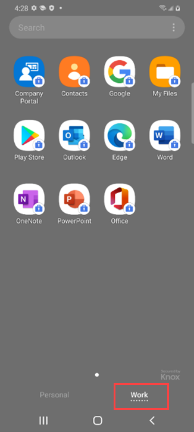
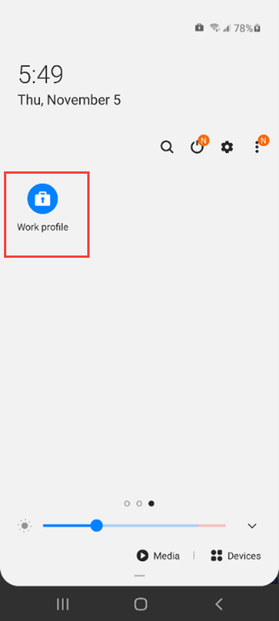
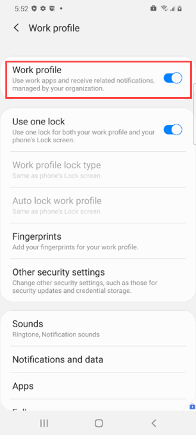

---
# required metadata

title: Introduction to Android work profile - Microsoft Intune | Microsoft Docs
description: Describes how to navigate a work profile and find work apps on your Intune-enrolled device. 
keywords:
author: lenewsad
ms.author: lanewsad
manager: dougeby
ms.date: 11/11/2020
ms.topic: end-user-help
ms.prod:
ms.service: microsoft-intune
ms.subservice: end-user
ms.technology:
ms.assetid: 
searchScope:
 - User help

# optional metadata

ROBOTS:  
#audience:

ms.reviewer: arnab
ms.suite: ems
#ms.tgt_pltfrm:
ms.custom: intune-enduser
ms.collection: 
---

# Introduction to Android work profile

A work profile is set up on an Android device to separate work apps and data from personal apps and data. The work profile lives on a separate part of the device so that your personal things stay private and unaffected by work. In this article, you'll learn how to:  

* Find your work profile. 
* Tell the difference between work apps and personal apps. 
* Get more apps for work.  
* Pause your work profile.  

Your IT support person can only manage the work-related email, apps, settings, and data on your device. They can’t access the personal email, apps, settings, and data. They also can’t reset or wipe your device. 

To learn how to set up a work profile, see [Create a work profile and enroll your device](enroll-device-android-work-profile.md).  

## Access your work profile  
Once you've set up a work profile, your organization can automatically install work apps on your device. 

The location of the work profile varies by device manufacturer and Android version. This section describes where to find the work profile in the app drawer and on the home screen.  

> [!NOTE] 
> If you're using a custom launcher, work apps can appear in places other than the app drawer or home screen folder.    

### App drawer  
Swipe up on the home screen or select **Apps** to access the app drawer. Work apps appear alongside your personal apps or within a **Work** tab in your app drawer.  

  

To see how it appears on other Android devices, see the [examples](what-happens-when-you-create-a-work-profile-android.md#work-profile-in-app-drawer) at the bottom of this article. 

### Folder  
On some devices, work apps are in a work-designated folder on the home screen. This folder is automatically created during setup.  

  

To see how it appears on other Android devices, see the [examples](what-happens-when-you-create-a-work-profile-android.md#work-profile-folder) at the bottom of this article.  

## Identify work apps 
Work apps are marked with a briefcase badge, while personal apps do not have a briefcase badge. Some screen readers and voice assistants identify work apps by saying "work" before the app name.  

|Personal app (no briefcase)|Work app (briefcase)|
|---|---|  
|||  
 

After you've set up the work profile, you may see duplicate appson your device. For example, you could have two Outlook apps. To check your work email, use the version that's marked with the briefcase.  

> [!TIP] 
> For the best experience, always sign in to work apps with your work account, and sign in to personal apps with your personal account. 

The appearance of the briefcase can vary slightly from device to device. To see how it appears on other Android devices, see the [examples](what-happens-when-you-create-a-work-profile-android.md#briefcase-badge) at the bottom of this article.   

## Get more work apps  

Open the work version of the Google Play Store to see all of the apps your organization has made available to you.  

  

Continue to use the work version of the Play Store to search for and install other apps for work.  If you don’t see an app you need for work, you can request it from your IT support person. 

The appearance of the Google Play Store app varies by device manufacturer and Android version, but the work version is always marked with a briefcase.  

## Pause the work profile  

Pause the work profile to take a break from work apps and notifications. Pausing effectively turns off the work profile by disabling work apps and work notifications. 

The location of the pause setting varies by device manufacturer and Android version (Android 7 and later is required). It's commonly found in quick settings, the Settings app, or the app drawer.  

### Quick settings pause option 
Swipe down on your screen to access the quick settings menu. Tap **Work profile** to pause the work profile.   

 

To see how quick settings appear on other Android devices, see the [examples](what-happens-when-you-create-a-work-profile-android.md#pause-in-quick-settings) at the bottom of this article.   

### Settings app pause option 
Open the Settings app and go to **Work profile** settings.Switch the **Work profile** toggle off.   

  

To see how work profile settings appear on other Android devices, see the [examples](what-happens-when-you-create-a-work-profile-android.md#pause-in-settings-app) at the bottom of this article.   

### App drawer pause option 
 Swipe up on the home screen or select **Apps** to access the app drawer. Tap the **Work** tab and then switch the **Work profile** toggle off.  

   

 
## Examples  
This section shows screenshots of how the work profile and its features appear on common Android devices. Those devices are:

* Surface Duo (Android 10)
* Google Pixel 4 (Android 11)
* Samsung Galaxy S20 (Android 10)
* Nexus 5X (Android 8.1.0)

Some features are not available on all devices.   

### Work profile folder
The following table shows examples of the work profile folder that appears on the home screen. 

|Surface Duo (Android 10)|Samsung Galaxy S20 (Android 10)|Nexus 5X (Android 8.1.0)|
|---|---|---|  
||||  

### Work profile in app drawer 
The following examples show how the work profile appears in the app drawer.  

Surface Duo (Android 10)   

   

Google Pixel 4 (Android 11)  

    

Samsung Galaxy S20 (Android 10)   

   

Nexus 5X (Android 8.1.0)    

      

### Briefcase badge  

The following tables shows examples of the briefcase badge.  

|Surface Duo (Android 10)|Google Pixel 4 (Android 11)|
|---|---| 
|||  

|Samsung Galaxy S20 (Android 10)|Nexus 5X (Android 8.1.0)| 
|---|---|  
|| | 

### Pause in quick settings   
The following examples show where the pause option appears in the quick settings menu.

Surface Duo (Android 10)  

   > [!div class="mx-imgBorder"]
   >   

Google Pixel 4 (Android 11)    

   > [!div class="mx-imgBorder"]
   >   

Samsung Galaxy S20 (Android 10)   

   > [!div class="mx-imgBorder"]
   >   

  
Nexus 5X (Android 8.1.0)  

   > [!div class="mx-imgBorder"]
   >   

### Pause in Settings app 
The following examples show where the pause option appears in the Settings app.  

Surface Duo (Android 10)  

   > [!div class="mx-imgBorder"]
   >   

Google Pixel 4 (Android 11)  

   > [!div class="mx-imgBorder"]
   >   

Samsung Galaxy S20 (Android 10)  

   > [!div class="mx-imgBorder"]
   >  

Nexus 5X (Android 8.1.0)   

   > [!div class="mx-imgBorder"]
   >  

### Pause in app drawer   
The following example shows where the pause option appears in the app drawer on a Google Pixel 4 (Android 11).    

   > [!div class="mx-imgBorder"]
   >   

## Next steps   
Still need help? Contact your IT support person. For contact information, check the [Company Portal website](https://go.microsoft.com/fwlink/?linkid=2010980).  
