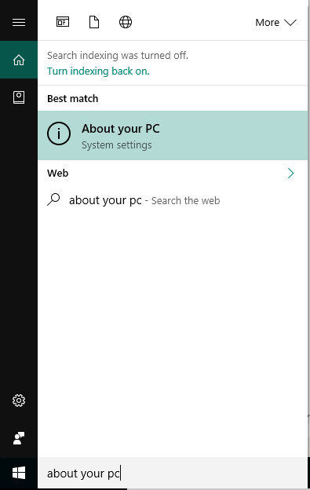
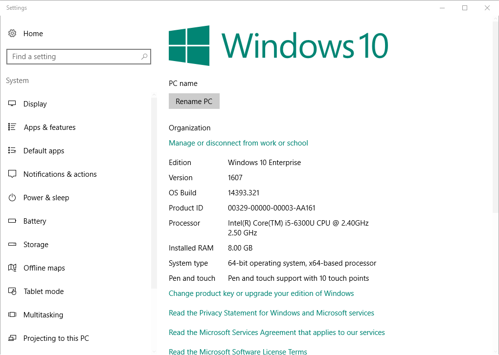

---
# required metadata

title: Windows device enrollment in Intune Company Portal| Microsoft Docs
description: Get started enrolling a Windows device in Company Portal
keywords:
author: lenewsad
ms.author: lanewsad
manager: dougeby
ms.date: 05/24/2019
ms.topic: article
ms.prod:
ms.service: microsoft-intune
ms.subservice: end-user
ms.technology:
ms.assetid: 36250832-c6fd-4e8d-b681-de735023ebc3
searchScope:
 - User help

# optional metadata

ROBOTS:   
#audience:

ms.reviewer: jieyang
ms.suite: ems
#ms.tgt_pltfrm:
ms.custom: intune-enduser
ms.collection: 
---

# Windows device enrollment in Intune Company Portal  

Enroll your Windows device in the Intune Company Portal app to get secure access to work and school apps, emails, and files. If your organization requires or recommends certain apps, such as Office or OneDrive, you'll either receive them during enrollment, or they'll be available in Company Portal after enrollment.  

You can enroll Windows 10 devices through the Company Portal website *or* app. If you're enrolling a device with an earlier version of Windows, you must enroll the device through the Company Portal website.  

## Install Company Portal app  
You might already have the Company Portal app installed on your device. Check for the app in your __All apps__ list.  If you don't see Company Portal in your list of apps, follow these steps to install it.  

1. Open **Microsoft Store** on your device.

2. In the **Search** field, type **Company Portal**.

3. In the list of results, select **Company Portal** > **Install**.

4. Select either **Install** or **Free**. There is no difference between these two options; the words appear based on how your organization set up the app.  

## Find Windows 10 version number  
Enrollment steps differ for different versions of Windows 10 devices. The following steps describe how to find the version number on Windows 10 desktop and mobile devices. After you know your version, continue to the recommended enrollment steps.  

### Windows 10 Desktop devices  

1. Go to **Start**.

2. In the search bar, type the phrase "about your PC." Select __About your PC__ from the results.  

     

3. Scroll down to **Windows specifications** to find the **Version** of Windows 10 that's installed on your PC.  

     

4. If your version is  

    * __1607 or later__: Enroll your device by way of the [**Settings** > **Account** > **Access work or school** route](enroll-windows-10-device.md#enroll-windows-10-version-1607-and-later-device).   
    * __1511 or earlier__: Enroll your device by way of the [**Settings** > **Account** > **Your accounts** route](enroll-windows-10-device.md#enroll-windows-10-version-1511-and-earlier-device).  

### Windows 10 Mobile devices

1. Go to __All apps__ and select the __Settings__ app.
2. Select __System__ > __About__.
3. Under __Device information__, find the __Version__.  
4. If your version is  

    * __1607 or later__: Enroll your device using the [**Settings** > **Access work or school** route](enroll-windows-10-device.md#enroll-windows-10-version-1607-and-later-device).   
    * __1511 or earlier__: Enroll your device using the [**Settings** > **Accounts** route](enroll-windows-10-device.md#enroll-windows-10-version-1511-and-earlier-device).  

## Enroll non Windows 10 devices  
Use the following articles to enroll other supported Windows devices through the Company Portal website:   
* [Windows 8.1. or Windows RT 8.1 device](enroll-your-W81-or-rt81-windows.md)  
* [Windows Phone 8.1 device](enroll-your-wp81-windows.md)    

## IT administrator support  
If you're an IT administrator and run in to problems while enrolling devices, see [Troubleshooting Windows device enrollment problems in Microsoft Intune](https://support.microsoft.com/help/4469913). This article lists common errors, their causes, and steps to resolve them.  

## Next steps  
Now that you know the supported devices, and your Windows 10 version number, proceed to the recommended enrollment article.  
 
For more information about device management, Company Portal, and how both are used in schools and at work, see the following articles:  
* [Use managed devices to access work or school resource](use-managed-devices-to-get-work-done.md)  
* [What happens when you enroll your device in Intune](what-happens-if-you-install-the-company-portal-app-and-enroll-your-device-in-intune-windows.md)  
* [What information can my organization see when I enroll my device?](what-info-can-your-company-see-when-you-enroll-your-device-in-intune.md)  

Need help? Contact your company support. [Go to the Company Portal website](https://go.microsoft.com/fwlink/?linkid=2010980) to find your organization's IT contact information.  
