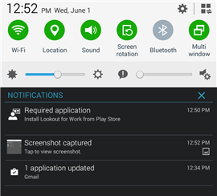
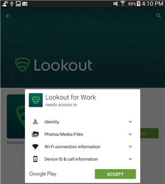

---
# required metadata

title: You need to install Lookout for Work on your Android device | Microsoft Docs
description: Learn how to install Lookout for Work for Android.
keywords:
author: lenewsad
ms.author: lanewsad
manager: dougeby
ms.date: 09/25/2017
ms.topic: end-user-help
ms.prod:
ms.service: microsoft-intune
ms.subservice: end-user
ms.technology:
ms.assetid: 0d357dc0-3e14-43d0-9874-6886ebc847fc
searchScope:
 - User help

# optional metadata

ROBOTS:  
#audience:

#ms.reviewer: heenamac
#ms.suite: ems
#ms.tgt_pltfrm:
ms.custom: intune-enduser
ms.collection: 
---

# Install Lookout for Work

Before you can access your work, your company support needs you to install the Lookout for Work app, which helps to protect your device by finding potential security threats.

If you have trouble with the installation, try the troubleshooting steps at the end of this topic.

## What you need to do

1. Drag down from the top of the screen to open the Notifications bar, and then tap **Required application – Install Lookout for Work from Play Store**.

   

2. You are taken to the Lookout for Work installation page in the Play Store. Install Lookout for Work, and then tap **ACCEPT** to let Lookout for Work access your device.

   

3. Open Lookout for Work, and then tap **ACTIVATE**.

   

4. Tap **Sign in with Azure Active Directory**, and then enter the account that you use to access work or school email and files.

   

5. Select the account that you use to access work or school email and files, and then tap **ADD ACCOUNT**.

   

6. Tap **Accept** to give Lookout for Work permission to sign you in and read your profile. A screen shows that Lookout for Work is connecting to the Lookout Security Cloud.

   

7. Review the items about how Lookout protects your device, and then tap **OK**.

   

   When you see the following screen, Lookout is now set up and connected.

   

   Lookout for Work starts to check right away for security threats on your device. If no threats are found, you'll see the following screen.

   

   The Device Details screen in the Company Portal shows that you are now in compliance with your company's security requirements.

    

   If Lookout for Work finds a security threat on your device, you will see instructions about how to fix the issue.

## If the installation doesn't work

Sometimes installations can fail due to technical issues beyond your control. If this happens, try installing Lookout for Work [manually from the Play Store](https://play.google.com/store/apps/details?id=com.lookout.enterprise).

Still need help? Contact your company support. For contact information, check the [Company Portal website](https://go.microsoft.com/fwlink/?linkid=2010980).

