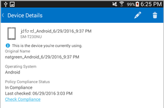

---
# required metadata

title: You need to install Zimperium zIPS on your Android device | Microsoft Docs
description: Learn how to install Zimperium zIPS on your Android device.
keywords:
author: lenewsad
ms.author: lanewsad
manager: dougeby
ms.date: 09/10/2019
ms.topic: end-user-help
ms.prod:
ms.service: microsoft-intune
ms.subservice: end-user
ms.technology:
ms.assetid: eb1884b2-d760-4a14-800b-378a33774a41
searchScope:
 - User help

# optional metadata

ROBOTS:  
#audience:

#ms.reviewer: heenamac
#ms.suite: ems
#ms.tgt_pltfrm:
ms.custom: intune-enduser
ms.collection: 
---

# Install Zimperium zIPS on your Android device

Before you can access your work, your company support needs you to install the Zimperium zIPS app, which helps to protect your device by finding potential security threats.

If you have trouble with the installation, try the troubleshooting steps at the end of this topic.

## What you need to do

1. Drag down from the top of the screen to open the Notifications bar, and then tap **Required application – Install Zimperium from Play Store**. You can also find this inside of the Company Portal app under __Compliance Details__.

2. You are taken to the Zimperium zIPS installation page in the Play Store. Install Zimperium zIPS, and then tap **ACCEPT** to let Zimperium zIPS access your device.

3. Open Zimperium zIPS, and then tap **VERIFY**.

4. Tap **Sign in with Azure Active Directory**, and then enter the account that you use to access work or school email and files.

5. Select the account that you use to access work or school email and files, and then tap **ADD ACCOUNT**.

6. Tap **Accept** to give Zimperium zIPS permission to sign you in and read your profile.

7. Review the items about how Zimperium zIPS protects your device, and then tap **OK**. Zimperium zIPS will take a few moments to set up, then will begin to check for security threats on your device.

8. Zimperium zIPS starts to check right away for security threats on your device.

   * If Zimperium zIPS finds a security threat on your device, you will see instructions about how to fix the issue.

   * If no threats are found, all three threat types will appear green.

11. The **Device Details** screen in the Company Portal shows that you are now in compliance with your company's security requirements.

    

## If the installation doesn't work

Sometimes installations can fail due to technical issues beyond your control. If this happens, try installing Zimperium zIPS [manually from the Play Store](https://play.google.com/store/apps/details?id=com.zimperium.zips).

Still need help? Contact your company support. For contact information, check the [Company Portal website](https://go.microsoft.com/fwlink/?linkid=2010980).
