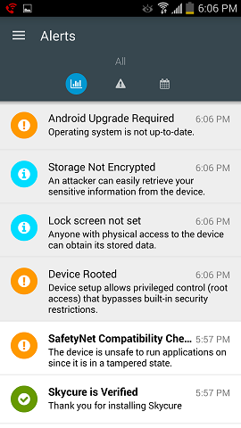

---
# required metadata

title: Resolving threats found by Harmony Mobile Protect on iOS | Microsoft Docs
description: Learn how to fix a threat found by Harmony Mobile Protect for iOS.
keywords:
author: lenewsad
ms.author: lanewsad
manager: dougeby
ms.date: 10/05/2018
ms.topic: end-user-help
ms.prod:
ms.service: microsoft-intune
ms.subservice: end-user
ms.technology:
ms.assetid: 5b2a69e7-cc86-4f1b-81d9-35b8b23b937b
searchScope:
 - User help

# optional metadata

ROBOTS:  
#audience:

#ms.reviewer: heenamac
#ms.suite: ems
#ms.tgt_pltfrm:
ms.custom: intune-enduser
ms.collection: 
---

# Resolve a threat found by Harmony Mobile Protect on iOS

Harmony Mobile Protect is a Mobile Threat Defender service that identifies and assesses potential threats on your iOS devices. It then reports the threats so that you can view them from the Company Portal app. Threats appear to you in the app as unresolved, noncompliant issues. As long as these threats are present, you may be unable to:

* Connect to corporate e-mail
* Connect to corporate Wi-Fi
* Connect to SharePoint Online
* Sync corporate files with OneDrive
* Access company apps

This article describes how to recognize Harmony Mobile Protect threat alerts and what to do to resolve them.  

## Troubleshoot virus or security threat  
If a virus or security threat is detected, Harmony Mobile Protect app acts according to your organization's access policies. Access policies could prevent you from accessing your work's network, apps, and email.  

  
Harmony Mobile Protect will prompt you to take action to regain the access you've lost. Select the threat and follow the instructions within the app to resolve it.

Because the app is integrated with your company's MDM provider, you'll also see a warning about restricted access in the Company portal app. The warning instructs you to open Harmony Mobile Protect to fix the virus or security threat.  

    

## Troubleshoot an app threat  

If you install an app that's seen as a threat to your device, you'll receive a notification within Harmony Mobile Protect. If the affected app remains on your device, you'll be unable to access company resources.  

To resolve, select the app from the list of threats in Harmony Mobile Protect. Then follow the instructions to remove and uninstall the app.  

Still need help? Check in with your company support. You can find their contact information on the [Company Portal website](https://go.microsoft.com/fwlink/?linkid=2010980).  
