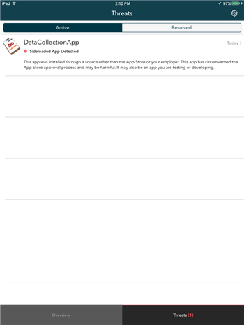

---
# required metadata

title: Resolving threats found by Lookout for Work on iOS | Microsoft Docs
description: Learn how to fix a threat found on your iOS device by the Lookout for Work app.
keywords:
author: lenewsad

ms.author: lanewsad
manager: dougeby
ms.date: 10/05/2018
ms.topic: end-user-help
ms.prod:
ms.service: microsoft-intune
ms.subservice: end-user
ms.technology:
ms.assetid: dd6aec3a-4063-4054-8d0f-d2f2034f0d3d

searchScope:
 - User help

# optional metadata

ROBOTS:  
#audience:

ms.reviewer:  natgreen
#ms.suite: ems
#ms.tgt_pltfrm:
ms.custom: intune-enduser
ms.collection: 
---

# Resolve a threat found by Lookout for Work on iOS

The Lookout for Work app is a Mobile Threat Defender service that identifies potential threats on your iOS device. These threats are reported to the Company Portal app, and appear there as unresolved, noncompliant issues. As long as these threats are present, you may be unable to:

* Connect to corporate e-mail
* Connect to corporate Wi-Fi
* Connect to SharePoint Online
* Sync corporate files with OneDrive
* Access company apps

This article describes how to recognize Lookout for Work threat alerts and what to do to resolve them. 

## Troubleshoot virus or security threat  
Regain access to your company's resources when the Lookout for Work app detects a security or app threat.  

1. If a virus or security threat is detected, you'll receive a message like the one shown in the screenshot below. Tap the **device management portal** link to open the [Company Portal website](https://portal.manage.microsoft.com/devices).  

      

2. Select your device.  
3. Read the warning that appears below your device. It will instruct you to open Lookout for Work to fix the virus or security threat.     

      

## Troubleshoot an app threat   
If you install an app that Lookout for Work identifies as a threat, you'll receive a message like the one shown in the screenshot below.  

    
Select the app name shown at the top of your screen. Then follow the instructions to remove and uninstall the app. As long as the app is on your device, you'll be unable to access company resources.    

Still need help? Check in with your company support. You can find their contact information on the [Company Portal website](https://go.microsoft.com/fwlink/?linkid=2010980).    
