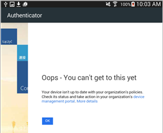
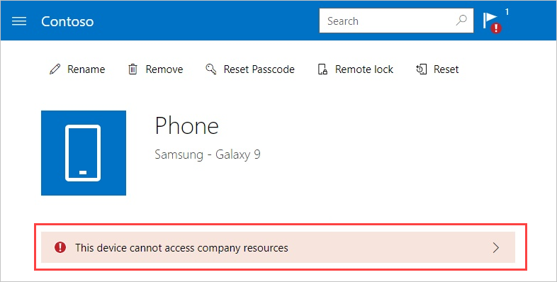

---
# required metadata

title: Resolving threats found by Symantec Endpoint Protection Mobile for Android | Microsoft Docs
description: Learn how to fix threats found on your Android device.
keywords:
author: lenewsad

ms.author: lanewsad
manager: dougeby
ms.date: 08/28/2018
ms.topic: end-user-help
ms.prod:
ms.service: microsoft-intune
ms.subservice: end-user
ms.technology:
ms.assetid: b5521762-a80c-4630-ae30-38b471da216b

searchScope:
 - User help

# optional metadata

ROBOTS:  
#audience:

ms.reviewer: heenamac
#ms.suite: ems
#ms.tgt_pltfrm:
ms.custom: intune-enduser
ms.collection:
- tier2
---

# Resolve a threat found by Symantec Endpoint Protection Mobile on Android

Symantec Endpoint Protection (SEP) Mobile is a Mobile Threat Defender service that identifies potential threats on your Android devices. These threats are reported to the Company Portal app, and appear as unresolved, noncompliant issues. If your device is identified as being noncompliant, you may be unable to:

* Connect to corporate e-mail
* Connect to corporate Wi-Fi
* Connect to SharePoint Online
* Sync corporate files with OneDrive
* Access company apps

This article describes how to recognize SEP Mobile threat alerts and what to do to resolve them. 

## Resolve virus or security threat  

1. When you attempt to access company email or websites, you'll receive a message like the one shown in the screenshot below. Tap the **device management portal** link to open the [Company Portal website](https://portal.manage.microsoft.com/devices).

      

2. Select your device.  
3. Read the warning that appears below your device. It will instruct you to open SEP Mobile to fix the virus or security threat.     

    

## Resolve an app threat  

If you install an app that's seen as a threat to your device, you'll receive a notification within the SEP Mobile app. If the affected app remains on your device, you'll be unable to access company resources.  

To resolve, select the app from the list of threats in SEP Mobile. Then follow the on-screen instructions to remove and uninstall the app.  

Still need help? Contact your company support. For contact information, check the [Company Portal website](https://go.microsoft.com/fwlink/?linkid=2010980).  
