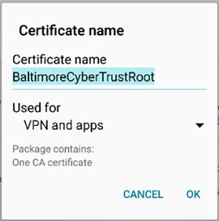

---
# required metadata

title: Your device is missing a certificate | Microsoft Docs
description:
keywords:
author: lenewsad
ms.author: lanewsad
manager: dougeby
ms.date: 01/04/2017
ms.topic: article
ms.prod:
ms.service: microsoft-intune
ms.subservice: end-user
ms.technology:
ms.assetid: df973b18-9166-417d-8aa3-49edd2bda256
searchScope:
 - User help

# optional metadata

ROBOTS: NOINDEX, NOFOLLOW   
#audience:

ms.reviewer: arnab
ms.suite: ems
#ms.tgt_pltfrm:
ms.custom: intune-enduser
ms.collection: 
---

# Your Android device is missing a certificate that usually comes installed on your phone

If your device isn’t enrolled in Intune, and it’s missing a certificate that usually comes installed on your phone, you won’t be able to sign in to the Company Portal app. When you try to sign in, you’ll see the following message:

You can fix this issue by getting the required certificate from [Digicert's certificate page](https://www.digicert.com/digicert-root-certificates.htm).

1. Find and download the __Baltimore CyberTrust Root__ certificate. You can also download it directly from [here](https://www.digicert.com/CACerts/BaltimoreCyberTrustRoot.crt).

2. Drag down from the top of the screen to display the list of your recent notifications, and tap **BaltimoreCyberTrustRoot.crt**.

3. Your device will ask you to **Name the Certificate**. Do not change the default certificate name that appears.

4. Ensure that **Credential Use** is set to **Used for VPN and apps**, and then tap **OK**.

    

5. Close your browser and the Company Portal app.

6. Reopen the Company Portal app. You should now be able to sign in to the Company Portal app. If you still cannot use the Company Portal app, contact your company support using the information provided on the [Company Portal website](https://go.microsoft.com/fwlink/?linkid=2010980) for further instructions.

>[!NOTE]
> If installing this certificate doesn't solve the issue, and you see a different "missing certificate" message, you will need to take additional steps to [install the missing certificate](your-device-is-missing-an-IT-required-certificate-android.md).

Still need help? Contact your company support. For contact information, check the [Company Portal website](https://go.microsoft.com/fwlink/?linkid=2010980).
