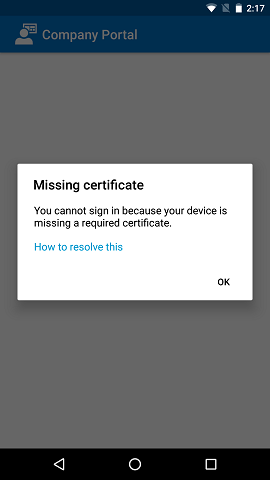

---
# required metadata

title: Install missing required certificate
description: If your device isn't enrolled in Intune, and it's missing a required certificate, you won't be able to sign in to the Company Portal app.
keywords:
author: lenewsad
ms.author: lanewsad
manager: dougeby
ms.date: 08/25/2020
ms.topic: end-user-help
ms.prod:
ms.service: microsoft-intune
ms.subservice: end-user
ms.technology:
ms.assetid: f0ba4cbb-ef0a-4335-86bf-f1d006867fa2
searchScope:
 - User help

# optional metadata

ROBOTS:
#audience:

ms.reviewer: arnab
ms.suite: ems
#ms.tgt_pltfrm:
ms.custom: intune-enduser
ms.collection: 
---

# Install missing certificate required by your organization  

If your device isn't enrolled in Intune, and it's missing a required certificate, you won't be able to sign in to the Company Portal app. When you try to sign in, you'll see the following message:

This article describes how to enable browser access in the Company Portal app so that you can download the required certificate and get your device enrolled. 

## Enable browser access
Complete these steps to enable browser access. After you've enabled access, Company Portal will install the appropriate certificate and continue enrollment.    

1. In the Company Portal app, go to the right-hand corner and select the menu.  
2. Select **Settings**.  
3. Next to **Enable Browser Access**, select **Enable**.  
4. On the Device Administrator screen, select **ACTIVATE**.  

## Next steps  
If you receive the missing certificate message again, and you've already gone through these steps, contact your IT support person for further help. They can help you identify and install the correct certificate. Your organization's contact information is available from the [Company Portal website](https://go.microsoft.com/fwlink/?linkid=2010980).  

