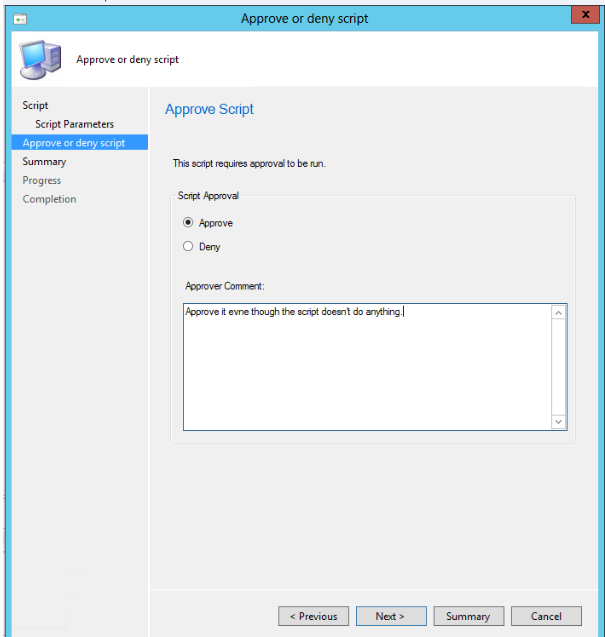

# Create and run PowerShell scripts from the Configuration Manager console

*Applies to: System Center Configuration Manager (Current Branch)*

>[!TIP]
>Introduced with version 1706, the ability to run PowerShell scripts is a pre-release feature. To enable scripts, see [Pre-release features in System Center Configuration Manager](/sccm/core/servers/manage/pre-release-features).

We've now better integrated the ability to run Powershell scripts with System Center Configuration Manager. Powershell has the benefit of creating sophisticated, automated scripts that are understood and shared with a larger community. The scripts simplify building custom tools to administer software and let you accomplish mundane tasks quickly, allowing you to get big jobs done more easily and more consistently.

With this integration in System Center Configuration Manager, you can use the *Run Scripts* functionality to do the following:

- Create and edit scripts for use with System Center Configuration Manager.
- Manage script usage through roles and security scopes. 
- Run scripts on collections or individual on-premises managed Windows PCs.
- Get rapid aggregated script results from client devices.
- Monitor script execution and view reporting results from script output.

>[!WARNING]
>Given the power of scripts, we remind you to be intentional and careful with their usage. We have built in additional safeguards to assist you; segregated roles and scopes. Be sure to validate the accuracy of scripts before running them and confirm they are from a trusted source, to prevent unintended script execution. Be mindful of extended characters or other obfuscation and educate yourself about securing scripts.

## Prerequisites

- To run PowerShell scripts, the client must be running PowerShell version 3.0 or later. However, if a script you run contains functionality from a later version of PowerShell, the client on which you run the script must be running that version of PowerShell.
- Configuration Manager clients must be running the client from the 1706 release, or later in order to run scripts.
- To use scripts, you must be a member of the appropriate Configuration Manager security role.
- To import and author scripts - Your account must have **Create** permissions for **SMS Scripts** in the **Full Administrator** security role.
- To approve or deny scripts - Your account must have **Approve** permissions for **SMS Scripts** in the **Full Administrator** security role.
- To run scripts - Your account must have **Run Script** permissions for **Collections** in the **Full Administrator** security role.

For more information about Configuration Manager security roles, see [Fundamentals of role-based administration](/sccm/core/understand/fundamentals-of-role-based-administration).

## Limitations

Run Scripts currently supports:

- Scripting languages: PowerShell
- Parameter types: integer, string and, list

## Run Script authors and approvers

Run Scripts uses the concept of *script authors* and *script approvers* as separate roles for implementation and execution of a script. Having the author and approver roles separated allows for an important process check for the powerful tool that Run Scripts is.

### Scripts roles control

By default, users cannot approve a script they have authored. Because scripts are powerful, versatile, and can be deployed to many devices, you can separate the roles between the person that authors the script and the person that approves the script. These roles give an additional level of security against running a script without oversight. You can turn off this secondary approval, for ease of testing.

### Approve or Deny a script

Scripts must be approved, by the *script approver* role, before they can be run. To approve a script:

1. In the Configuration Manager console, click **Software Library**.
2. In the **Software Library** workspace, click **Scripts**.
3. In the **Script** list, choose the script you want to approve or deny and then, on the **Home** tab, in the **Script** group, click **Approve/Deny**.
4. In the **Approve or deny script** dialog box, select **Approve** or **Deny** for the script. Optionally, enter a comment about your decision.  If you deny a script, it cannot be run on client devices. <br>

1. Complete the wizard. In the **Script** list, you see the **Approval State** column change depending on the action you took.

### Allow users to approve their own scripts

This approval is primarily used for the testing phase of script development.

1. In the Configuration Manager console, click **Administration**.
2. In the **Administration** workspace, expand **Site Configuration**, and then click **Sites**.
3. In the list of sites, choose your site and then, on the **Home** tab, in the **Sites** group, click **Hierarchy Settings**.
4. On the **General** tab of the **Hierarchy Settings Properties** dialog box, clear the checkbox **Do not allow script authors to approve their own scripts**.

>[!IMPORTANT]
>As a best practice, you shouldn't allow a script author to approve their own scripts. This should only be allowed in a lab setting. Carefully consider the potential impact of changing this setting in a production environment.

## Security scopes
*(Introduced with version 1710)*  
Run Scripts uses security scopes, an existing feature of Configuration Manager, to control scripts authoring and execution through assigning tags that represent user groups. For more information on using security scopes, see [Configure role-based administration for System Center Configuration Manager](../../core/servers/deploy/configure/configure-role-based-administration.md).

## Create a script

1. In the Configuration Manager console, click **Software Library**.
2. In the **Software Library** workspace, click **Scripts**.
3. On the **Home** tab, in the **Create** group, click **Create Script**.
4. On the **Script** page of the Create **Script** wizard, configure the following settings:
	- **Script Name** - Enter a name for the script. Although you can create multiple scripts with the same name, using duplicate names makes it harder for you to find the script you need in the Configuration Manager console.
	- **Script language** - Currently, only PowerShell scripts are supported.
	- **Import** - Import a PowerShell script into the console. The script is displayed in the **Script** field.
	- **Clear** - Removes the current script from the Script field.
	- **Script** - Displays the currently imported script. You can edit the script in this field as necessary.
1. Complete the wizard. The new script is displayed in the **Script** list with a status of **Waiting for approval**. Before you can run this script on client devices, you must approve it.
    > [!WARNING]
    >  Scripting a reboot stops the Configuration Manager agent. Instead, use client notification to restart the device. Starting in Configuration Manager version 1710, the [pending restart column](/sccm/core/clients/manage/manage-clients#Restart-clients) can help identify devices that need a restart. 
<!--SMS503978--Script reboot warning-->
## Script parameters
*(Introduced with version 1710)*  
Adding parameters to a script provides increased flexibility for your work. The following outlines the Run Scripts feature's current capability with script parameters for; *String*, *Integer* data types. Lists of preset values are also available. If your script has unsupported data types, you get a warning.

In the **Create Script** dialog, click **Script Parameters** under **Script**.

Each of your script's parameters has its own dialog for adding further details and validation.

### Parameter validation

Each parameter in your script has a **Script Parameter Properties** dialog for you to add validation for that parameter. After adding validation, you should get errors if you are entering a value for a parameter that does not meet its validation.

#### Example: *FirstName*

In this example, you are able to set the properties of the string parameter, *FirstName*.


The validation section of the **Script Parameter Properties** dialog contains the following fields for your use:

- **Minimum Length** - minimum number of characters of the *FirstName* field.
- **Maximum Length**- maximum number of characters of the *FirstName* field
- **RegEx** - short for *Regular Expression*. For more information on using the Regular Expression, see the next section, *Using Regular Expression validation*.
- **Custom Error** - useful for adding your own custom error message that supersedes any system validation error messages.

#### Using Regular Expression validation

A regular expression is a compact form of programming for checking a string of characters against an encoded validation. For example, you could check for the absence of a capital alphabetic character in the *FirstName* field by placing `[^A-Z]` in the *RegEx* field.

The regular expression processing for this dialog is supported by the .NET Framework. For guidance on using regular expressions, see [.NET Regular Expression](https://docs.microsoft.com/dotnet/standard/base-types/regular-expressions). 


## Script examples

Here are a couple examples that illustrate scripts you might want to use with this capability.

### Create a new folder and file

This script creates a new folder and a file within it given your naming input.

``` powershell
Param(
[Parameter(Mandatory=$True)]
[string]$FolderName,
[Parameter(Mandatory=$True)]
[string]$FileName,
)

New-Item $FolderName -type directory
New-Item $FileName -type file
```

### Get OS Version

This script uses WMI to query the machine for its OS version.

``` powershell
Write-Output (Get-WmiObject -Class Win32_operatingSystem).Caption
```

## Run a script

After a script is approved, it can be run against a single device or a collection. Once execution of your script begins, it is launched quickly through a high priority system that times-out in one hour. The results of the script are then returned using a state message system.

To select a collection of targets for your script:

1. In the Configuration Manager console, click **Assets and Compliance**.
2. In the Assets and Compliance workspace, click **Device Collections**.
3. In the **Device Collections** list, click the collection of devices on which you want to run the script.
4. Select a collection of your choice, click **Run Script**.
5. On the **Script** page of the **Run Script** wizard, choose a script from the list. Only approved scripts are shown.
6. Click **Next**, and then complete the wizard.

>[!IMPORTANT]
>If a script does not run, for example because a target device is turned off during the one hour time period, you must run it again.

### Target machine execution

The script is executed as the *system* or *computer* account on the targeted client(s). This account has limited network access. Any access to remote systems and locations by the script must be provisioned accordingly.

## Script monitoring

After you have initiated running a script on a collection of devices, use the following procedure to monitor the operation. Beginning with version 1710, you are both able to monitor a script in real time as it executes, and you can also return to a report for a given Run Script execution. <br>


1. In the Configuration Manager console, click **Monitoring**.
2. In the **Monitoring** workspace, click **Script Status**.
3. In the **Script Status** list, you view the results for each script you ran on client devices. A script exit code of **0** generally indicates that the script ran successfully.

## See Also

- [Configure role-based administration for System Center Configuration Manager](../../core/servers/deploy/configure/configure-role-based-administration.md)
- [Fundamentals of role-based administration](/sccm/core/understand/fundamentals-of-role-based-administration)
