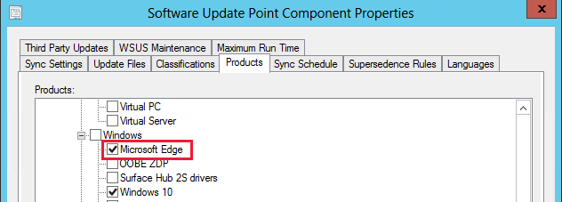

# Microsoft Edge Management

*Applies to: Configuration Manager (Current Branch)*

The all-new Microsoft Edge is ready for business. Starting in Configuration Manager version 1910, you can now deploy [Microsoft Edge, version 77 and later](https://docs.microsoft.com/deployedge/) to your users. A PowerShell script is used to install the Edge build selected. The script also turns off automatic updates for Edge so they can be managed with Configuration Manager.

##  Deploy Microsoft Edge
<!--4561024-->
Admins can pick the Beta, Dev, or Stable channel, along with a version of the Microsoft Edge client to deploy. Each release incorporates learnings and improvements from our customers and community.

### Prerequisites for deploying

For clients targeted with a Microsoft Edge deployment:

- PowerShell [Execution Policy](https://docs.microsoft.com/powershell/module/microsoft.powershell.core/about/about_execution_policies) can't be set to Restricted.
  - PowerShell is executed to perform the installation.

The device running the Configuration Manager console needs access to the following endpoints:

|Location|Use|
|---|---|
|`https://edgeupdates.microsoft.com/api/products?view=enterprise`|Information about releases of Microsoft Edge|
|`http://dl.delivery.mp.microsoft.com`|Content for Microsoft Edge releases|

### Verify Microsoft Edge update policies

In version 1910, when Microsoft Edge is deployed, the installation script turns off automatic updates for Microsoft Edge so they can be managed with Configuration Manager. You can change this behavior using Group Policy. For more information, see [Plan your deployment of Microsoft Edge](https://docs.microsoft.com/deployedge/deploy-edge-plan-deployment#define-and-configure-policies) and [Microsoft Edge update policies](https://docs.microsoft.com/DeployEdge/microsoft-edge-update-policies).

### Create a deployment

Create a Microsoft Edge application using the built-in application experience, which makes Microsoft Edge easier to manage:

1. In the console, under **Software Library**, there's a new node called **Microsoft Edge Management**.
1. Select **Create Microsoft Edge Application** from either the ribbon, or by right-clicking on the **Microsoft Edge Management** node.

   

1. On the **Application Settings** page of the wizard, specify a name, description, and location for the content for the app. Ensure the content location folder you specify is empty.
1. On the **Microsoft Edge Settings** page, you select a channel and version to deploy. The Learn More link takes you to the [Microsoft Edge Insiders page](https://www.microsoftedgeinsider.com/).

   

1. On the **Deployment** page, decide if you want to deploy the application. If you select **Yes**, you can specify your deployment settings for the application. For more information about deployment settings, see [Deploy applications](/configmgr/apps/deploy-use/deploy-applications#bkmk_deploy-general).
1. In **Software Center** on the client device, the user can see and install the application.

   

### Log files for deployment

|Location|Log|Use|
|---|---|---|
| Site server|SMSProv.log|Shows details if the creation of the app or deployment fails.|
| [Varies](/sccm/core/plan-design/hierarchy/log-files)|PatchDownloader.log| Shows details if the content download fails|
| Client|  AppEnforce.log|Shows installation information|

## Update Microsoft Edge
<!--4831871-->

Starting in Configuration Manager version 1910, you'll see a node called **All Microsoft Edge updates** under **Microsoft Edge Management**. This node helps you manage updates for all Microsoft Edge channels.<!--initial edge updates released Jan 15,2020-->

1. To get updates for Microsoft Edge, ensure you have the **Updates** classification and the **Microsoft Edge** product [selected for synchronization](/configmgr/sum/get-started/configure-classifications-and-products).

   

1. In the **Software Library** workspace, expand **Microsoft Edge Management** and click on the **All Microsoft Edge Updates** node.

1. If needed, click **Synchronize Software Updates** in the ribbon to start a synchronization. For more information, see [Synchronize software updates](/configmgr/sum/get-started/synchronize-software-updates).

   

1. Manage and deploy Microsoft Edge updates like any other update, such as adding them to your [automatic deployment rule](/configmgr/sum/deploy-use/automatically-deploy-software-updates). Some of the common updates tasks you can do from the **All Microsoft Edge Updates** node include:

   - [Create a phased deployment](/configmgr/osd/deploy-use/create-phased-deployment-for-task-sequence)
   - [Manually deploy software updates](/configmgr/sum/deploy-use/manually-deploy-software-updates)
   - [Download software updates](/configmgr/sum/deploy-use/download-software-updates)

##  Microsoft Edge Management dashboard
<!--3871913-->
*(Introduced in version 2002)*

Starting in Configuration Manager 2002, the Microsoft Edge Management dashboard provides you insights on the usage of Microsoft Edge and other browsers. In this dashboard, you can:

- See how many of your devices have Microsoft Edge installed
- See how many clients have different versions of Microsoft Edge installed
- Have a view of the installed browsers across devices
- Have a view of preferred browser by device

### Prerequisites for the dashboard

Enable the following properties in the below [hardware inventory](/configmgr/core/clients/manage/inventory/extend-hardware-inventory) classes for the Microsoft Edge Management dashboard:

- **Installed Software - Asset Intelligence (SMS_InstalledSoftware)**
   - Software Code
   - Product Name
   - Product Version

- **Default Browser (SMS_DefaultBrowser)**
   - Browser Program ID

### View the dashboard

From the **Software Library** workspace, click **Microsoft Edge Management** to see the dashboard. Change the collection for the graph data by clicking **Browse** and choosing another collection. By default your five largest collections are in the drop-down list. When you select a collection that isn't in the list, the newly selected collection takes the bottom spot on your drop-down list.

## Next steps

[Monitor applications](/configmgr/apps/deploy-use/monitor-applications-from-the-console)

[Monitor software updates](/configmgr/sum/deploy-use/monitor-software-updates)

[Manage and monitor phased deployments](/configmgr/osd/deploy-use/manage-monitor-phased-deployments)
