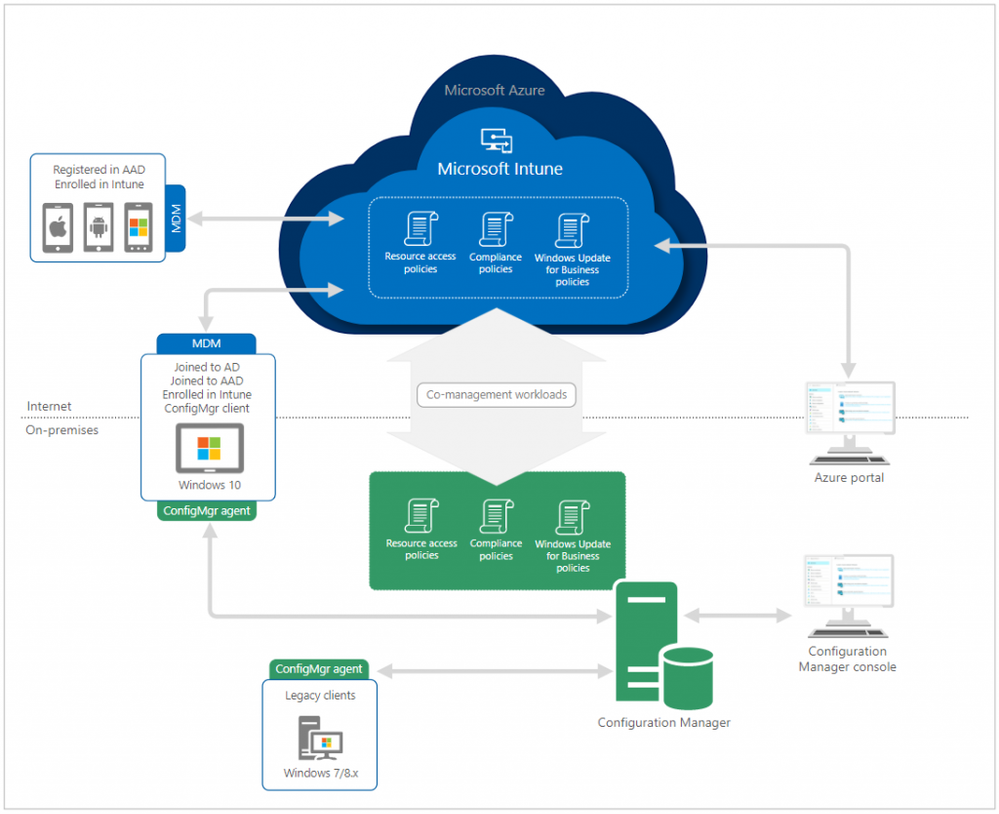
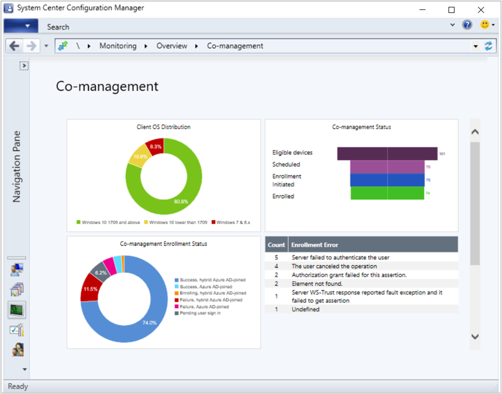

# What is co-management?

<!-- 1350871 -->
Co-management enables you to concurrently manage Windows 10 devices by using both Configuration Manager and Microsoft Intune. It lets you cloud-attach your existing investment in Configuration Manager by adding new functionality. By using co-management, you have the flexibility to use the technology solution that works best for your organization. 

When a Windows 10 device has the Configuration Manager client and is enrolled to Intune, you get the benefits of both services. You control which workloads, if any, you switch the authority from Configuration Manager to Intune. Configuration Manager continues to manage all other workloads, including those workloads that you don't switch to Intune, and all other features of Configuration Manager that co-management doesn't support.

You're also able to pilot a workload with a separate collection of devices. Piloting allows you to test the Intune functionality with a subset of devices before switching a larger group. 

## Paths to co-management

There are two main paths to reach to co-management:  

- **Existing Configuration Manager clients**: You have Windows 10 devices that are already Configuration Manager clients. You set up hybrid Azure AD, and enroll them into Intune.  

- **New internet-based devices**: You have new Windows 10 devices that join Azure AD and automatically enroll to Intune. You install the Configuration Manager client to reach a co-management state.  

## Benefits 

When you enroll existing Configuration Manager clients in co-management, you gain the following immediate value:  

- Conditional access with device compliance  

- Intune-based remote actions:  
    - [Factory reset](https://docs.microsoft.com/intune/devices-wipe#factory-reset)  
    - [Selective wipe](https://docs.microsoft.com/intune/apps-selective-wipe)  
    - [Delete devices](https://docs.microsoft.com/intune/devices-wipe#delete-devices-from-the-azure-active-directory-portal)  
    - [Restart device](https://docs.microsoft.com/intune/device-restart)  
    - [Fresh start](https://docs.microsoft.com/intune/device-fresh-start)   

- Centralized visibility of device health  

- Link users, devices, and apps with Azure Active Directory (Azure AD)  

- Modern provisioning with Windows Autopilot  

- Remote actions

Co-management also enables you to orchestrate with Intune for several workloads. For more information, see the [Workloads](#workloads) section. 

## Prerequisites

Co-management has these prerequisites in the following areas:

- [Licensing](#licensing)  
- [Configuration Manager](#configuration-manager)  
- [Azure Active Directory](#azure-ad) (Azure AD)  
- [Microsoft Intune](#intune)  
- [Windows 10](#windows-10)  
- [Permissions and roles](#permissions-and-roles)  

### Licensing

- Azure AD Premium 
- EMS or Intune license for all users  

    > [!Note]  
    > An Enterprise Mobility + Security (EMS) subscription includes both Azure Active Directory Premium and Microsoft Intune.

> [!Tip]  
> Make sure you assign an Intune license to the account that you use to sign in to your tenant. Otherwise, sign in fails with the error message "User not recognized".  

### Configuration Manager

Co-management requires Configuration Manager version 1710 or later.

Starting in Configuration Manager version 1806, you can connect multiple Configuration Manager instances to a single Intune tenant. <!--1357944-->  

Enabling co-management itself doesn't require that you onboard your site with Azure AD. For the [second path scenario](#paths-to-co-management), internet-based Configuration Manager clients require the [cloud management gateway](/sccm/core/clients/manage/cmg/plan-cloud-management-gateway) (CMG). The CMG requires the site is [onboarded to Azure AD for cloud management](/sccm/core/servers/deploy/configure/azure-services-wizard). 

### Azure AD

- Windows 10 devices must be joined to Azure AD. They can be either of the following types:  

    - [Hybrid Azure AD-joined](https://docs.microsoft.com/azure/active-directory/devices/hybrid-azuread-join-plan), where the device is joined to your on-premises Active Directory and registered with your Azure Active Directory.  

    - [Azure AD-joined](https://docs.microsoft.com/azure/active-directory/devices/azureadjoin-plan) only. (This type is sometimes referred to as "cloud domain-joined")<!--SCCMDocs issue 605-->  

- [Enable Windows 10 automatic enrollment](https://docs.microsoft.com/intune/windows-enroll#enable-windows-10-automatic-enrollment)  

### Intune

For more information, see [Set up Intune](https://docs.microsoft.com/intune/setup-steps).  

> [!Note]  
> If you have a hybrid MDM environment (Intune integrated with Configuration Manager), you can't enable co-management. However, you can start migrating users to Intune standalone and then enable their associated Windows 10 devices for co-management. For more information about migrating to Intune standalone, see [Start migrating from hybrid MDM to Intune standalone](/sccm/mdm/deploy-use/migrate-hybridmdm-to-intunesa).  
> 
> If you're using [mixed authority](/sccm/mdm/deploy-use/migrate-mixed-authority), first complete the migration to Intune standalone. Then, set the MDM authority to Intune before setting up co-management.<!--SCCMDocs issue #797-->

### Windows 10

Upgrade your devices to Windows 10, version 1709 or later. For more information, see [Adopting Windows as a service](/sccm/core/understand/configuration-manager-and-windows-as-service#key-articles-about-adopting-windows-as-a-service).

> [!IMPORTANT]
> Windows 10 mobile devices don't support co-management.

### Permissions and roles
<!--SCCMDocs issue #667-->

| Action | Role needed |
|----|----|
| Set up a cloud management gateway in Configuration Manager | Azure **Subscription Manager** |
| Create Azure AD apps from Configuration Manager | Azure AD **Global Administrator** |
| Import Azure apps in Configuration Manager | Configuration Manager **Full Administrator** No additional Azure roles needed |
| Enable co-management in Configuration Manager | An Azure AD user Configuration Manager **Full Administrator** with **All** scope rights.<!--SCCMDoc issue 626--> | 

For more information about Azure roles, see [Understand the different roles](https://docs.microsoft.com/azure/role-based-access-control/rbac-and-directory-admin-roles).

For more information about Configuration Manager roles, see [Fundamentals of role-based administration](/sccm/core/understand/fundamentals-of-role-based-administration).

## Workloads 

You don't have to switch the workloads, or you can do them individually when you're ready. Configuration Manager continues to manage all other workloads, including those workloads that you don't switch to Intune, and all other features of Configuration Manager that co-management doesn't support.

Co-management supports the following workloads:

- Compliance policies  

- Windows Update policies  

- Resource access policies  

- Endpoint Protection  

- Device configuration  

- Office Click-to-Run apps  

- Client apps  

For more information, see [Workloads](/sccm/comanage/workloads).

## Monitor co-management

The co-management dashboard helps you review machines that are co-managed in your environment. The graphs can help identify devices that might need attention.

For more information, see [How to monitor co-management](/sccm/comanage/how-to-monitor).

## Next steps

- [Learn more about immediate value and getting started with co-management](/sccm/comanage/quickstarts)  

- [Tutorial: Enable co-management for existing Configuration Manager clients](/sccm/comanage/tutorial-co-manage-clients)  

