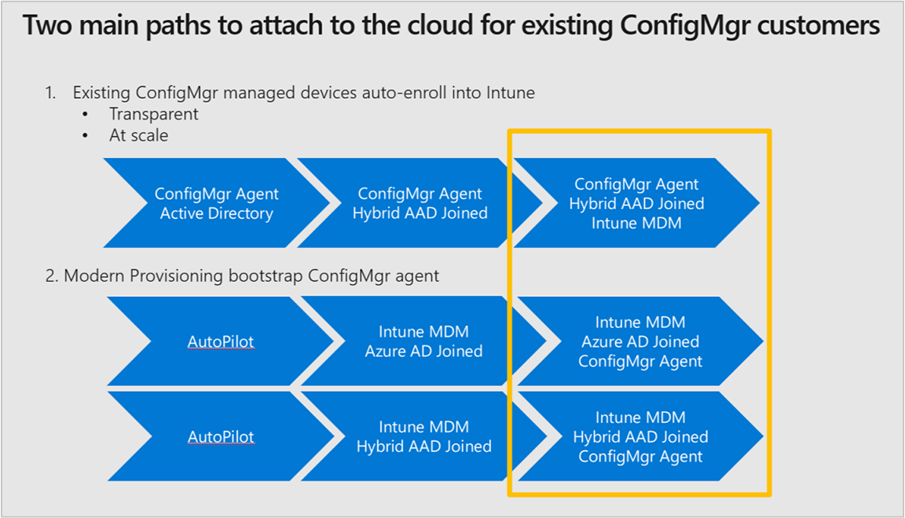

# Paths to co-management

There are two primary ways for you to set up co-management. It's important to understand the prerequisites for each path. They each require some combination of Azure Active Directory (Azure AD), Configuration Manager, Microsoft Intune, and Windows 10. 

1. [Auto-enroll existing Configuration Manager-managed devices into Intune](#bkmk_path1)  
2. [Bootstrap the Configuration Manager client with modern provisioning](#bkmk_path2)  

##  Path 1: Auto-enroll existing clients

Taking this path can get your existing Configuration Manager-managed devices quickly enrolled into Intune. The management of these devices from Configuration Manager is no different from before you enable co-management. Now you get all the cloud-based benefits. This path is transparent to your users.

Here's what you need to set it up:
- Hybrid Azure AD
    - Active Directory Federation Services (ADFS) with pass-through authentication (PTA)
    - Azure AD Connect
    - Azure AD Premium license
    - Configure hybrid Azure AD-join (choose one option):
        - For managed domains
        - For federated domains
- Client agent setting for hybrid Azure AD-join
- Configure auto-enrollment of devices to Intune
- Assign Intune user licenses
- Enable co-management in Configuration Manager

For a tutorial on this path, see [Tutorial: Enable co-management for existing Configuration Manager clients](/sccm/comanage/tutorial-co-manage-clients).

##  Path 2: Bootstrap with modern provisioning

Here's what you need to set it up:

1. [Setup enhanced HTTP](/sccm/core/plan-design/hierarchy/enhanced-http)  
2. [Create the cloud services in Azure](/sccm/core/servers/deploy/configure/azure-services-wizard)  
3. [Configure the management point and clients to use the cloud management gateway](/sccm/core/clients/manage/cmg/setup-cloud-management-gateway)  
4. [Use Intune to deploy the Configuration Manager client](/sccm/comanage/how-to-prepare-win10)  

> [!Note]  
> A tutorial for this path is coming soon.

