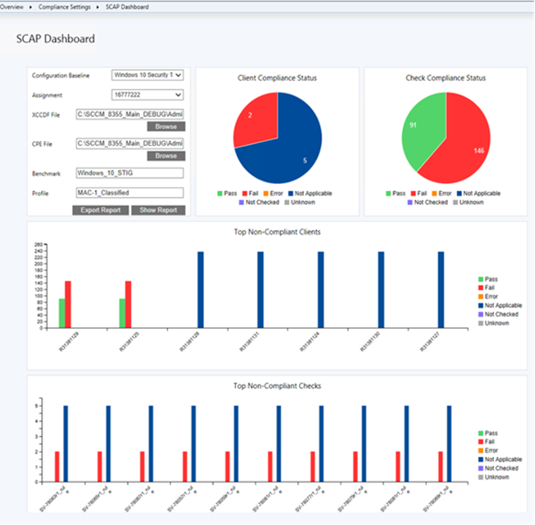
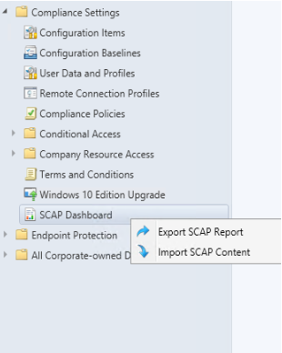
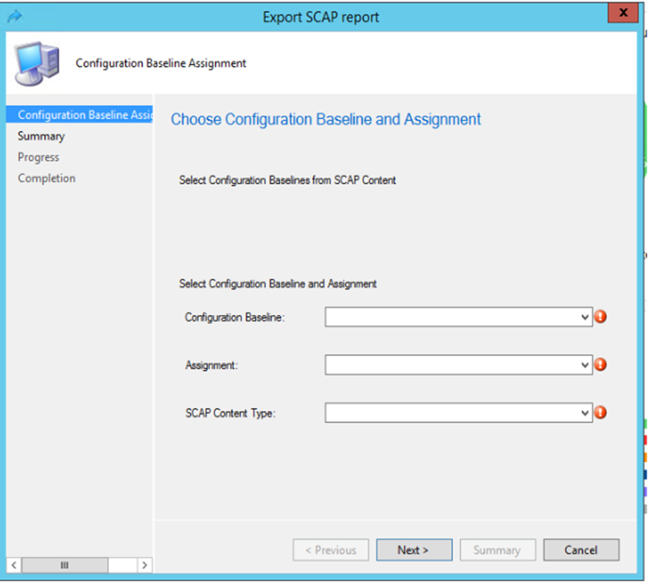
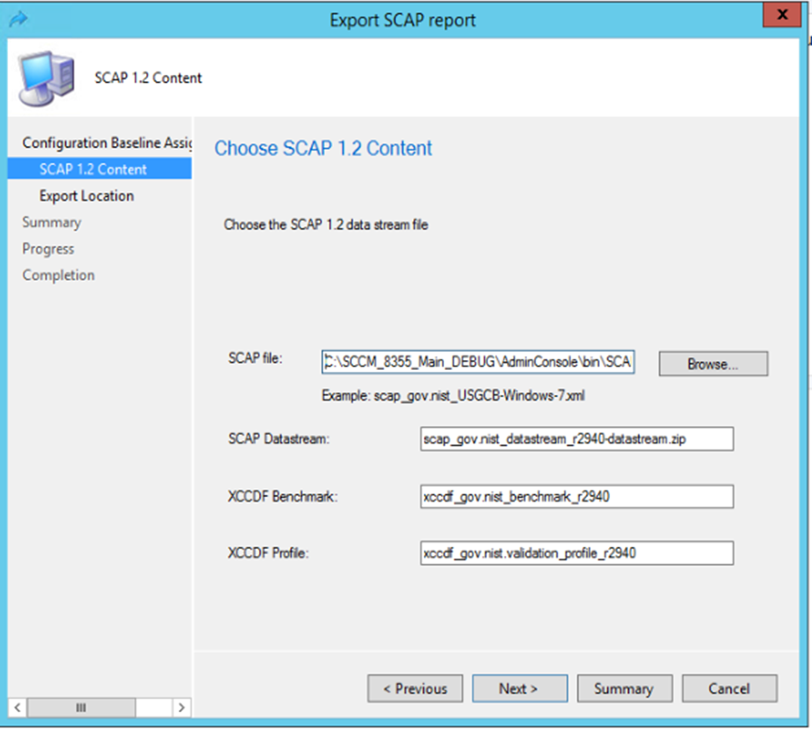
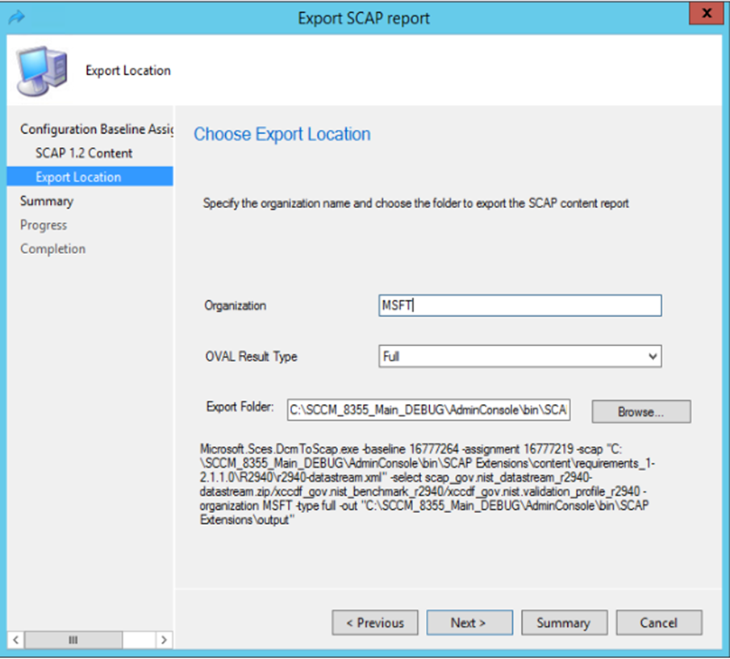
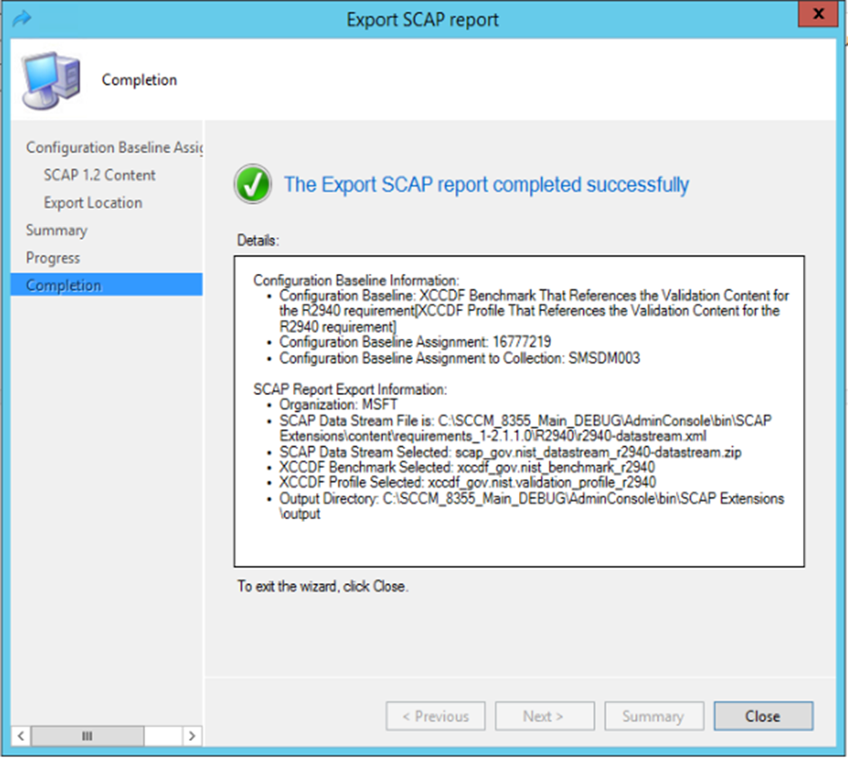
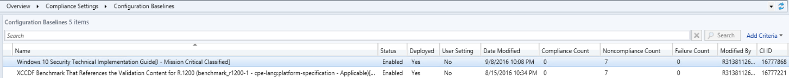

# Import the Compliance Settings Compliant .cab Files into System Center Configuration Manager
*Applies to: System Center Configuration Manager (Technical Preview)*

The next step in the process is to use the Configuration Manager Console to import the Compliance Settings-compliant .cab files into Configuration Manager. When you import the .cab files you created earlier in this process, one or more configuration items and configuration baselines are created in the Configuration Manager database. Later in the process you can assign each of the configuration baselines to a computer collection in Configuration Manager.

## To import the Compliance Settings compliant .cab files into Configuration Manager

1. Open the **Configuration Manager Console**.
2. In the **Configuration Manager Console** , in the navigation pane, go to **Assets and Compliance**> **Compliance Settings** > **Configuration Baselines**.

3. In the actions pane, click **Import Configuration Data** to start the Import Configuration Data Wizard.

1. Complete the **Import Configuration Data Wizard** using the information in the following table and accepting the default values unless otherwise specified.

Import Configuration Data Wizard Process

| Wizard page name | User action |
| --- | --- |
| **Choose Files** |1. Click **Add**.  The Open dialog box appears.|
||2. In the **Open** dialog box, go to the **&lt;compliant cab output\_folder &gt;**, click the **&lt; compliant\_cab&gt;**.cab file, where _compliant cab **output\_folder** is the folder that we specified following the –output switch when we ran the Sces.ScapToDcm.exe tool, and **compliant\_file** is the name of a .cab file you created earlier in the process, and then click **Open**.   The Configuration Manager Console – Security Warning dialog box appears.|
||3. In the **Configuration Manager Console – Security Warning** dialog box, click **Run**. On the Choose Files page, the configuration data appears in the list of baselines to import.|
||3. Click **Next**.|
| **Summary** |5. Click **Next**. |
| **Completing the Import Configuration Data Wizard** |6. Click **Close**. |

The new configuration baseline appears in the information pane of the Configuration Manager Console.

>[!IMPORTANT]
> You need to repeat this process for each .cab file that you created earlier in the process. There is a .cab file for each selectedprofile in XCCDF/DataStreamXML file that you downloaded from the NVD Web site, which you can process by running the Microsoft.Sces.ScapToDcm.exe tool.

The imported configuration baseline is read only and has a Status of &#39;Enabled&#39; and an initial Deployed state of &#39;No&#39;.  The &#39;Date Modified&#39; property indicates the time that the baseline was imported.  The name of the configuration baseline is taken from the display name section of the XCCDF/Datastream XML and is constructed using the following convention:

ABC[XYZ] where ABC is the XCCDF Benchmark ID, and XYZ is the XCCDF Profile ID (if a profile is selected).

## Assign Configuration Baselines to the Computer Collections

After creating the appropriate computer collections for the computers that you want to assess for SCAP compliance, you are ready to assign the configuration baselines that you imported to associate with the computer collections. This section provides you with information to assign a configuration baseline to a computer collection using the Configuration Manager Console.

To assign a configuration baseline to a computer collection:

1. Open the **Configuration Manager**  **Console**.

2. In the **Configuration Manager Console** , in the navigation pane, go to **Assets and Compliance** > **Compliance Settings** >**Configuration Baselines**.
3. In the navigation pane, click &lt; **configuration\_baseline&gt;** , where &lt;_configuration\_baseline&gt;_ is the name of the configuration baseline that you want to assign to a computer collection.

    The list of configuration items for the configuration baseline displays in the information pane of Configuration Manager.

4. In the actions pane, click **Deploy**.

5. Complete the **Deploy**  **Configuration Baseline**  **Dialog** using the information in the following table and accepting the default values unless otherwise specified.

### Deploy Configuration Baseline Dialog Process

| Wizard page name | User action |
| --- | --- |
| **Choose Collection** | 1. Click **Browse**.|
||2. In the **Select Collection** dialog box, select **Device Collections**, then click **&lt;computer\_collection&gt;**, where &lt;_computer\_collection&gt;_ is the name of the computer collection that you created earlier in the process, and then click **OK**.|
| **Set Schedule** |3. Select the schedule that is appropriate for your organization.|
 
>[!IMPORTANT]
> Repeat this process for each computer collection that you want to assign to each configuration baseline. At a minimum, assign each configuration baseline to at least one computer collection.

## Verify that the Compliance Data Has Been Collected

Before exporting the compliance data back to SCAP format, you need to verify that the data has been collected. After you assign a configuration baseline to a computer collection, the Configuration Manager client on each computer in the collection automatically gathers the compliance information. Then the compliance information is stored in the Configuration Manager database.

You view the status of the configuration baseline deployment in Configuration Manager to ensure that the appropriate data has been collected by the Configuration Manager clients. It is important to verify that the appropriate compliance data has been collected in Configuration Manager because it can help you validate the XCCDF/DataStream results files that you create later in the process.

### Verify that the compliance data has been collected

1. Open the Configuration Manager Console.
2. In the Configuration Manager Console, in the navigation pane, go to **Monitoring** > **Deployments**.
3. Click the **Feature Type** to sort the deployment type and find items that type are **Baseline** in the list.
4. Right click the &lt;configuration\_baseline&gt; in the list that you just deployed to the collection, and click **View Status**.
5. Then move to the &lt;configuration\_baseline&gt; node to view the compliant status, if there is a machine under the unknown state, then it means the compliance data collection is still not completed for that machine.

### Validate the XCCDF/Datastream results

1. Open the Configuration Manager console.
2. In the Configuration Manager console, in the navigation pane, go to **Compliance Settings** > **SCAP Dashboard**.
3. Select the Configuration Baseline, Assignment, SCAP File, Datastream, Benchmark and Profile (if applicable).
4. Click **Show Report**
 

## Export Compliance Results to SCAP Format

The next task in the process is to export the Compliance Settings compliance data to SCAP format, which is an ARFreport file in XML/human-readable format. The SCAP Extensions Export Wizard and Microsoft.Sces.DcmToScap.exe tool export a separate XCCDF/DataStreamARF results file for each Compliance Settings configuration baseline. These files correspond to each XCCDF/DataStream input file that the Microsoft.Sces.ScapToDcm.exe tool uses to create each Compliance Settings configuration baseline.

### Export the Compliance Settings compliance data using the Export SCAP Report Wizard

1. Start the Export SCAP Report Wizard from the right click menu on the SCAP Dashboard.

2. Select the Configuration Baseline and Assignment

3. Choose the location of the SCAP datastream file, XCCDF/CPE file or Oval content and variable files.

4. Specify the organization name and choose the folder location to export the SCAP report.
 

5. Confirm the settings.
 

6. Choose **Next**to export the report.  You will see a progress bar and then a completion page.
 

### (Alternate method) Export the Compliance Settings compliance data using the Microsoft.Sces.DcmToScap.exe Tool

1. At the command prompt, go to AdminConsole\Bin folder type the command-line parameters listed in the following table, and then press **ENTER** :

    >[!NOTE] 
    >Your account must have read permissions for the Configuration Manager provider, and also have write permissions for the out folder specified in the –out parameter of the command line.

**For SCAP 1.0/1.1 content (such as USGCB and DISA content):**

Microsoft.Sces.DcmToScap.exe -baseline BaselineCIID -assignment AssignmentID –xccdf &lt;xccdf.xml&gt; -cpe &lt;cpe.xml&gt;  -select &lt;xccdfBenchmark/profile&gt; -out &lt;outputResultFolder&gt;  [-log logFileName]

  >[!NOTE] 
    >You should use the –select parameter to specify the benchmark/profile which has been evaluated on the clients if there are multiple benchmark/profile in the content.

**For SCAP1.2 content (such as the latest USGCB content):**

Microsoft.Sces.DcmToScap.exe -baseline BaselineCIID -assignment AssignmentID  -select &lt;datastream/xccdfBenchmark/profile&gt; -out &lt;outputResultFolder&gt;  [-log logFileName]

   >[!NOTE] 
   >You should use the –select parameter to specify the datastream/benchmark/profile which has been evaluated on the clients if there are multiple datastream/benchmark/profile in the content.

**For single OVAL file with external variables:**

Microsoft.Sces.DcmToScap.exe -baseline BaselineCIID -assignment AssignmentID –oval &lt;singleOvalFile.xml&gt; [-variable &lt;externalVariableFile.xml&gt;]  -out &lt;outputResultFolder&gt;  [-log logFileName]

   >[!NOTE] 
    >The Microsoft.Sces.DcmToScap.exe _will only generate OVAL definition results report for each target machine, the ARF report will not be generated.

#### How to get Baseline CI ID and Assignment ID

In Admin Console, go to **Assets and Compliance** > **Compliance Settings** > **Configuration Baselines**. The CI ID is the Configuration Baseline CI ID.

Select the desired Configuration Baseline, click Deployments tab, if Assignment ID is not in display, right click the column header, click Assignment ID to enable it.

#### Microsoft.Sces.DcmToScap.exe Command-Line Parameters

| **Parameter** | **Usage** | **Required** |
| --- | --- | --- |
| -baseline [Baseline CI ID] | Specify the Configuration Baseline | Yes |
| -assignment [Assignment ID] | Specify the Configuration Baseline deployment | Yes |
| -organization [organization name] | Specify the organization name, which would be displayed in report. It can be separated by &#39;;&#39; to specify a multi-line organization name. | No |
| -type [thin/full/fullnosc] | Specify the OVAL result type: thin result or full result or full result without system characteristic. | No(if not specified, then the default value is full) |
| -scap [scap data stream file] | Specify the SCAP data stream file | Yes(for SCAP 1.2 data stream, mutually exclusive with –xccdf and –oval / -variable) |
| -xccdf [xccdf file] | Specify the XCCDF file | Yes(for SCAP 1.0/1.1 XCCDF, mutually exclusive with –scap and –oval / -variable) |
| -cpe [cpe file] | Specify the CPE file | Yes(for SCAP 1.0/1.1 XCCDF, mutually exclusive with –scap and –oval / -variable) |
| -oval [oval file] | Specify the OVAL file | Yes(for standalone OVAL file, mutually exclusive with –xccdf and -scap) |
| -variable [oval external variable file] | Specify the OVAL external variable file | No(Optional for standalone OVAL file when there is an external OVAL variable file, mutually exclusive with –xccdf and -scap) |
| -select [xccdf benchmark/profile] | Select XCCDF benchmark, profile from either the SCAP data stream or XCCDF file | Yes(a selection must be made to generate a report so that we can match the corresponding DCM baseline in Configuration Manager database |
| -out [output directory] | Specify where to output the Compliance Settings cab file | No(if not specified, then the tool would only list the content without conversion) |
| -log [log file] | Specify the log file | No(if not specified, then log is written to Microsoft.Sces.DcmToScap.log file) |
| -help / -? | Print out tool usage | No |

 >[!TIP] 
 >You can specify the -? –h, or –help parameter to display the syntax of the Microsoft.Sces.DcmToScap.exe tool and a list of the parameters.

By default, the Microsoft.Sces.DcmToScap.exe tool accesses the Configuration Manager database using your credentials. The Microsoft.Sces.DcmToScap.exe tool requires a minimum of read access to the Configuration Manager database.

After verifying that the appropriate **ARF** report: _ARF\_xxxx.xml_ and/or **Human-readable** report: xxx.txt, **Cyberscope** report: LASR\_xxx.xml, **ConsumedOval** report: xx-oval-&lt;machineName&gt;.xml, **XCCDF Benchmark result** report: xccdf\_xxx.xml files exist, on the command line, type exit and then press **ENTER** to exit the command prompt.

## Next step
[Troubleshooting](/sccm/compliance/plan-design/scap/troubleshooting-scap)