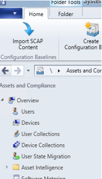
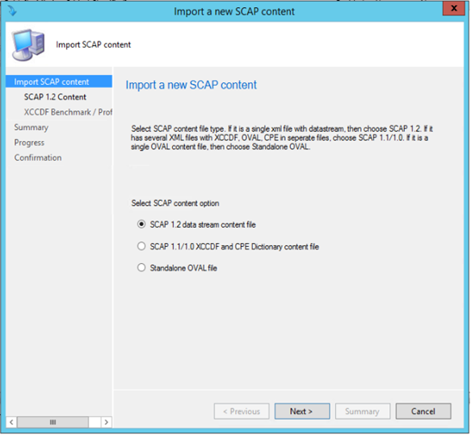
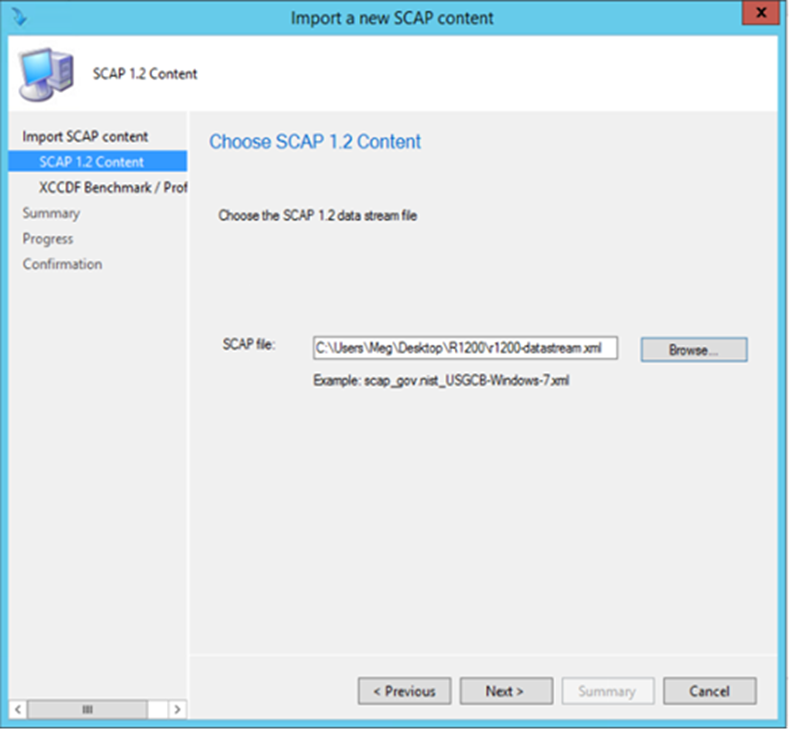
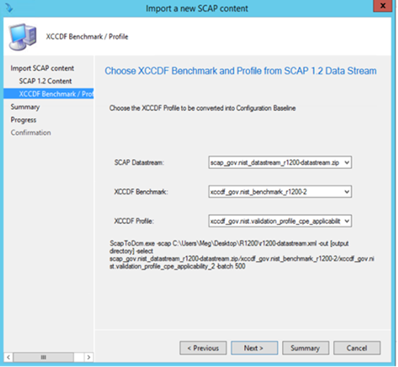
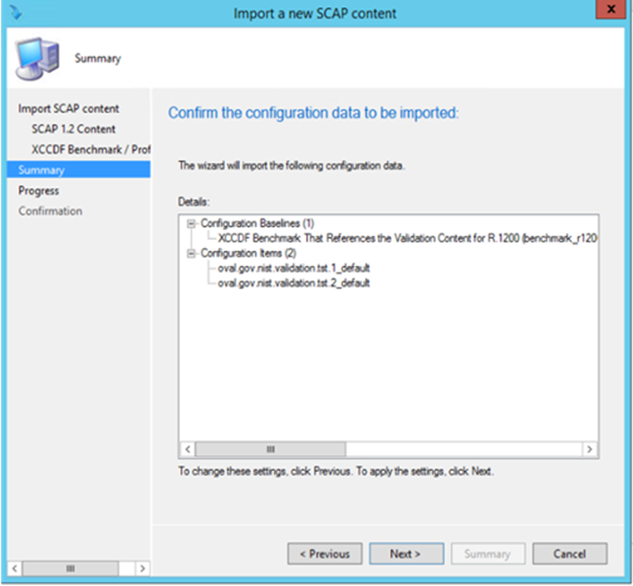
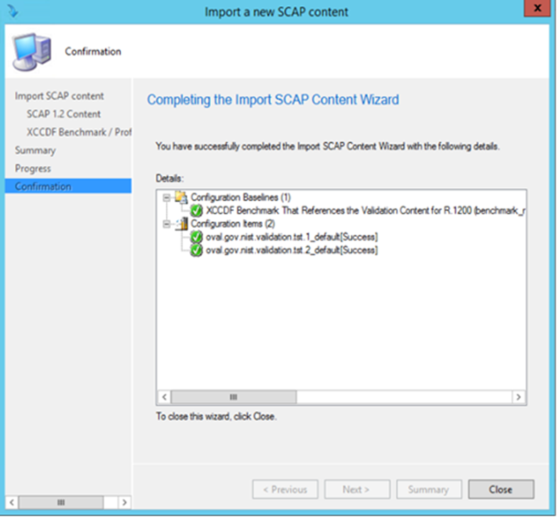

# Install and configure the SCAP extensions for Configuration Manager

*Applies to: System Center Configuration Manager (Current Branch)*

After [preparing the infrastructure](/sccm/compliance/plan-design/scap/about-scap#bkmk_prepare), you're ready to install and configure the SCAP extensions for Configuration Manager on the computer from which you want to run this process.


## <a name="bkmk_install"></a> Install SCAP extensions

The installation file is located at the following path in the installation directory on the Configuration Manager site server:  
`cd.latest\SMSSETUP\TOOLS\ConfigMgrSCAPExtension\ConfigMgrExtensionsForSCAP.msi`

1. Copy **ConfigMgrExtensionsforSCAP.msi** to the computer with the Configuration Manager console where you want to run this process.  

2. In Windows Explorer, go to the folder where you copied **ConfigMgrExtensionsforSCAP.msi**. Double-click the file to open it and start the SCAP extensions for Configuration Manager installation wizard.  

3. Review the license agreement. Click **I accept the terms in the License Agreement** and then click **Install**.  

4. When the installation is complete, click **Finish** to close the installation wizard.  

The installation wizard installs the SCAP extensions in the Configuration Manager console install folder. By default the console install folder is `C:\Program Files (x86)\Microsoft Configuration Manager\AdminConsole`.  


## <a name="bkmk_scap-data-stream-files"></a> Download and install the SCAP data stream files

Before you can run the SCAP extensions, you must download the SCAP data stream files from the National Vulnerability Database (NVD) [download page](https://csrc.nist.gov/Projects/United-States-Government-Configuration-Baseline). Then copy them into the folder where you installed the SCAP extensions.

Depending on your environment, you may not need all the SCAP data stream files listed on the download page.

### Install the SCAP data streams

1. Visit the [NVD Web site](http://nvd.nist.gov/) to identify the SCAP data streams that are required by your organization.
The SCAP data streams published by NIST are organized into multiple bundles, which are also called _checklists_.  

2. Download the SCAP data streams from the [NVD Web site](http://nvd.nist.gov/home.cfm), which are stored in compressed files with a .zip file name extension or marked as DataStream XML file.  

    > [!IMPORTANT]  
    > There are many SCAP data stream files with the .xml extension that you can download from the NVD. However, only .xml files that include XCCDF (SCAP1.0 and 1.1)/DataStream (SCAP1.2) content are appropriate for use with the SCAP extensions.  

3. Extract the SCAP data streams .zip files/DataStream XML file that you downloaded into the same folder where you installed the SCAP extensions.  


## <a name="bkmk_convert-and-import"></a> Convert and import the SCAP data stream files 

After getting the SCAP data streams, you're ready to import and convert the data streams to configuration baselines. The SCAP data streams published by NIST are organized into multiple bundles. Follow NIST's instructions to verify which bundles to use in your environment. For example, there's a separate bundle for each version of Windows, another version-specific bundle for the firewall configuration, and a bundle for Internet Explorer. Use the following procedures to accomplish this task.

### Import with the console wizard

1. Click **Import SCAP Content** wizard in the ribbon from the configuration baseline group.

     

2. Select the SCAP content option.

      

3. Select the SCAP data stream file, XCCDF, and CPE dictionary file or Oval content file.

     

4. If SCAP 1.2 select the data stream. Then select the benchmark and profile for SCAP 1.x. Click **Next** to convert the content. 

      

5. Confirm the configuration data to be imported.

      

6. Click **Next** to import the configuration data.

      

### Import with the command-line tool

After getting the SCAP data streams, you can use the **Microsoft.Sces.ScapToDcm.exe** tool to convert the SCAP data streams into compliance settings-compliant .cab files. Then import the .cab files into Configuration Manager. The Microsoft.Sces.ScapToDcm.exe tool converts the SCAP data streams into configuration items and configuration baselines that you can use in Configuration Manager. The Microsoft.Sces.ScapToDcm.exe tool converts the SCAP data streams into XML manifests. It then packages the XML manifests into a .cab file that you can import into Configuration Manager.

#### Use Microsoft.Sces.ScapToDcm.exe to convert SCAP data streams into .cab files

At the command prompt, go to **AdminConsole\Bin** folder, and run **Microsoft.Sces.ScapToDcm.exe**. This tool generates a compliance settings-compliant .cab file, and imports it to the Configuration Manager site.

   > [!NOTE]  
   > Your account must have read/write permissions for the output folder.

**Usage for SCAP 1.0/1.1 content (XCCDF XML file, such as USGCB and DISA content):**  

`Microsoft.Sces.ScapToDcm.exe –xccdf <xccdf.xml> -cpe <cpe.xml> -out <outputFolder> [-select benchmark/profile] [-log LogFileName]`  

   > [!NOTE]  
   > If you don't specify the benchmark/profile by using the `–select` parameter, then the tool generates a .cab file for each benchmark in the content file.  

**Usage for SCAP 1.2 content (DataStream XML file, such as the latest USGCB content):**  

`Microsoft.Sces.ScapToDcm.exe –scap <scapdatastreamfile.xml> -out <outputFolder> [-select datastream/benchmark/profile] [-log LogFileName]`  

   > [!NOTE]  
   > If you don't specify the datastream/benchmark/profile by using the `–select` parameter, then the tool generates a .cab file for each benchmark in the content file.

**Usage for single OVAL file with external variables:**  

`Microsoft.Sces.ScapToDcm.exe –oval <singleOvalFile.xml> [-variable <externalVariableFile.xml>] -out <outputFolder> [-log LogFileName]`  

   > [!NOTE]  
   > If there are multiple values for one variable in the external variable file, then the Microsoft.Sces.ScapToDcm.exe tool treats the values as an array for this variable.  


#### Microsoft.Sces.ScapToDcm.exe command-line parameters

| Parameter | Usage | Required |
| --- | --- | --- |
| `-scap [scap data stream file]` | Specify the SCAP data stream file | Yes (for SCAP 1.2 data stream, mutually exclusive with –xccdf and –oval / -variable) |
| `-xccdf [xccdf file]` | Specify the XCCDF file | Yes (for SCAP 1.0/1.1 XCCDF, mutually exclusive with –scap and –oval / -variable) |
| `-cpe [cpe file]` | Specify the CPE file | Yes (for SCAP 1.0/1.1 XCCDF, mutually exclusive with –scap and –oval / -variable) |
| `-oval [oval file]` | Specify the OVAL file | Yes (for standalone OVAL file, mutually exclusive with –xccdf and -scap) |
| `-variable [oval external variable file]` | Specify the OVAL external variable file | No (Optional for standalone OVAL file when there's an external OVAL variable file, mutually exclusive with –xccdf and -scap) |
| `-select [xccdf benchmark/profile]` | Select XCCDF benchmark, profile from either the SCAP data stream or XCCDF file | No (This parameter isn't required but recommended. If not specified, then the tool generates a cab for all the profiles in all embedded DataStream/benchmarks) |
| `-out [output directory]` | Specify where to output the DCM cab file | No (If not specified, then the tool only lists the content without conversion) |
| `-log [log file]` | Specify the log file | No (If not specified, then the log is written to Microsoft.Sces.ScapToDcm.log file) |
| `-help` or `-?` | Print out tool usage | No |


#### Microsoft.Sces.ScapToDcm.exe examples

**SCAP 1.2 content:**  

`Microsoft.Sces.ScapToDcm.exe –scap scap_gov.nist_USTCB-ie8.xml –out .\mytestfolder –select mySCAPDataStreamID/myBenchMarkID/myProfileID`  

**SCAP 1.0/1.1 content:**  

`Microsoft.Sces.ScapToDcm.exe–xccdf scap_gov.nist_Test-WinXP_xccdf.xml –cpe scap_gov.nist_Test-WinXP_cpe.xml –out .\mytestfolder –select XCCDFBenchmarkID/MyProfileID`  

**SCAP OVAL content:**  

`Microsoft.Sces.ScapToDcm.exe –oval myOvalFile.xml –variable myOvalExternalVariableFile.xml –out .\mytestfolder`  


#### Sample output from Microsoft.Sces.ScapToDcm.exe

```
  Compliance Settings compliant cab file created:

  Validate the schema of SCAP data stream file C:\24SCAP\BVT_Test_Data_Stream.xml

  Successfully validate the schema of SCAP data stream file C:\24SCAP\BVT_Test_Data_Stream.xml

  Process XCCDF Benchmark xccdf_tst.bvt_benchmark_Windows-F

  Process XCCDF Profile: xccdf_tst.bvt_profile_version_1.0.0.0-BVT Profile #1

  Process OVAL: scap_tst.bvt_comp_Windows-F-oval.xml

  Successfully finished process OVAL: scap_tst.bvt_comp_Windows-F-oval.xml

  Process OVAL: scap_tst.bvt_comp_Windows-F-cpe-oval.xml

  Successfully finished process OVAL: scap_tst.bvt_comp_Windows-F-cpe-oval.xml
   Process SCAP data stream: scap_tst.bvt_datastream_Windows-F.zip
    SCAP Data Stream: [scap_tst.bvt_datastream_Windows-F.zip]

  Version:        [1.2]

  Timestamp:      [2/24/2012]

  Use-case:       [CONFIGURATION]

  CPE Dictionary:  [scap_tst.bvt_comp_Windows-F-cpe-dictionary.xml]

  OVAL:              [Windows-F-cpe-oval.xml]
  Product name:    [National Institute of Standards and Technology]

  Product version: []

  Schema version:  [5.3]

  Timestamp:       [2/24/2012]

  XCCDF Benchmark: [xccdf_tst.bvt_benchmark_Windows-F]

  Version:       [v1.0.0.0]
   Update:        [http://usgcb.nist.gov]

  Timestamp:     [2/24/2012]

  Status:        [accepted]

  Status date:   [2/24/2012]

  Title:         [Ohh New BVT for SCAP 1.2]

 Description:   [My description]

  XCCDF Profile: [xccdf_tst.bvt_profile_version_1.0.0.0]
 
  OVAL:              [Windows-F-oval.xml]

   Product name:    [scaptool]

   Product version: []

   Schema version:  [5.4]

   Timestamp:       [2/24/2012]

  Start SCAP to DCM conversion...

  Processing SCAP data stream: scap_tst.bvt_datastream_Windows-F.zip

  Processing CPE dictionary: scap_tst.bvt_comp_Windows-F-cpe-dictionary.xml

  …

  Generating CI baseline cab file: C:\28\bbt\xccdf_tst.bvt_benchmark_Windows-F[xccdf_tst.bvt_profile_version_1.0.0.0].cab

  Successfully generated CI baseline cab file: C:\28\bbt\xccdf_tst.bvt_benchmark_Windows-F[xccdf_tst.bvt_profile_version_1.0.0.0].cab

  Successfully converted XCCDF profile: xccdf_tst.bvt_profile_version_1.0.0.0 into DCM baseline xccdf_tst.bvt_benchmark_Windows-F[xccdf_tst.bvt_profile_version_1.0.0.0].cab
```


## Next step
> [!div class="nextstepaction"]
> [Import SCAP compliance settings and export compliance results](/sccm/compliance/plan-design/scap/import-scap-compliance-settings)
