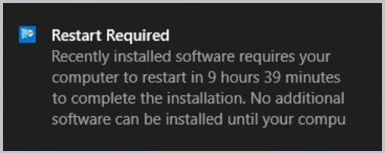

# About device restart notifications in Configuration Manager

*Applies to: System Center Configuration Manager (current branch)*

The notifications a user receives for a pending device restart can vary depending on [Computer restart client settings](/sccm/core/clients/deploy/about-client-settings#computer-restart) and which version of Configuration Manager is being used. This article helps admins determine what the user experience is for pending device restart notifications.

>[!NOTE]
>This article focuses on client settings found in Configuration Manager version 1902 and version 1906.

## Deployment types for restart notifications

The [Computer restart client settings](/sccm/core/clients/deploy/about-client-settings#computer-restart) change the user experience for all required deployments that require a restart of the following types:

- [Application](/sccm/apps/deploy-use/deploy-applications)
- [Task sequence](/sccm/osd/deploy-use/manage-task-sequences-to-automate-tasks#BKMK_DeployTS)
- [Software update](/sccm/sum/deploy-use/deploy-software-updates)

## Restart notification types

When a restart is required, the end user is is given notification of the upcoming restart. There are three types of notifications users can receive:

**Toast notification** showing time remaining before a restart is enforced.

Software Center notification with a snooze button showing time remaining before a restart is enforced.

Software Center final countdown notification that can't be closed by the user. The snooze button is grayed out.

## Device restart notifications starting in version 1906
<!--3976435-->
Some admins prefer frequent restart notifications and a short time frame for allowing restarts to be postponed. Other admins allow users to postpone a restart for longer periods of time and want users to be notified of the pending restart infrequently. Configuration Manager version 1906 gives an admin additional control over the timing and frequency of restart notifications.

## Device restart notifications in version 1902

## Next steps

- [Introduction application management](/sccm/apps/understand/introduction-to-application-management)
- [Introduction to operating system deployment](/sccm/osd/understand/introduction-to-operating-system-deployment)
- [Introduction to software updates management](/sccm/sum/understand/software-updates-introduction)
