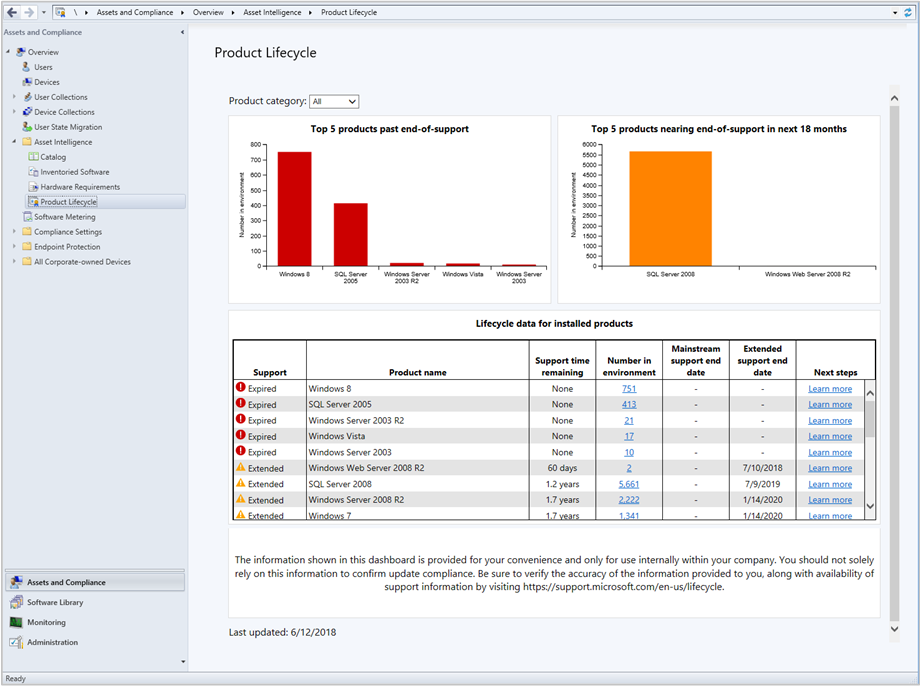

# Manage Microsoft Lifecycle Policy with Configuration Manager

*Applies to: System Center Configuration Manager (Current Branch)*

Beginning with version 1806, you can use the Configuration Manager product lifecycle dashboard to view the Microsoft Lifecycle Policy. The dashboard shows the state of the Microsoft Lifecycle Policy for Microsoft products installed on devices managed with Configuration Manager. It also provides you with information about Microsoft products in your environment, supportability state, and support end dates. Use the dashboard to understand the availability of support for each product. This information helps you plan for when to update the Microsoft products you use before their current end of support is reached.  

For more information, see the [Microsoft Lifecycle Policy](https://support.microsoft.com/lifecycle).

Starting in version 1810, the dashboard includes information for System Center 2012 Configuration Manager and later.<!--1358702-->  

## Prerequisites 

 To see data in the product lifecycle dashboard, the following components are required:  

- Internet Explorer 9 or later must be installed on the computer running the Configuration Manager console.  

- A reporting services point is required for hyperlink functionality in the dashboard. The dashboard links to SQL Server Reporting Services (SSRS) reports. For more information, see [Reporting in Configuration Manager](/sccm/core/servers/manage/reporting).  

- The asset intelligence synchronization point must be configured and synchronized. The dashboard uses the asset intelligence catalog as metadata for product titles. The metadata is compared against inventory data in your hierarchy. For more information, see [Configure asset intelligence in Configuration Manager](/sccm/core/clients/manage/asset-intelligence/configuring-asset-intelligence).  

     > [!NOTE]  
     > If you're configuring the asset intelligence service point for the first time, make sure to [enable asset intelligence hardware inventory classes](/sccm/core/clients/manage/asset-intelligence/configuring-asset-intelligence#BKMK_EnableAssetIntelligence). The lifecycle dashboard depends on those asset intelligence hardware inventory classes. The dashboard won't display data until clients have scanned for and returned hardware inventory.  

## Use the product lifecycle dashboard

Based on inventory data the site collects from managed devices, the dashboard displays information about all current products. However, the information displayed for operating systems and SQL Server is limited to the following versions:

- Windows Server 2008 and later
- Windows XP and later
- SQL Server 2008 and later

To access the lifecycle dashboard in the Configuration Manager console, go to the **Assets and Compliance** workspace, expand **Asset Intelligence**, and select the **Product Lifecycle** node.

> [!NOTE]  
> The data in the dashboard is based on the site the Configuration Manager console connects to. If the console connects to your top-tier site, you see data for the entire hierarchy. When connected to a child primary site, only data from that site displays.

### Product lifecycle dashboard

Change the view by selecting one of the following options from the **Product category** list:  
- **All**: View all products together  
- **Windows Client**: View Windows client OS versions  
- **Windows Server**: View Windows server OS versions  
- **Database**: View SQL Server versions  
- **Configuration Manager**: Starting in version 1810, view Configuration Manager versions  

The dashboard has the following tiles:  

- **Top five products past end-of-life**: This tile is a consolidated data view of products found in your environment past their end-of-life. The graph shows installed software that's expired when compared against the support lifecycle for operating systems and SQL server products.  

- **Top five products nearing end-of-life**: This tile is a consolidated data view of products found in your environment that are nearing end-of-life in next eighteen months. The graph shows installed software that's within eighteen months of end-of-life when compared against the support lifecycle for operating systems and SQL server products.  

- **Lifecycle data for installed products**: This tile gives you a general idea of when a product transitions from supported to the expired state. The chart provides a breakdown of the number of clients where the product is installed, the support availability state, and a link to learn more about the next steps to take. The following information is included in the chart:     
    - Support time remaining
    - Number in environment 
    - Mainstream support end date
    - Extended support end date
    - Next steps  

> [!IMPORTANT]  
> The information shown in this dashboard is provided for your convenience and only for use internally within your company. You should not solely rely on this information to confirm compliance. Be sure to verify the accuracy of the information provided to you, along with availability of support information by visiting the [Microsoft Lifecycle Policy](https://support.microsoft.com/lifecycle).  

## Reporting

Additional reports are available as well. In the Configuration Manager console, go to the **Monitoring** workspace, expand **Reporting**, and expand **Reports**. The following new reports are added under the category **Asset Intelligence**:  

- **Lifecycle 01A - Computers with a specific software product**: View a list of computers on which a specified product is detected.  

- **Lifecycle 02A - List of machines with expired products in the organization**: View computers that have expired products on them. You can filter this report by product name.

- **Lifecycle 03A - List of expired products found in the organization**: View details for products in your environment that have expired lifecycle dates.  

- **Lifecycle 04A - General Product Lifecycle overview**: View a list of product lifecycles. Filter the list by product name and days to expiration.  

- **Lifecycle 05A - Product lifecycle dashboard**: Starting in version 1810, this report includes similar information as the in-console dashboard. Select a category to view the count of products in your environment, and the days of support remaining.  

For more information, see [List of reports](/sccm/core/servers/manage/list-of-reports#asset-intelligence).<!--SCCMDocs issue 997-->  
