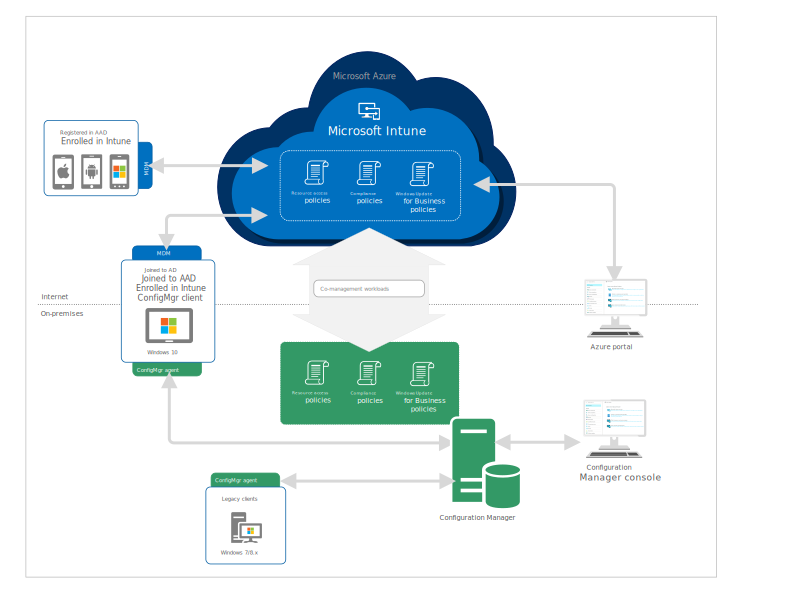

---
# required metadata

title: Co-management for Windows 10 devices  
titleSuffix: Configuration Manager
description: Learn how to concurrently manage Windows 10 devices by using both Configuration Manager and Microsoft Intune. 
keywords:
author: mestew
ms.author: mstewart
manager: dougeby
ms.date: 03/28/2018
ms.topic: article
ms.prod: configuration-manager
ms.service:
ms.technology:
ms.assetid: d6bbc787-83a5-44b4-ad64-016e5da7413f

# optional metadata

#ROBOTS:
#audience:
#ms.devlang:
#ms.reviewer: [ALIAS]
#ms.suite: ems
#ms.tgt_pltfrm:
#ms.custom:

---
# Co-management for Windows 10 devices    
<!-- 1350871 -->
Many customers want to manage Windows 10 devices in the same way they manage mobile devices using a simplified, lower cost, cloud-based solution. However, making the transition from traditional management to modern management can be challenging. In the previous Windows 10 updates, you can already join a Windows 10 device to on-premises Active Directory (AD) and cloud-based Azure AD at the same time (hybrid Azure AD). Starting with Configuration Manager version 1710, co-management takes advantage of this improvement and enables you to concurrently manage Windows 10, version 1709 (also known as the Fall Creators Update) devices by using both Configuration Manager and Intune. It’s a solution that provides a bridge from traditional to modern management and gives you a path to make the transition using a phased approach. 

There are two main paths to reach to co-management.  One is Configuration Manager provisioned co-management where Windows 10 devices managed by Configuration Manager and hybrid Azure AD joined get enrolled into Intune. The other is Intune provisioned devices that are enrolled in Intune and then installed with the Configuration Manager client reach a co-management state.

## Prerequisites
You must have the following prerequisites in place before you can enable co-management. There are general prerequisites, and different prerequisites for devices with the Configuration Manager client and devices that do not have the client installed.

> [!IMPORTANT]
> Windows 10 mobile devices do not support Co-management.

### General prerequisites
The following are general prerequisites for you to enable co-management:  

- Configuration Manager version 1710 or later
- Azure AD
- EMS or Intune license for all users
- [Azure AD automatic enrollment](https://docs.microsoft.com/intune/windows-enroll#enable-windows-10-automatic-enrollment) enabled
- Intune subscription &#40;MDM authority in Intune set to **Intune**&#41;

   > [!Note]  
   > If you have a hybrid MDM environment (Intune integrated with Configuration Manager), you cannot enable co-management. However, you can start migrating users to Intune standalone and then enable their associated Windows 10 devices for co-management. For more information about migrating to Intune standalone, see [Start migrating from hybrid MDM to Intune standalone](/sccm/mdm/deploy-use/migrate-hybridmdm-to-intunesa).

### Additional prerequisites for devices with the Configuration Manager client
- Windows 10, version 1709 (also known as the Fall Creators Update) and later
- [Hybrid Azure AD joined](https://docs.microsoft.com/azure/active-directory/device-management-hybrid-azuread-joined-devices-setup) (joined to AD and Azure AD)

### Additional prerequisites for devices without the Configuration Manager client
- Windows 10, version 1709 (also known as the Fall Creators Update) and later
- [Cloud Management Gateway](/sccm/core/clients/manage/manage-clients-internet#cloud-management-gateway) in Configuration Manager (when you use Intune to install the Configuration Manager client)

## Workloads you can switch to Intune
After you enable co-management, Configuration Manager continues to manage all workloads. When you decide that you are ready, you can have Intune start managing available workloads. You can have Intune manage the following workloads:   

### Compliance policies
Compliance policies define the rules and settings that a device must comply with to be considered compliant by conditional access polices. You can also use compliance policies to monitor and remediate compliance issues with devices independently of conditional access. For details, see [Device compliance policies](/sccm/mdm/deploy-use/device-compliance-policies).  

### Windows Update for Business policies
Windows Update for Business policies let you configure deferral policies for Windows 10 feature updates or quality updates for Windows 10 devices managed directly by Windows Update for Business. For details, see [Configure Windows Update for Business deferral policies](/sccm/sum/deploy-use/integrate-windows-update-for-business-windows-10#configure-windows-update-for-business-deferral-policies).  

### Resource access policies
Resource access policies configure VPN, Wi-Fi, email, and certificate settings on devices. For details, see [Deploy resource access profiles](/sccm/protect/deploy-use/deploy-wifi-vpn-email-cert-profiles).

### Endpoint Protection 
<!-- 1357365 -->
Starting in Configuration Manager 1802, the Endpoint Protection workload can be transitioned to Intune. For details, see [Workloads able to be transitioned to Intune](/sccm/core/clients/manage/co-management-switch-workloads#Workloads-able-to-be-transitioned-to-Intune) and [Endpoint Protection in Configuration Manager](/sccm/protect/deploy-use/endpoint-protection).

## Architectural overview for co-management
The following diagram provides an architectural overview of co-management and how it fits into existing Configuration and Intune infrastructures.

## Scenarios to enable co-management  
You can enable co-management for both Windows 10 devices enrolled in Microsoft Intune and existing Windows 10 Configuration Manager clients. Both scenarios result in Windows 10 devices concurrently managed by Configuration Manager and Intune, as well as joined to AD and Azure AD.  

### Devices enrolled in Intune  
When Windows 10 devices are enrolled in Intune, you can install the Configuration Manager client on the devices (using a specific command-line argument) to prepare the clients for co-management. Then, you enable co-management from the Configuration Manager console to start moving specific workloads to Intune for specific Windows 10 devices.  

For Windows 10 devices that are not yet enrolled in Intune, you can use automatic enrollment in Azure to enroll the devices. For new Windows 10 devices, you can use [Windows AutoPilot](https://docs.microsoft.com/intune/enrollment-autopilot) to configure the Out of Box Experience (OOBE), which includes automatic enrollment that enrolls devices in Intune.  

### Configuration Manager clients
When you have Windows 10 devices that are Configuration Manager clients, you can enroll these devices and enable co-management from the Configuration Manager console. Configuration Manager triggers automatic enrollment into Intune based on the Azure AD tenant information.  

## Remote actions available in Intune on Azure for co-managed devices
When a Windows 10 device is enabled for co-management, you have the following remote actions available to you from Intune on Azure:  
- [Factory reset](https://docs.microsoft.com/intune/devices-wipe#factory-reset)
- [Selective wipe](https://docs.microsoft.com/intune/apps-selective-wipe)
- [Delete devices](https://docs.microsoft.com/intune/devices-wipe#delete-devices-from-the-azure-active-directory-portal)
- [Restart device](https://docs.microsoft.com/intune/device-restart)
- [Fresh start](https://docs.microsoft.com/intune/device-fresh-start)

## Next steps
[Prepare Windows 10 devices for co-management](co-management-prepare.md)
