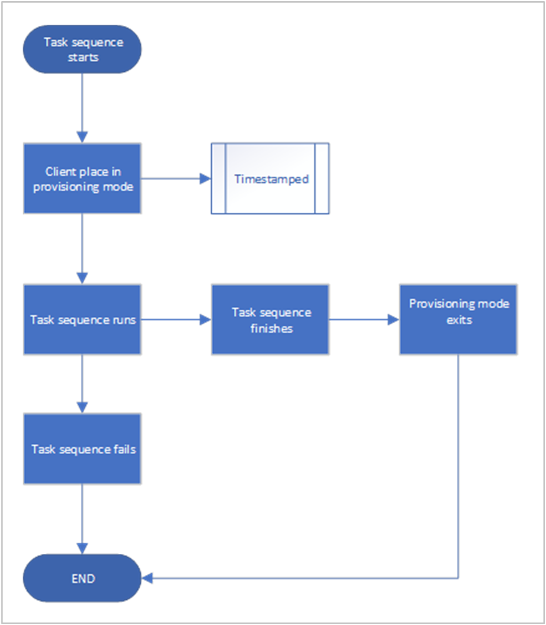
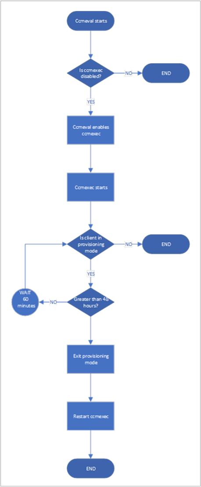

##  Client provisioning mode timeout
<!--3197824-->

During an OS deployment task sequence, Configuration Manager places the client in provisioning mode. In this state, the client doesn't process policy from the site. This behavior allows the task sequence to run without risk of additional deployments running on the client. When the task sequence completes, either success or handled failure, it exits client provisioning mode.

If the task sequence unexpectedly fails, the client can be left in provisioning mode. For example, if the device restarts in the middle of task sequence processing, and it's unable to recover. An administrator must manually identify and fix clients in this state. 

Now the task sequence sets a timestamp when it puts the client in provisioning mode. A client in provisioning mode checks every 60 minutes the duration of time since the timestamp. If it's been in provisioning mode for more than 48 hours, the client automatically exits provisioning mode and restarts its process. 

48 hours is the default provisioning mode timeout value. You can adjust this timer on a device by setting the **ProvisioningMaxMinutes** value in the following registry key: `HKLM\Software\Microsoft\CCM\CcmExec`. If this value doesn't exist or is `0`, the client uses the default 48 hours. 

The following diagrams show the process flow for the task sequence and the client:

| Task sequence | Client remediation |
|---------|---------|
|  |  |
